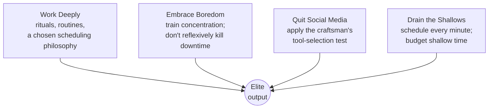

# Deep Work

Cal Newport defines **deep work** as *professional activity performed in a state of
distraction-free concentration that pushes your cognitive capabilities to their
limit.* Its opposite is **shallow work** — non-cognitively-demanding, logistical
tasks (email, most meetings, routine admin) that are easy to replicate and add little
lasting value. The book's thesis has two parts:

- **The Deep Work Hypothesis** — the ability to perform deep work is becoming both
  increasingly *rare* (as distraction culture and open offices erode it) and
  increasingly *valuable* (as the knowledge economy rewards mastering hard things
  fast and producing at an elite level). Anyone who cultivates this skill will thrive.
- Deep work is the key to acquiring and applying rare, valuable skills, which
  Newport ties to **deliberate practice** — the deep concentration required to
  stretch just beyond current ability is precisely the state that shallow work
  precludes.

Newport also invokes a "productivity" law: **high-quality work produced = time spent
× intensity of focus.** Because most people leave the intensity term far below its
ceiling, the leverage is not in more hours but in deeper ones.

## Attention residue

A core mechanism is **attention residue**: when you switch from one task to another,
part of your attention stays stuck on the previous task, so you perform the new one
with diminished capacity. Constant context-switching (checking email "just for a
second," a Slack ping) leaves a permanent film of residue, capping the quality of
everything you do. This is why the fragmented, always-connected workday is so
corrosive to cognitively demanding output — and it connects to the same
comprehension and focus costs discussed across the AI-era work in
[Learning the Craft](../ai-org/learning-the-craft.md).

## The four rules

The second half of the book is prescriptive — four "disciplines" for building a deep
work practice.

1. **Work Deeply.** Willpower is finite, so build **routines and rituals** that make
   entering depth automatic. Choose a scheduling philosophy: *monastic* (eliminate
   shallow work almost entirely), *bimodal* (alternate long deep stretches with open
   periods), *rhythmic* (a fixed daily deep-work block — the most practical for most
   people), or *journalistic* (drop into depth whenever a gap opens; hard, requires
   practice). Also make big bets on high-leverage goals and track lead measures.

2. **Embrace Boredom.** The ability to concentrate is a trainable muscle, and
   constantly reaching for your phone at the first hint of boredom trains the
   opposite. Don't take breaks *from* distraction (a "digital sabbath"); take
   scheduled breaks *from focus*. Productive meditation — working a hard problem in
   your head while walking — strengthens the muscle.

3. **Quit Social Media.** Apply the **craftsman's approach to tool selection**: adopt
   a tool only if its positive impacts on the things you care about *substantially
   outweigh* its negatives — not merely because it offers *some* benefit ("any-benefit
   mindset"). Most social media fails this test for serious knowledge workers because
   it is engineered to fragment attention.

4. **Drain the Shallows.** Ruthlessly minimize shallow work. Newport's tactics:
   **schedule every minute** of the day, **quantify the depth** of each activity,
   **budget a hard cap** on shallow time, **finish work by a fixed hour**
   (fixed-schedule productivity), and make yourself hard to reach so email doesn't own
   your calendar.

## Why it matters

Deep Work is the discipline of *intensity of focus*, complementing the discipline of
*commitment capture* in [Getting Things Done](getting-things-done.md) and the
discipline of *what to focus on* in
[Essentialism](essentialism.md) and
[The 7 Habits of Highly Effective People](seven-habits-of-highly-effective-people.md)
(Quadrant II work). It shares deep roots with [Flow](flow.md) — the immersive
optimal-experience state — and its deliberate-practice thread connects to
[Grit](grit.md), [Mindset](mindset-dweck.md), and the craft of high-leverage
engineering in
[The Effective Engineer](../software-engineering/the-effective-engineer.md).

## References

- [Deep Work: Rules for Focused Success in a Distracted World — Cal Newport](https://calnewport.com/deep-work-rules-for-focused-success-in-a-distracted-world/)
