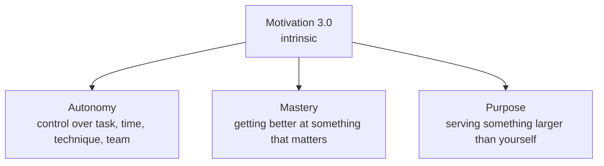

# Drive

Daniel Pink argues that the conventional carrot-and-stick model of motivation is outdated
and, for most modern work, counterproductive. Drawing on decades of behavioral-science
research, he shows that human beings run on three distinct drives, and that organizations
and schools over-rely on the second while neglecting the third.

## Three drives (the operating-system metaphor)

Pink frames motivation as successive "operating systems":

- **Motivation 1.0** — biological drives (hunger, thirst, safety).
- **Motivation 2.0** — extrinsic reward and punishment ("if-then" incentives). Effective
  for simple, rule-based tasks, but it degrades performance on anything requiring cognition
  or creativity.
- **Motivation 3.0** — intrinsic motivation: the built-in human need to direct our own
  lives, get better at things that matter, and contribute to something larger. This is the
  upgrade most workplaces still haven't installed.

## When rewards backfire

If-then rewards ("do this, then get that") narrow focus — useful when the path is obvious,
harmful when the task needs exploration. Pink catalogs seven ways extrinsic rewards can
misfire: they can **extinguish intrinsic motivation**, **reduce performance**, **crush
creativity**, **crowd out good behavior**, **encourage cheating and shortcuts**, **become
addictive**, and **foster short-term thinking**. The lesson isn't "no rewards" — pay people
fairly and generously enough to take money off the table — but that dangling contingent
carrots over interesting work is the wrong tool.

## The three elements of intrinsic motivation

- **Autonomy** — self-direction over what you do, when, how, and with whom (the "four Ts":
  task, time, technique, team).
- **Mastery** — the desire to improve at something meaningful. Mastery is a *mindset*,
  demands *effort* (it's painful, gradual), and is an *asymptote* (never fully reached) —
  which is precisely what keeps it engaging. This is why it pairs with the compounding,
  practice-driven views in [atomic-habits.md](atomic-habits.md) and [grit.md](grit.md).
- **Purpose** — the yearning to do work in service of something beyond oneself.

## Type I vs. Type X

Pink distinguishes two behavioral profiles:

- **Type X** — fueled by extrinsic desires; the reward matters more than the activity.
- **Type I** — fueled by intrinsic desires; the activity's inherent satisfaction matters
  more than the external payoff.

Type I behavior is *made, not born* — it's learnable, and it tends to outperform Type X over
the long run on nearly every metric that counts, especially for complex work.

## Related notes

- [grit.md](grit.md) — mastery and sustained effort toward long-term goals
- [atomic-habits.md](atomic-habits.md) — mastery as compounding 1% improvements
- [mindset-dweck.md](mindset-dweck.md) — the growth mindset that makes mastery possible
- [flow.md](flow.md) — the optimal-experience state autonomy and mastery produce
- [mans-search-for-meaning.md](mans-search-for-meaning.md) — purpose as the deepest driver

## References

- [Drive — Daniel Pink](https://www.danpink.com/books/drive/)
