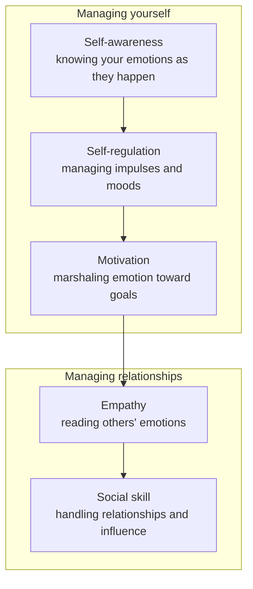

# Emotional Intelligence

*Emotional Intelligence: Why It Can Matter More Than IQ* (1995, Daniel Goleman)
popularized the argument that success in life — academic, professional, social,
and personal — depends at least as much on how well we handle emotions as on raw
cognitive intelligence. IQ is largely fixed and, Goleman argues, a weak predictor
of who thrives; **emotional intelligence (EQ)** is a set of competencies that can
be taught and cultivated, and it better explains why some capable people flounder
while others succeed. The book synthesizes brain science with practical
psychology and makes the case for teaching emotional skills, including in school
curricula.

## The five domains

Goleman organizes EQ into five domains — the first three are how you manage
yourself, the last two how you manage relationships.

- **Self-awareness** — recognizing a feeling as it happens; the keystone, since
  you cannot manage what you cannot perceive.
- **Self-regulation** — managing impulses and distressing emotions so they don't
  hijack you; being able to soothe yourself and recover from upset.
- **Motivation** — marshaling emotions in service of a goal: delaying
  gratification, staying hopeful and persistent through setbacks. (Goleman cites
  the "marshmallow test" of delayed gratification as strongly predictive.)
- **Empathy** — sensing what others feel, largely through nonverbal cues; the
  foundation of all social competence.
- **Social skill** — handling emotions in relationships: reading situations,
  influencing, resolving conflict, leading.

## The amygdala hijack

Goleman's most cited idea. The **amygdala**, the brain's emotional alarm, can
trigger a fast, overwhelming response — the "**amygdala hijack**" — before the
rational neocortex has time to weigh in. Emotional signals reach the amygdala on
a fast, crude pathway ahead of the slower conscious route, so we can be flooded
with fear or rage and act before we think. Self-awareness and self-regulation are
what let us insert a pause between impulse and action and keep the thinking brain
online. This is the neuroscience beneath the everyday advice to "keep your cool."

## Relation to other work

Emotional Intelligence supplies the psychological grounding for the interpersonal
methods on this shelf. Carnegie's insistence that people are creatures of emotion
in [How to Win Friends and Influence People](how-to-win-friends-and-influence-people.md)
is the pre-scientific version of Goleman's thesis. "Mastering my stories" in
[Crucial Conversations](crucial-conversations.md) is a concrete drill for
preventing an amygdala hijack, and its safety model runs on empathy and social
skill. The tactical empathy of
[Never Split the Difference](never-split-the-difference.md) is EQ weaponized for
negotiation. And empathy's reliance on nonverbal reading connects directly to
[How to Read People / Body Language](how-to-read-people-body-language.md).

## References

- [Emotional Intelligence — Wikipedia](https://en.wikipedia.org/wiki/Emotional_Intelligence_(book))
- [Emotional Intelligence — Daniel Goleman](http://www.danielgoleman.info/topics/emotional-intelligence/)
