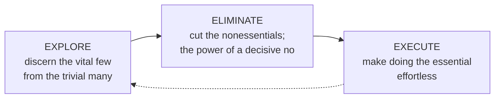

# Essentialism

Greg McKeown's *Essentialism* is subtitled *The Disciplined Pursuit of Less*, and the
subtitle is the whole thesis. An **Essentialist** does not ask "How can I fit it all
in?" but "What is the *one thing* I should be doing?" The goal is not to get more done
in less time — it is to get **only the right things** done. McKeown's core distinction:

- The **Nonessentialist** thinks *almost everything is essential*, believes they *have
  to* do it all, reacts to whatever is loudest, and spreads effort thin — making a
  millimeter of progress in a million directions.
- The **Essentialist** thinks *almost everything is noise*, chooses deliberately, and
  concentrates effort where it produces the highest contribution — making significant
  progress in the few things that truly matter.

The book rests on three beliefs the Essentialist internalizes: **"I choose to"** (agency
over obligation), **"only a few things really matter"** (discernment over
undifferentiated importance), and **"I can do anything but not everything"** (the
reality of trade-offs).

## Trade-offs are the strategy

The central mental shift is embracing **trade-offs**. Nonessentialists ask "How can I
do *both*?" and thereby refuse to choose — which means the choice gets made for them,
by circumstance or by whoever asks last. Essentialists accept that saying yes to
anything is saying no to everything else, and treat that as the fundamental strategic
question: *not "What do I have to give up?" but "What do I want to go big on?"* This is
the same leverage instinct behind the "important, not urgent" quadrant in
[The 7 Habits of Highly Effective People](seven-habits-of-highly-effective-people.md).

## The essentialist process: explore, eliminate, execute

McKeown organizes the discipline into three phases that feed a virtuous cycle.

**Explore.** Counterintuitively, Essentialists explore *more* options than
Nonessentialists — but they commit to far fewer. You must create space to think,
look, play, sleep, and be selective before you can discern what matters. The
selection filter is deliberately extreme: the **90 percent rule** — score every option
against your single most important criterion; if it isn't a clear 9 or 10, it's a zero
and you decline it. *"If it isn't a clear yes, it's a clear no."*

**Eliminate.** Cut the nonessential, which requires the courage to say **no**
gracefully and firmly. McKeown reframes the fear of missing out: the real cost is
missing out on the *essential* by drowning in the trivial. He warns against the **sunk-
cost trap** (committing further to something failing because of past investment) and
recommends setting boundaries as a way to eliminate whole categories of intrusion.

**Execute.** Make the disciplined pursuit *effortless* by building systems rather than
forcing willpower each time: buffer time into estimates, identify the "slowest hiker"
(the constraint that governs the whole — an idea shared with
[The Goal](../process-and-teams/the-goal.md)), practice **small wins** and progress,
and turn the essential into **routine**. Routine is where Essentialism meets habit
formation — see [Atomic Habits](atomic-habits.md) and
[The Power of Habit](the-power-of-habit.md).

## Why it matters

Essentialism is the discipline of *choosing what to do*, the top-down complement to
the *how to do it deeply* of [Deep Work](deep-work.md) and the *how to reliably do it*
of [Getting Things Done](getting-things-done.md). In an AI-augmented world of
seemingly infinite capacity, the constraint shifts from throughput to judgment — which
makes the decisive "no" and the pursuit of the vital few more valuable, not less. It
connects directly to high-leverage thinking in
[The Effective Engineer](../software-engineering/the-effective-engineer.md).

## References

- [Essentialism: The Disciplined Pursuit of Less — Greg McKeown](https://gregmckeown.com/books/essentialism/)
