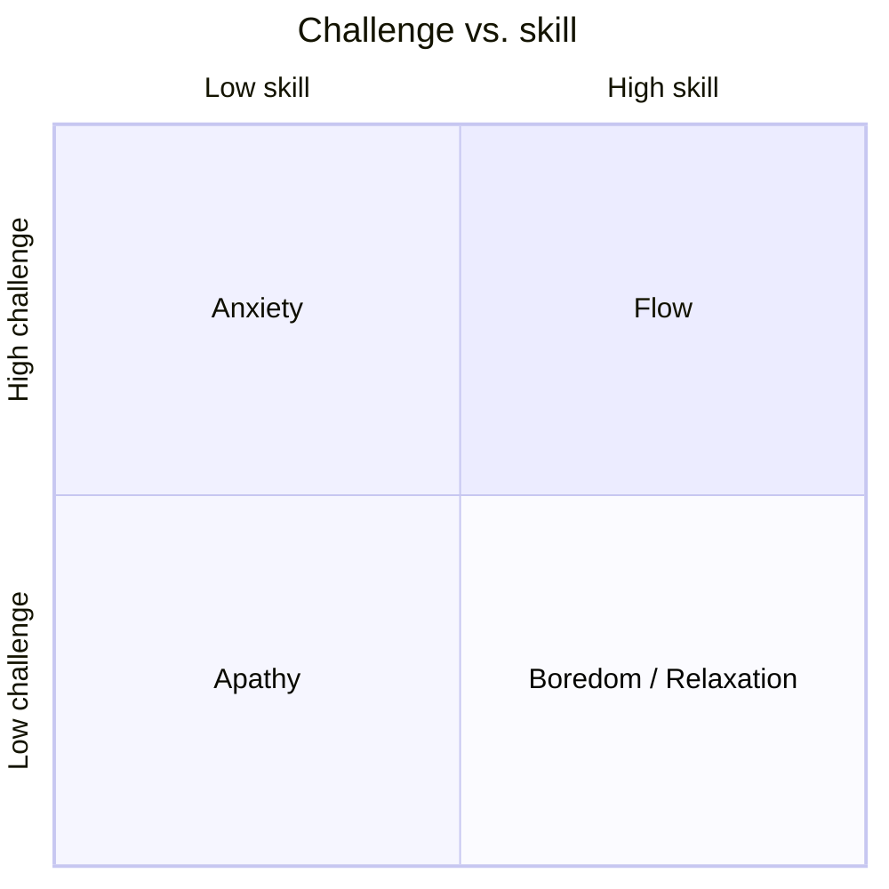

# Flow: The Psychology of Optimal Experience

Mihaly Csikszentmihalyi (pronounced *cheek-sent-me-hi*) spent decades asking a
research question ordinary happiness studies ignored: *when do people report feeling
their best?* The answer was not during passive leisure but during moments of total
absorption in a demanding activity — a surgeon operating, a climber on a wall, a
musician improvising, a programmer lost in a problem. He named this state **flow**:
optimal experience, when consciousness is ordered and attention fully invested in a
goal, and action feels effortless despite (in fact, *because of*) difficulty.

## The challenge–skill balance

Flow lives on the diagonal where the **challenge** of a task matches your **skill**.
Push challenge far above skill and you get anxiety; let skill outrun challenge and
you get boredom; let both drop and you get apathy. Flow sits in the narrow channel
between anxiety and boredom — and because it lives there, it is inherently a *growth*
state: as skill rises, staying in flow requires taking on harder challenges, so the
person is continually stretched. Optimal experience is not comfort; it is the edge of
your competence.

## Conditions and characteristics

Three conditions tend to *produce* flow:

1. **Clear goals** that give the activity structure and direction.
2. **Immediate feedback** so you always know how you are doing and can adjust.
3. **A challenge–skill balance** demanding enough to command full attention.

When those hold, flow *feels* like: intense concentration on the present moment;
a merging of action and awareness; loss of self-consciousness (the inner critic goes
quiet); a sense of control; distorted time (hours vanish, or a second stretches); and
the activity being **autotelic** — rewarding in itself, needing no external payoff.

## The autotelic personality and life

*Autotelic* comes from the Greek *autos* (self) + *telos* (goal): a thing done for
its own sake. Csikszentmihalyi argues some people have an **autotelic personality** —
marked by curiosity, persistence, low self-absorption, and a habit of doing things
for intrinsic reasons — that lets them find flow more readily, even in dull or
adverse conditions. The larger thesis of the book is that a good life is not a
collection of pleasures but a *sequence of flow experiences*: by turning more of
daily life — work, relationships, even solitude — into activities with clear goals,
feedback, and matched challenge, one builds a life that is both enjoyable and
meaningful.

## Related notes

- [Deep Work](deep-work.md) — Cal Newport's disciplined-concentration counterpart:
  flow is the felt experience; deep work is the practice that engineers it.
- [Drive](drive-daniel-pink.md) — flow is intrinsic motivation made vivid; autotelic
  activity is mastery and autonomy in action.
- [Mindset](mindset-dweck.md) — the challenge-seeking of flow requires a growth
  stance toward one's own skill ceiling.
- [Man's Search for Meaning](mans-search-for-meaning.md) — engagement as a route to a
  meaningful life.
- [Atomic Habits](atomic-habits.md) — immediate feedback and clear cues, the same
  levers that make habits stick, also open the door to flow.
- Intrinsic reward here mirrors the reward signal in
  [reinforcement learning](../ai/reinforcement-learning.md): behavior sustained by an
  internal reward rather than an external prize.

## References

- [Flow — Mihaly Csikszentmihalyi (HarperCollins)](https://www.harpercollins.com/products/flow-mihaly-csikszentmihalyi)
