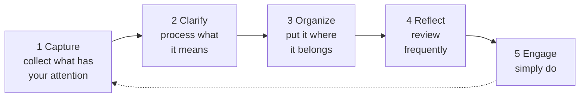

# Getting Things Done

David Allen's *Getting Things Done* (GTD) is a system for **stress-free
productivity**. Its founding premise is a claim about cognition: **your mind is for
having ideas, not for holding them.** Every unfinished commitment you try to keep in
your head becomes an "open loop" that consumes attention and generates low-grade
anxiety, whether or not you are working on it. The remedy is to move every commitment
out of your head and into a **trusted external system**, then work from that system.

Allen calls the resulting state **"mind like water"** — a mind that responds to
inputs with exactly the right amount of energy and then returns to calm, the way
water reacts to a thrown pebble and settles. You reach it not by trying harder to
remember, but by trusting a system so completely that your mind lets go.

## The five steps

GTD is a repeatable pipeline that applies order to chaos. Each step is distinct, and
the discipline is doing them separately rather than all at once.

1. **Capture** — collect *everything* that has your attention into trusted "inboxes"
   (a notebook, an app, a physical tray). Nothing stays in your head. The bar is
   completeness: an incomplete capture erodes trust in the whole system.

2. **Clarify** — process each captured item by asking: *Is it actionable?*
   - If **no**: trash it, incubate it (a "Someday/Maybe" list), or file it as
     reference.
   - If **yes**: identify the **very next physical action**. If a single action
     finishes it, it's a project (a "project" is any outcome needing more than one
     step). This is where the **two-minute rule** applies: *if the next action takes
     less than two minutes, do it now* — the overhead of tracking it exceeds the cost
     of just doing it.

3. **Organize** — put reminders where they belong: next actions sorted by
   **context** (`@calls`, `@computer`, `@errands`, `@home`), a projects list, a
   calendar for date/time-specific items, and a "waiting for" list for delegated
   work. Context lets you match tasks to your situation and tools at hand rather than
   scanning one undifferentiated to-do list.

4. **Reflect** — review the system frequently enough to trust it. The keystone is the
   **Weekly Review**: get clear (empty inboxes), get current (review lists and
   calendar), and get creative (surface new ideas). The Weekly Review is what keeps
   the system alive; skip it and trust decays.

5. **Engage** — simply do. Because clarifying and organizing are already done, you
   choose *what* to do in the moment with confidence, using four criteria: context,
   time available, energy available, and priority.

## The horizons of focus

Beyond runway-level next actions, Allen adds altitude. Commitments exist at six
**horizons**: current actions, current projects, areas of focus/responsibility,
one-to-two-year goals, three-to-five-year vision, and life purpose. Most productivity
failures come from managing only the ground level; periodic review at higher horizons
keeps daily work aligned with what actually matters.

## Why it matters

GTD is the canonical bottom-up execution system: it excels at reliably capturing and
discharging commitments so nothing is dropped. It pairs naturally with top-down
prioritization frameworks — the "important, not urgent" discipline of
[The 7 Habits of Highly Effective People](seven-habits-of-highly-effective-people.md)
and the "less but better" filter of [Essentialism](essentialism.md) decide *which*
loops are worth keeping, while GTD ensures the kept ones actually close. It clears the
mental clutter that [Deep Work](deep-work.md) calls "the shallows," freeing attention
for concentration, and it operationalizes the "next physical action" habit for the
kind of high-leverage execution described in
[The Effective Engineer](../software-engineering/the-effective-engineer.md).

## References

- [What is GTD? — Getting Things Done (David Allen Company)](https://gettingthingsdone.com/what-is-gtd/)
