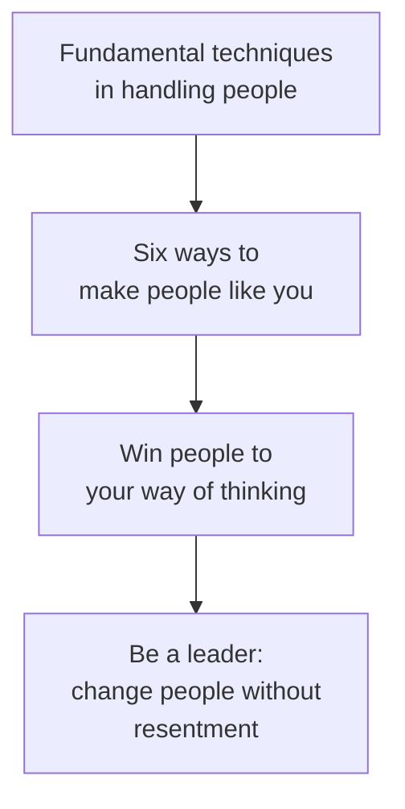

# How to Win Friends and Influence People

Dale Carnegie's 1936 book is the foundational text of modern interpersonal
influence. Its thesis is disarmingly simple: people are not creatures of logic
but creatures of emotion, driven by pride and a hunger to feel important. You
cannot argue, criticize, or pressure someone into genuinely changing their mind
or liking you. You win people by taking a sincere interest in *them* — their
wants, their self-image, their point of view — and letting them arrive at
conclusions as if they were their own. Influence is a byproduct of making the
other person feel valued, not a technique applied to them.

The book is organized as four sets of principles.

## The four parts

**Fundamental techniques in handling people.** Don't criticize, condemn, or
complain — criticism puts people on the defensive and wounds their pride, and
they rationalize rather than change. Give honest, sincere appreciation (not
flattery, which is cheap and transparent). Arouse in the other person an eager
want: frame everything in terms of what *they* want, because the only way to
influence anyone is to talk about what they care about.

**Six ways to make people like you.** Become genuinely interested in other
people. Smile. Remember that a person's name is, to them, the sweetest sound in
any language. Be a good listener and encourage others to talk about themselves.
Talk in terms of the other person's interests. Make the other person feel
important — and do it sincerely.

**Win people to your way of thinking.** Avoid arguments — you can't win one; even
if you "win," you lose the person's goodwill. Never say "you're wrong"; show
respect for their opinions. If you're wrong, admit it quickly and emphatically.
Begin in a friendly way. Get the other person saying "yes, yes" early. Let them
do most of the talking. Let them feel the idea is theirs. Try honestly to see
things from their point of view. Be sympathetic to their ideas and desires.
Appeal to nobler motives. Dramatize your ideas. Throw down a challenge.

**Be a leader: change people without giving offense or arousing resentment.**
Begin with praise and honest appreciation. Call attention to mistakes
indirectly. Talk about your own mistakes first. Ask questions instead of giving
orders. Let the other person save face. Praise every improvement, even the
slightest. Give them a fine reputation to live up to. Use encouragement — make
the fault seem easy to correct. Make the other person happy about doing what you
suggest.

## Why it still holds

Carnegie's principles are the ancestor of nearly every later framework for
constructive dialogue. The "see it from their point of view" and "make it safe
to disagree" instincts reappear as explicit method in
[Crucial Conversations](crucial-conversations.md), and his emphasis on curiosity
and labeling the other person's world prefigures the tactical empathy of
[Never Split the Difference](never-split-the-difference.md). His underlying claim
— that emotional attunement, not raw intellect, governs how people respond to us
— is precisely what [Emotional Intelligence](emotional-intelligence.md) later
grounded in psychology. Reading nonverbal cues (see
[How to Read People / Body Language](how-to-read-people-body-language.md)) sharpens
the "genuine interest" he prescribes.

## References

- [How to Win Friends and Influence People — Wikipedia](https://en.wikipedia.org/wiki/How_to_Win_Friends_and_Influence_People)
