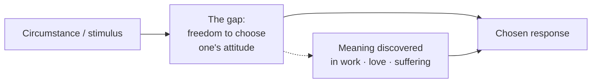

# Man's Search for Meaning

Viktor Frankl's 1946 book has two halves. The first is a psychiatrist's firsthand
account of surviving Nazi concentration camps — Auschwitz among them. The second
lays out **logotherapy**, the school of psychotherapy he founded, whose one idea the
camps put to the harshest possible test: that the primary drive in human life is not
pleasure (Freud) or power (Adler) but the **search for meaning**.

## The will to meaning

Frankl argues that a human being is fundamentally motivated by a *will to meaning* —
a need to find purpose in one's life. When that need is frustrated, the result is an
"existential vacuum": boredom, emptiness, a sense that nothing matters. Meaning is
not invented or handed down; it is *discovered*, and it is always specific — to this
person, this moment, this task. There is no meaning-in-general, only the meaning of
your concrete situation right now.

He identifies three broad avenues to meaning:

1. **Work** — creating something or doing a deed; giving to the world.
2. **Love** — experiencing something or encountering someone; the meaning found in
   another person.
3. **Suffering** — the attitude one takes toward unavoidable suffering. When a
   situation cannot be changed, we are challenged to change ourselves. Suffering that
   is meaningless is unbearable; suffering met with meaning becomes endurable, even
   an achievement.

## The last of the human freedoms

The book's most quoted insight comes straight from the camps: everything can be
taken from a person but one thing — *the last of the human freedoms: to choose one's
attitude in any given set of circumstances, to choose one's own way.* Between what
happens to us (stimulus) and how we act (response) lies a gap, and in that gap sits
our freedom. Guards could control every external condition of a prisoner's life and
still not control his inner stance toward it. The ones who found a *why* to live —
a task waiting, a person to return to — could bear almost any *how*. Frankl repeatedly
returns to Nietzsche's line: "He who has a why to live for can bear almost any how."

## Logotherapy in practice

Because meaning is future- and task-oriented, logotherapy points the patient
*outward* rather than inward. Frankl warns that meaning and happiness cannot be
pursued directly — they *ensue* as the side effect of a commitment to something
greater than oneself. Chase happiness and it recedes; devote yourself to a cause or
a person and it arrives unbidden. In later editions he adds **tragic optimism**: the
capacity to say "yes to life" even given pain, guilt, and death — to turn suffering
into achievement, guilt into self-improvement, and mortality into a spur to act.

## Related notes

- [Meditations](meditations.md) — the Stoic dichotomy of control is the same gap
  between circumstance and response, arrived at eighteen centuries earlier.
- [Mindset](mindset-dweck.md) — the belief that one's response to adversity is a
  choice, not a fate.
- [Flow](flow.md) — meaning through absorbing, purposeful engagement.
- [Grit](grit.md) — a "why" as the source of sustained perseverance.
- [Emotional Intelligence](emotional-intelligence.md) — the pause between stimulus and
  response is where self-regulation lives.

## References

- [Viktor Frankl Institute — publications](https://www.viktorfrankl.org/publications.html)
