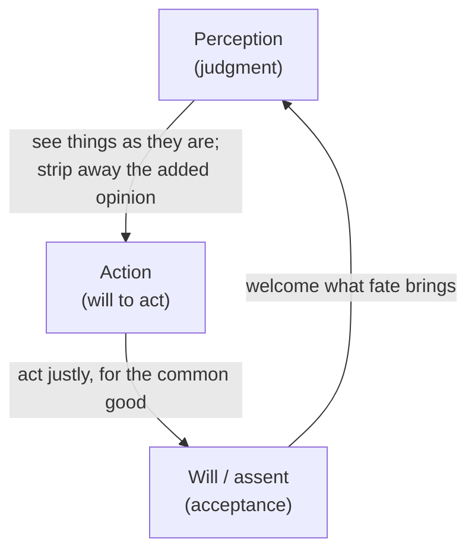

# Meditations

*Meditations* (Greek: *Ta eis heauton*, "to himself") is not a book Marcus Aurelius
wrote for an audience. It is the private notebook of a Roman emperor — written in
Greek, on campaign, in the 170s CE — a running set of reminders addressed to himself
about how to live well. That is precisely its power: it is Stoic philosophy not as
theory but as a working man's daily self-correction, the ruler of the known world
coaching himself to be patient, just, and unafraid.

## The dichotomy of control

The load-bearing idea, inherited from Epictetus, is the **dichotomy of control**:
some things are *up to us* (our judgments, intentions, desires, responses) and some
are *not* (other people, reputation, the body, fortune, death). Peace comes from
investing entirely in the first category and releasing the second. External events
are not good or bad in themselves — they are "indifferents." What harms us is our
*opinion* about them. "You have power over your mind, not outside events. Realize
this, and you will find strength."

## Virtue is the only good

For the Stoic, the sole genuine good is **virtue** — wisdom, justice, courage,
temperance — because it is the one thing fully within our control and always
sufficient for a good life. Wealth, health, and status are "preferred indifferents":
fine to have, but not what makes a life good or its owner happy. Act rightly, and
the outcome, being external, is not your concern.

## Memento mori and the view from above

Two recurring practices give the book its tone:

- **Memento mori** — remember that you will die. Marcus dwells on impermanence not
  to depress but to clarify: life is short, so waste none of it on anger, vanity, or
  postponement. Do what is in front of you, well, now.
- **The view from above** — imagine your troubles from a cosmic distance: the whole
  Earth a dot, empires flickering, your own name soon forgotten. Seen from there,
  most grievances shrink to their true size.

## The three disciplines

Later interpreters (notably Pierre Hadot) organize Marcus's practice into three
Stoic disciplines, each governing one faculty:

- **Discipline of perception** — judge events accurately; withhold the reflexive
  value-label the mind attaches.
- **Discipline of action** — act rightly toward others; we are made for cooperation,
  "as the hands, feet, eyelids."
- **Discipline of will** — accept with equanimity whatever is outside your control.

## Related notes

- [Man's Search for Meaning](mans-search-for-meaning.md) — Frankl's "last of the human
  freedoms" is the dichotomy of control rediscovered in a concentration camp.
- [Mindset](mindset-dweck.md) — reframing setbacks as neutral events to work with, not
  verdicts to fear.
- [Emotional Intelligence](emotional-intelligence.md) — the Stoic pause before
  assenting to an impression is self-regulation by another name.
- Forward-link: the [philosophy field hub](../philosophy/index.md) — Stoicism sits
  within the broader tradition once that folder is built out.

## References

- [The Meditations of the Emperor Marcus Antoninus (Wikisource)](https://en.wikisource.org/wiki/The_Meditations_of_the_Emperor_Marcus_Antoninus)
