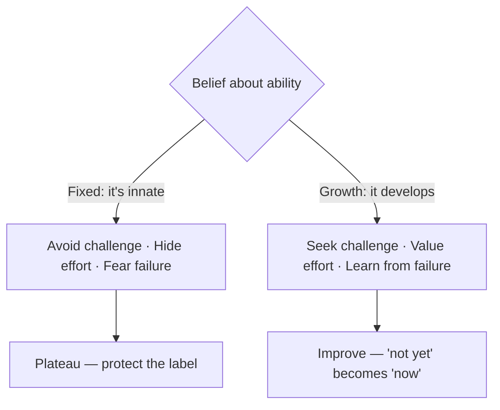

# Mindset: The New Psychology of Success

Carol Dweck's central claim is deceptively simple: what you believe about the
*source* of ability changes what you can become. Those beliefs — she calls them
"implicit theories" — sort people along a continuum between two poles.

- **Fixed mindset.** Ability, intelligence, and talent are innate and static. You
  have a fixed amount and your job is to prove you have enough. Effort is
  suspicious (if you were really smart, you wouldn't have to try), challenge is
  threatening (it might expose a limit), and failure is a verdict on who you *are*.
- **Growth mindset.** Ability is a starting point that grows through effort,
  strategy, learning, and persistence. Effort is the path to mastery, challenge is
  where growth happens, and failure is information — a description of *this attempt*,
  not of *you*.

The mindset you hold silently steers a chain of downstream choices: which goals you
set, how you read setbacks, whether you persist or quit, how you respond to
criticism, and how you feel about the success of others. Fixed-mindset people avoid
hard tasks to protect the label "smart"; growth-mindset people seek hard tasks
because that is where they get better. Over time these small, repeated choices
compound into very different trajectories.

## Praise the process, not the person

Dweck's most cited applied finding concerns *praise*. Telling a child "you're so
smart" installs a fixed mindset: it teaches that performance is evidence of a fixed
trait, so the child then avoids anything that might endanger the label. Praising the
**process** — effort, strategy, focus, persistence, the choice to tackle something
hard — installs a growth mindset and builds resilience. The praise attaches success
to controllable actions rather than to an identity that a bad result could puncture.

## The power of "yet"

The single-word intervention: reframe "I can't do this" as "I can't do this *yet*."
"Yet" converts a fixed verdict into a point on a learning curve. It keeps the door
open, restores agency, and turns failure from a wall into a stage.

## Nuance and critique

Mindset is not "believe and achieve." Growth mindset without effective *strategy*
is just cheerful stubbornness; the point is to try, and when a try fails, to change
approach. Dweck herself has warned against a "false growth mindset" that praises
effort alone while ignoring whether the effort worked. The research has also drawn
replication scrutiny — some large studies find small or inconsistent effects — so
the honest reading is that beliefs about malleability matter, but they are one lever
among many, not a guarantee.

## Related notes

- [Grit](grit.md) — sustained effort toward long-term goals; the behavioral engine a
  growth mindset justifies.
- [Atomic Habits](atomic-habits.md) — identity-based habit change echoes the "process
  over trait" theme.
- [Man's Search for Meaning](mans-search-for-meaning.md) — the freedom to choose one's
  response to circumstance.
- [Flow](flow.md) — challenge-seeking and growth as intrinsically rewarding.
- Machine-learning parallel: the whole point of a
  [learning system](../ai/machine-learning.md) is that capability is *acquired from
  experience*, not fixed at initialization — a fixed vs. growth distinction in silicon.

## References

- [Mindset — the science (Mindset Works)](https://www.mindsetworks.com/science/)
