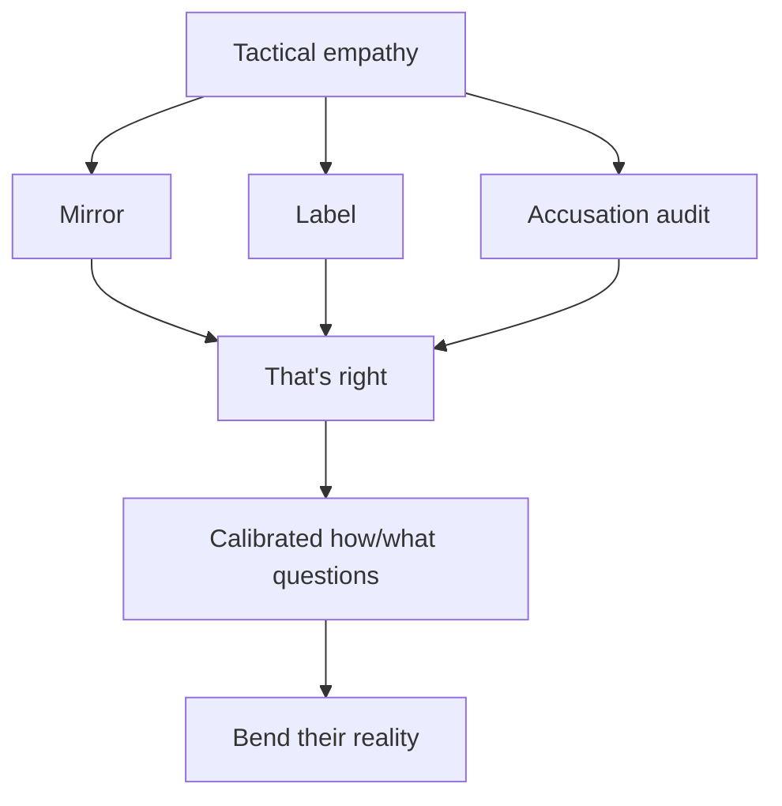

# Never Split the Difference

*Never Split the Difference: Negotiating As If Your Life Depended On It* (2016,
by former FBI lead international kidnapping negotiator Chris Voss with Tahl Raz)
argues that almost everything conventional bargaining teaches is wrong. People
are not rational; there is no such thing as "fair"; and compromise — splitting
the difference — is usually the worst outcome, a way to avoid the discomfort of
real negotiation and leave both sides unsatisfied. Voss's method is built from
hostage-negotiation tools that work precisely because in a hostage crisis there
is no compromise to be had. The engine of it all is **tactical empathy**:
deliberately understanding and *voicing* the other side's feelings and
perspective so they feel heard, which lowers their defenses and lets you steer.

## Core techniques

**Mirroring.** Repeat the last one to three words the other person said, as a
question. It signals attention, prompts them to elaborate, and buys you thinking
time — cheap, almost automatic rapport.

**Labeling.** Name the other side's emotion out loud: "It seems like…", "It
sounds like…", "It looks like…". Labeling a negative emotion defuses it; labeling
a positive one reinforces it. Never use "I" ("I hear that you…") — it makes it
about you.

**The accusation audit.** Front-load every negative thing they could say about
you or your position and voice it yourself before they can. Naming the worst
disarms it and builds trust.

**Get to "no," not "yes."** "Yes" makes people feel cornered and committed
before they're ready; "no" makes them feel safe and in control. Ask questions
people can say "no" to ("Is now a bad time to talk?"). A quick "yes" is often a
counterfeit meant to end the conversation.

**"That's right" beats "you're right."** The goal is to get the other side to
say "that's right" — the moment they feel you've truly summarized their world.
"You're right" is what people say to get you to stop talking; it signals
disengagement, not agreement.

**Calibrated questions.** Open-ended "how" and "what" questions ("How am I
supposed to do that?", "What about this is important to you?") give the other
side the illusion of control while making *them* solve your problem. Avoid "why"
— it sounds accusatory.

**Bend their reality.** Anchor emotions and expectations before numbers; use the
extreme "no deal" as a boundary; deploy loss aversion (people work harder to
avoid a loss than to secure a gain). Watch for **Black Swans** — hidden pieces of
unknown information that, once surfaced, change the whole game.

## Relation to other work

Voss's tactical empathy is a rigorous, field-tested version of Carnegie's "see
things from the other person's point of view" in
[How to Win Friends and Influence People](how-to-win-friends-and-influence-people.md),
and it shares the "make it safe first" logic of
[Crucial Conversations](crucial-conversations.md) (the accusation audit is a form
of restoring safety, labeling a form of mastering the other's story). The whole
method is applied [emotional intelligence](emotional-intelligence.md) — reading
and regulating emotion under pressure — and it leans heavily on decoding tone
and nonverbal signals, sharpened by
[How to Read People / Body Language](how-to-read-people-body-language.md).

## References

- [Never Split the Difference — The Black Swan Group](https://www.blackswanltd.com/never-split-the-difference)
