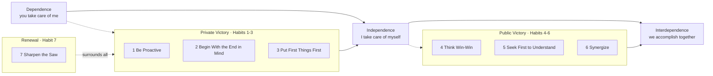

# The 7 Habits of Highly Effective People

Stephen R. Covey's central claim is that lasting effectiveness comes from
**character, not technique**. He draws a sharp line between two traditions in the
self-help literature:

- the **personality ethic** — surface tactics, image management, and "quick fix"
  social skills that treat effectiveness as a set of manipulable behaviors;
- the **character ethic** — deep, principle-based traits (integrity, patience,
  courage, fairness) that produce effectiveness from the inside out.

Covey argues the twentieth century drifted toward the personality ethic and lost
the character ethic, and that durable success requires reversing that. Effectiveness
is built on **timeless principles** — like natural laws, they operate whether or not
we acknowledge them. You don't break principles; you only break yourself against
them. This grounds the whole book: habits are the practiced expression of principles,
where a habit is the intersection of *knowledge* (what/why), *skill* (how), and
*desire* (want to).

## The Maturity Continuum

The seven habits move you along a growth path in a fixed order — you cannot lead
others well until you can lead yourself.

The key insight of the continuum is sequence. Most people chase **interdependence**
(teamwork, relationships, influence) before they have achieved **independence**
(self-mastery). Covey insists the *Private Victory* precedes the *Public Victory*:
you must be able to keep your own commitments before your promises to others carry
weight.

## The private victory (self-mastery)

**Habit 1 — Be Proactive.** Between stimulus and response lies the freedom to choose.
Proactive people focus on their **Circle of Influence** (what they can affect) rather
than dissipating energy on their **Circle of Concern** (what they can only worry
about). Reactive language ("I have to," "they make me") cedes agency; proactive
language ("I choose," "I prefer") reclaims it.

**Habit 2 — Begin With the End in Mind.** All things are created twice: first
mentally, then physically. Define the destination before you move. Covey's device is
a **personal mission statement** rooted in a chosen center (principles, not spouse,
work, money, or self). "Leadership is doing the right things; management is doing
things right" — Habit 2 is personal leadership.

**Habit 3 — Put First Things First.** The disciplined execution of Habit 2. Covey's
**time-management matrix** sorts activities by urgency and importance; the leverage
is in **Quadrant II** — important but *not* urgent (planning, relationships,
prevention, renewal). Effective people shrink the reactive urgent-crisis quadrants by
investing in Quadrant II, which requires the courage to say no to the merely urgent.
This is the same discipline that [essentialism](essentialism.md) elevates into an
entire philosophy, and it echoes the leverage focus in
[The Effective Engineer](../software-engineering/the-effective-engineer.md).

## The public victory (interdependence)

**Habit 4 — Think Win-Win.** Seek mutual benefit in all interactions; life is not a
zero-sum game. Win-win rests on an **Abundance Mentality** (there is enough for
everyone) rather than a scarcity mentality. Its backbone is the **Emotional Bank
Account** — trust built through consistent deposits (kindness, honoring commitments,
apologies). Where win-win is impossible, the mature stance is "no deal."

**Habit 5 — Seek First to Understand, Then to Be Understood.** Most people listen
with intent to reply, not to understand. **Empathic listening** — reflecting the
other person's feeling and meaning before advancing your own view — is the master key
to influence. You cannot prescribe before you diagnose. This principle underlies
[Crucial Conversations](crucial-conversations.md) and
[Never Split the Difference](never-split-the-difference.md).

**Habit 6 — Synergize.** The whole is greater than the sum of its parts. Synergy
comes from **valuing differences** — treating another's divergent view as a chance to
find a third alternative better than either party's original position. It is
creative cooperation, the fruit of Habits 4 and 5 working together.

## Renewal

**Habit 7 — Sharpen the Saw.** Preserve and enhance your greatest asset — yourself —
across four dimensions: **physical** (exercise, nutrition), **mental** (learning,
reading), **social/emotional** (relationships, service), and **spiritual** (values,
meditation, purpose). Renewal is the Quadrant II activity that makes all the other
habits sustainable; neglect it and effectiveness decays. The "upward spiral" of
learn–commit–do compounds growth over time.

## Why it matters

The 7 Habits is a foundational operating system for personal effectiveness that many
later works refine or specialize: habit formation in
[Atomic Habits](atomic-habits.md) and [The Power of Habit](the-power-of-habit.md);
prioritization and the decisive no in [Essentialism](essentialism.md); focus and
deep concentration in [Deep Work](deep-work.md); stress-free execution in
[Getting Things Done](getting-things-done.md); and the relational habits echoed in
[How to Win Friends and Influence People](how-to-win-friends-and-influence-people.md)
and [Emotional Intelligence](emotional-intelligence.md).

## References

- [The 7 Habits of Highly Effective People — FranklinCovey](https://www.franklincovey.com/the-7-habits/)
