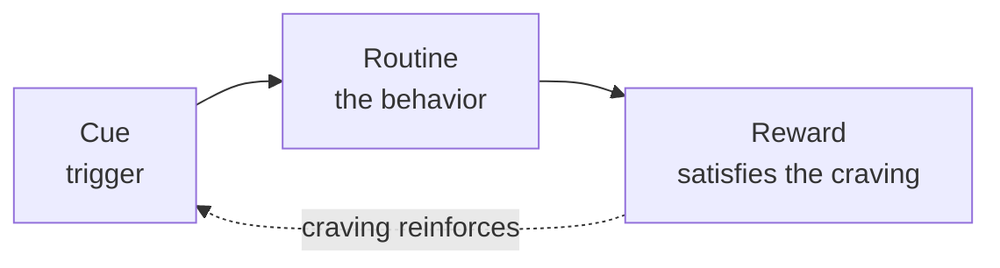

# The Power of Habit

Charles Duhigg synthesizes neuroscience, psychology, and business reporting to argue that
much of daily behavior — individual, corporate, and societal — runs on habit rather than
deliberate decision, and that understanding the mechanism is what makes change possible.
Habits exist because the brain offloads repeated sequences to the basal ganglia, saving
mental effort ("chunking"). That efficiency is why habits are durable — and why they can be
redirected but rarely erased.

## The habit loop

Every habit is a three-part neurological loop:

- **Cue** — a trigger (time, place, emotion, preceding action, company) that tells the
  brain to run an automatic routine.
- **Routine** — the behavior itself, physical, mental, or emotional.
- **Reward** — what the behavior delivers, which teaches the brain the loop is worth
  remembering.

The engine that locks the loop in place is **craving**: once the brain learns to anticipate
the reward at the cue, it *wants* it, and that anticipation drives the routine automatically.
James Clear expands this same loop into a four-stage change framework in
[atomic-habits.md](atomic-habits.md).

## The golden rule of habit change

You cannot extinguish a habit; you can only change it. The reliable method:

> Keep the **cue**, keep the **reward** — change the **routine**.

Diagnose which cue and reward drive an unwanted routine, then substitute a new routine that
delivers the same reward on the same cue. Belief — often reinforced by a group or community —
is what makes the substituted routine hold under stress.

## Keystone habits

Some habits matter far more than others because they set off a chain reaction. **Keystone
habits** (e.g., a personal exercise habit, or a corporate focus on worker safety) shift
other behaviors indirectly, create small wins that build momentum, and establish cultures
where change spreads. Duhigg's case of Alcoa — where a single focus on safety transformed
the whole company's performance — is the canonical example.

## Three scales

Duhigg argues the same mechanics operate at three levels:

- **Individual** — personal routines, willpower (itself a trainable keystone habit).
- **Organizational** — institutional routines and how companies change (Starbucks,
  Procter & Gamble, Alcoa).
- **Societal** — social movements that grow through the habits of communities and weak ties.

## Related notes

- [atomic-habits.md](atomic-habits.md) — James Clear's four-law extension of the same loop
- [grit.md](grit.md) — perseverance sustained by habit rather than willpower alone
- [seven-habits-of-highly-effective-people.md](seven-habits-of-highly-effective-people.md) — habit as the unit of character
- [drive-daniel-pink.md](drive-daniel-pink.md) — reward-and-punishment drive vs. intrinsic motivation

## References

- [The Power of Habit — Charles Duhigg](https://charlesduhigg.com/the-power-of-habit/)
