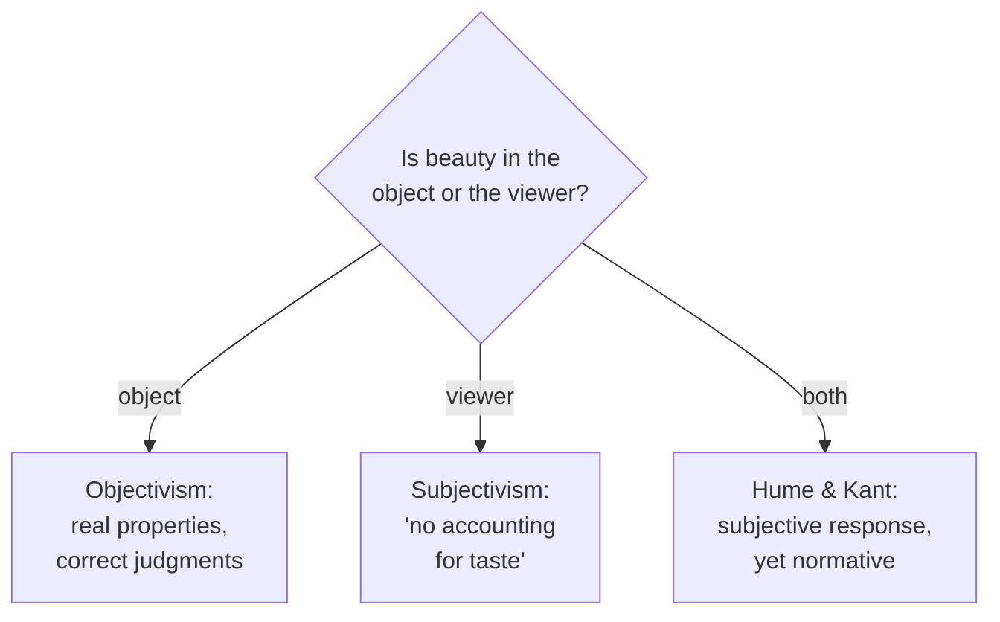

# Aesthetics

Aesthetics is the philosophy of art and beauty. It asks what makes something a **work of
art**, what an **aesthetic experience** is, whether **beauty** is a property of objects
or a response in us, how we can argue about **taste**, and why art has **value** at all.
It is a value-theoretic field alongside [ethics.md](ethics.md), and the two intersect
whenever we ask whether a work's moral content bears on its artistic worth.

## What is art?

There is no settled definition, and the history of the field is largely a sequence of
answers each broken by a counterexample.

- **Representation / mimesis** (Plato, Aristotle): art imitates reality. But abstract and
  non-representational art fit poorly.
- **Expression** (Romantics; Croce, Collingwood): art is the articulation of emotion or
  inner life. But not all art expresses, and much emotional expression is not art.
- **Formalism** (Bell, "significant form"): what matters is the arrangement of formal
  elements, not subject or feeling.
- **Institutional theory** (Dickie): something is art if the "artworld" — artists,
  critics, galleries — confers that status. This handles Duchamp's readymades but risks
  circularity.
- **Family resemblance** (after Wittgenstein): "art" names an open, evolving family with
  no single defining essence.

## Aesthetic experience and judgment

Beyond defining art, aesthetics examines the distinctive *experience* of attending to
something for its own sake — often described as disinterested, absorbed perception. When
we say "this is beautiful," are we reporting a feeling or claiming something others should
agree with? That tension is the central puzzle of taste.

## Beauty and taste: objective or subjective?

Two landmark attempts to escape the objective/subjective dilemma:

- **Hume, "Of the Standard of Taste":** judgments of taste are grounded in sentiment, so
  in one sense subjective — yet not all judgments are equal. The verdicts of *qualified
  critics* (sensitive, practiced, unprejudiced, with good sense) converge over time and
  constitute a *standard of taste*. Beauty is anchored in refined human response rather
  than in the object alone.
- **Kant, *Critique of the Power of Judgment*:** a judgment of beauty is *subjective*
  (based on the feeling of pleasure, not a concept) yet claims **universal validity** — we
  demand others agree. Beauty pleases *disinterestedly* (independent of desire or use) and
  exhibits "purposiveness without a purpose." This paradox of a subjective judgment with
  normative force is Kant's central contribution; it presupposes the theory of judgment
  built in [kant-critique-of-pure-reason.md](kant-critique-of-pure-reason.md).

## Representation, expression, and the value of art

Why does art matter? Candidate answers: it gives distinctive pleasure; it conveys
knowledge and moral insight unavailable through argument; it expresses and refines
emotion; it builds shared culture and identity. These do not compete so much as name
different roles the same work can play.

## Why it matters

Aesthetic questions surface directly in design. What makes an interface feel elegant,
coherent, or delightful — versus merely functional — is applied aesthetics, and the
Kant/Hume debate over whether taste is trainable underwrites the idea of design
craft and critique: see [../ux-design/index.md](../ux-design/index.md). The intersection
with [ethics.md](ethics.md) also matters for technology — whether an interface that is
beautiful but manipulative can be "good design" is both an aesthetic and a moral question.

## References

- Cross-field: [../ux-design/index.md](../ux-design/index.md)
- Related concept: [ethics.md](ethics.md)
- Anchoring work: [kant-critique-of-pure-reason.md](kant-critique-of-pure-reason.md)
