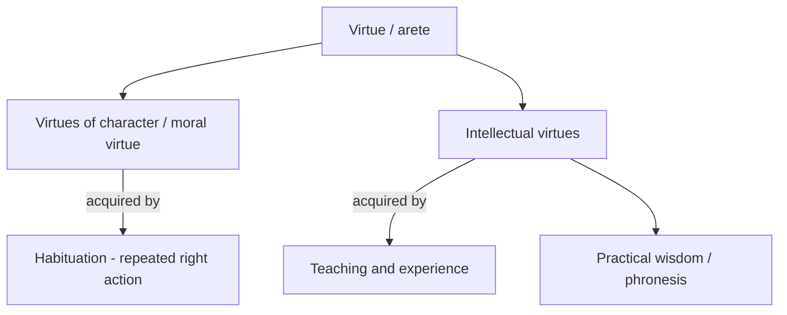

# Nicomachean Ethics (Aristotle)

Aristotle's *Nicomachean Ethics* (4th century BCE) is the founding text of **virtue
ethics** in the Western tradition. It asks not "which acts are right?" but "what kind of
person should I become, and what is the best life for a human being?" Its answer is
practical: ethics is not an exact science but a craft of good living, learned by doing.

## Eudaimonia and the function argument

Aristotle observes that every action aims at some good, and that these ends form a
hierarchy — we pursue money for the sake of other things, but the highest good must be
pursued **for its own sake**. That final good he calls **eudaimonia**, usually translated
"happiness" but better rendered *flourishing* or *living well*. It is not a feeling or a
momentary state but an activity spanning a complete life.

What is that activity? Here he gives the **function argument** (*ergon*): just as a good
flautist is one who plays the flute well, a good human is one who performs the
characteristic human function well. The distinctively human capacity is **rational
activity**. So the human good is *activity of the soul in accordance with virtue* — reason
exercised excellently over a full life. See [ethics.md](ethics.md).

## Virtue and the doctrine of the mean

Aristotle divides virtue in two:

**Virtues of character** (courage, temperance, generosity) are acquired by **habituation**
— we become just by doing just acts, brave by doing brave acts. Character is trained, not
taught. Each such virtue is a **mean** between two vices, one of excess and one of
deficiency: courage lies between recklessness and cowardice; generosity between wastefulness
and stinginess. This is the **golden mean** — but not a rigid midpoint. It is the
*appropriate* response "at the right time, toward the right people, for the right reason, in
the right way," relative to the situation and the person.

## Practical wisdom

Because the mean is situational, no rulebook can capture it. Finding it requires
**phronesis** — practical wisdom: the intellectual virtue of perceiving what the situation
calls for and deliberating well about how to act. Practical wisdom and moral virtue are
interdependent: virtue sets the right end, practical wisdom finds the right means. This is
why Aristotle insists ethics cannot be reduced to universal rules; the virtuous person's
trained perception does work no algorithm can.

## The best life

The *Ethics* closes by ranking lives. The life of moral virtue and political engagement is
excellent, but the highest happiness is the life of **contemplation** (*theoria*) — the
exercise of reason on the highest objects — because it most fully realizes the divine
element in us. This bridges Aristotle's ethics to his broader account of the soul, nature,
and being. See [metaphysics.md](metaphysics.md).

## References

- [The Nicomachean Ethics of Aristotle (Project Gutenberg)](https://www.gutenberg.org/ebooks/8438)
- Background: [Aristotle's Ethics (Stanford Encyclopedia of Philosophy)](https://plato.stanford.edu/entries/aristotle-ethics/)
