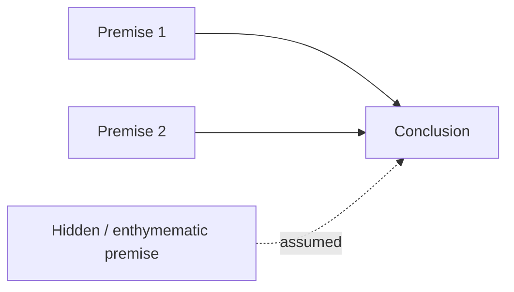

# Critical Thinking and Informal Logic

Informal logic is the study of arguments as they actually appear in natural
language — in essays, conversations, op-eds, courtrooms, and comment threads —
rather than the abstract symbol-pushing of the formal systems in the logic field.
Critical thinking is the disciplined habit that puts it to work: reading a claim,
finding the argument underneath the words, and judging whether the argument earns
the belief it asks for. Where the [logic field's formal treatment](../logic/informal-logic-and-argumentation.md)
supplies the machinery for validity and inference, the philosophy angle taken here
is evaluative and practical: *should a reasonable person be moved by this?*

This note is the philosophy-side companion to the formal treatment in
[informal-logic-and-argumentation.md](../logic/informal-logic-and-argumentation.md)
and the fallacy catalog in [fallacies.md](../logic/fallacies.md). Read those for
the logic-field mechanics; read this for how to reason well about arguments made
in ordinary language.

## Finding the argument: premises and conclusions

An **argument** is a set of statements in which some (the **premises**) are offered
as support for another (the **conclusion**). The first act of critical thinking is
structural: separate the claim being defended from the reasons given for it. Natural
language hides this. Conclusions are flagged by words like *therefore, thus, so,
hence, it follows that*; premises by *because, since, given that, for*. But much of
what fills a paragraph is neither — it is background, repetition, rhetorical
decoration, or throat-clearing. Reconstruction means stripping those away and, often,
supplying an unstated premise (an **enthymeme**) the arguer took for granted. Only
once the skeleton is exposed can it be judged.

## Deductive validity vs. inductive strength

Arguments come in two evaluative flavors, and confusing them is itself an error.

- A **deductive** argument aims for *validity*: if the premises are true, the
  conclusion **must** be true — the conclusion is already contained in the premises.
  Validity is all-or-nothing and says nothing about whether the premises are actually
  true. A valid argument with true premises is **sound**.
- An **inductive** argument aims for *strength*: if the premises are true, the
  conclusion is **probably** true — the premises make it more likely without
  guaranteeing it. Strength is a matter of degree. A strong inductive argument with
  true premises is **cogent**.

Most real-world reasoning — from scientific generalization to everyday prediction —
is inductive, so **cogency** (true premises + genuine support) is usually the
standard that matters. Demanding deductive certainty of an inductive argument, or
treating a strong induction as if a single counterexample refutes it, are both
misjudgments of the argument's own type. This maps directly onto the
[deductive/inductive distinction in the logic field](../logic/informal-logic-and-argumentation.md)
and onto how [science](philosophy-of-science.md) leans on inductive and abductive
inference.

## The disciplines of fair evaluation

Critical thinking is not the same as being contrarian. Several norms keep it honest:

- **The principle of charity.** Interpret an argument in its strongest reasonable
  form before criticizing it. Repair obvious slips, choose the more defensible reading
  of an ambiguous claim, and attack the best version. Refuting a weak paraphrase of
  someone's view proves nothing (and shades into the straw-man fallacy). Charity is
  also self-interested: if the best version still fails, the critique is decisive.
- **The burden of proof.** Whoever asserts a claim owes the support for it; the
  default is not to believe until the burden is met. Shifting that burden onto the
  doubter ("prove me wrong") is a rhetorical trick, not an argument — and it is the
  engine of the *appeal to ignorance*.
- **Rhetoric vs. logic.** Rhetoric is the art of persuasion; logic is the art of
  correct inference. They are independent. A conclusion can be true and defended by
  bad reasoning, or false and defended beautifully. Critical thinking asks whether the
  *reasons* support the claim, deliberately setting aside how compelling, fluent, or
  emotionally resonant the delivery is. This is why persuasive writing (see
  [ethics.md](ethics.md) on persuasion and manipulation) and valid argument must be
  assessed on different axes.
- **Cognitive biases vs. logical errors.** A **fallacy** is a defect in the argument
  — an inference that does not license its conclusion. A **cognitive bias** is a
  defect in the reasoner — a systematic tilt in how humans actually process evidence
  (confirmation bias, anchoring, motivated reasoning). The two interlock: biases make
  us *produce* fallacies and make fallacies *feel* convincing. Fixing the argument on
  paper does not fix the bias in the head, which is why critical thinking is a
  practiced habit and not a one-time checklist. This connects to
  [epistemology.md](epistemology.md): what counts as a good reason to believe, and how
  belief goes wrong.

## Fallacies

A **fallacy** is a pattern of reasoning that looks like it supports its conclusion
but does not. They persuade for predictable reasons: they mimic the *shape* of a
valid inference, they exploit cognitive shortcuts, they smuggle in an emotional or
social payload, or they trade on an ambiguity the listener does not pause to unpack.
Naming a fallacy is a diagnostic act — it locates *where* the support fails — but a
caution applies: an argument can commit no named fallacy and still be bad, and
labeling an argument "a fallacy" is not itself a refutation of its conclusion (that
would be the *fallacy fallacy*).

Fallacies split into two families. **Formal** fallacies are invalid by structure
alone — the logical form is broken regardless of content, and they belong to the
[formal fallacy catalog](../logic/fallacies.md) and
[propositional logic](../logic/propositional-logic.md). **Informal** fallacies are
structurally fine but defective in content, context, or relevance — these are the
staple of everyday argument.

| Fallacy | Family | What goes wrong | Why it persuades |
|---|---|---|---|
| **Affirming the consequent** | Formal | From *If P then Q* and *Q*, wrongly infers *P* | Mimics valid *modus ponens*; the conditional feels reversible |
| **Denying the antecedent** | Formal | From *If P then Q* and *not P*, wrongly infers *not Q* | Mimics valid *modus tollens*; "no cause, no effect" feels right |
| **Ad hominem** | Informal | Attacks the arguer instead of the argument | Character feels relevant; discrediting the person seems to discredit the claim |
| **Straw man** | Informal | Refutes a distorted, weaker version of the position | The distortion is easier to beat and often sounds like the original |
| **False dilemma** | Informal | Presents two options as exhaustive when more exist | Binary framing is cognitively simple and forces a choice |
| **Slippery slope** | Informal | Claims one step inevitably leads to an extreme end without warranting each link | Fear of the endpoint substitutes for evidence of the chain |
| **Appeal to authority** | Informal | Cites an authority who is irrelevant, biased, or not expert on the point | Deference to expertise is usually reasonable, so the shortcut feels safe |
| **Appeal to emotion** | Informal | Substitutes fear, pity, pride, or outrage for evidence | Emotion drives action faster than argument does |
| **Appeal to ignorance** | Informal | Treats "not disproven" as "proven" (or vice versa) | Absence of counterevidence masquerades as evidence |
| **Equivocation** | Informal | Shifts the meaning of a key term mid-argument | Same word looks like the same concept throughout |
| **Begging the question** | Informal | Assumes the conclusion among the premises (circular) | The reasoning is valid, so it sounds airtight — the smuggling is hidden |
| **Hasty generalization** | Informal | Draws a broad rule from too few or biased cases | Vivid examples feel representative |
| **Correlation vs. causation** | Informal | Infers *A causes B* from *A and B co-occur* | Temporal or statistical association intuitively reads as cause |
| **Whataboutism** | Informal | Deflects a criticism by pointing at the critic's faults | Reframes accountability as hypocrisy; changes the subject while feeling responsive |
| **Motte-and-bailey** | Informal | Defends a bold claim (bailey) by retreating to a modest one (motte) when challenged, then reclaims the bold one | Two claims share wording, so the easy defense seems to vindicate the hard claim |

Two entries deserve emphasis for their reach:

- **Correlation vs. causation** is the everyday face of a deep problem treated
  rigorously in [causal inference](../statistics/causal-inference.md): co-occurrence,
  confounding, and reverse causation can all produce the same pattern in the data, so
  causal claims require more than an observed association.
- **Motte-and-bailey** and **equivocation** are the ambiguity fallacies — both exploit
  a term or claim carrying two meanings, one easy to defend and one worth winning.
  Pinning down definitions is the antidote, which ties back to
  [philosophy of language](philosophy-of-language.md).

## Critical thinking in the age of AI

Large language models generate fluent, confident, well-structured prose — which is
exactly the profile that makes bad arguments *feel* good. An LLM can hallucinate a
citation, assert an invalid inference in flawless syntax, or produce a persuasive
paragraph with no valid argument inside it, because fluency and correctness are
independent (the rhetoric-vs-logic distinction, now automated at scale). See
[large-language-models.md](../ai/large-language-models.md) for how these systems
reason and where hallucinated arguments come from, and
[critical thinking during the age of AI](../ai-org/critical-thinking-during-the-age-of-ai.md)
for the practical stance: the reader's job — separating premises from conclusion,
checking sources, judging cogency, and naming the fallacy — becomes *more* essential,
not less, when the text is machine-generated. The tools of informal logic are the
defense.

## References

- [Informal Logic and Argumentation](../logic/informal-logic-and-argumentation.md) — the logic-field companion: argument structure, validity, and inference mechanics.
- [Fallacies](../logic/fallacies.md) — the logic-field catalog, including the formal fallacies in detail.
- [Logic field index](../logic/index.md) — hub for propositional, predicate, modal, and non-classical logic.
- [Epistemology](epistemology.md) — what counts as a good reason to believe.
- [Philosophy of Science](philosophy-of-science.md) — inductive and abductive inference in practice.
- [Ethics](ethics.md) — persuasion, manipulation, and the ethics of argument.
- [Causal Inference](../statistics/causal-inference.md) — the rigorous treatment of correlation vs. causation.
- [Large Language Models](../ai/large-language-models.md) — LLM reasoning and hallucinated arguments.
- [Critical Thinking During the Age of AI](../ai-org/critical-thinking-during-the-age-of-ai.md) — applying these tools to machine-generated text.
