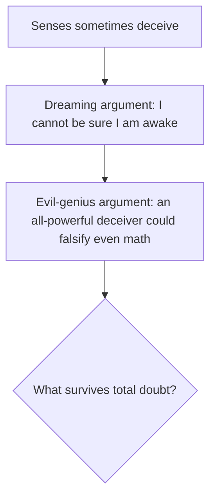

# Meditations on First Philosophy (Descartes)

René Descartes' *Meditations on First Philosophy* (1641) is a foundational text of modern
philosophy: a six-part first-person exercise in which the meditator tears down all prior
belief and rebuilds knowledge on certain foundations. It was published with six sets of
objections from other philosophers and Descartes' replies, which remain part of the work.

## The project: foundationalism

Descartes wants **perfect knowledge** — beliefs so secure they cannot later be overturned.
His epistemology is **foundationalist**: knowledge should rest on a small set of
indubitable first principles, with everything else derived from them, like a building on
bedrock. To find that bedrock he applies **methodic doubt**: reject as if false anything
that admits the slightest possibility of doubt, keeping only what survives. This is a
methodological device, not real skepticism — doubt is the tool for locating certainty. See
[epistemology.md](epistemology.md).

## The demolition: the doubting arguments

The First Meditation escalates through three doubts:

- **The senses** occasionally mislead, so perceptual beliefs are suspect.
- **The dreaming argument**: since dreams can feel exactly like waking life, no experience
  proves I am awake — undermining all beliefs based on the senses.
- **The evil-genius (deceiver) hypothesis**: suppose an all-powerful malicious being feeds
  me systematic illusions, so that even "2 + 3 = 5" or "a square has four sides" might be
  false. This hyperbolic doubt reaches even mathematics.

## The foundation: cogito ergo sum

The one thing the deceiver cannot falsify: that I am thinking. Even if I am deceived about
everything, *I* must exist to be deceived. **Cogito ergo sum** — "I think, therefore I am"
— is the first certainty, indubitable each time I entertain it. Descartes treats the *I*
that survives as a *thinking thing* (*res cogitans*): its essence is thought, known more
immediately than any body.

## Rebuilding and mind–body dualism

From the cogito Descartes rebuilds. He argues (controversially) for God's existence, and
because a perfect God would not be a deceiver, he can trust whatever he perceives **clearly
and distinctly** — restoring mathematics and, eventually, the external world. Along the way
he argues that mind and body are **distinct substances**: the mind is thinking and
unextended, the body extended and unthinking, and each can in principle exist without the
other. This **substance dualism** (later called Cartesian dualism) sets the agenda for the
philosophy of mind and the mind–body problem: how can two utterly different substances
interact? See [philosophy-of-mind.md](philosophy-of-mind.md) and
[metaphysics.md](metaphysics.md).

## References

- [Descartes' Epistemology — on the *Meditations* (Stanford Encyclopedia of Philosophy)](https://plato.stanford.edu/entries/descartes-epistemology/)
