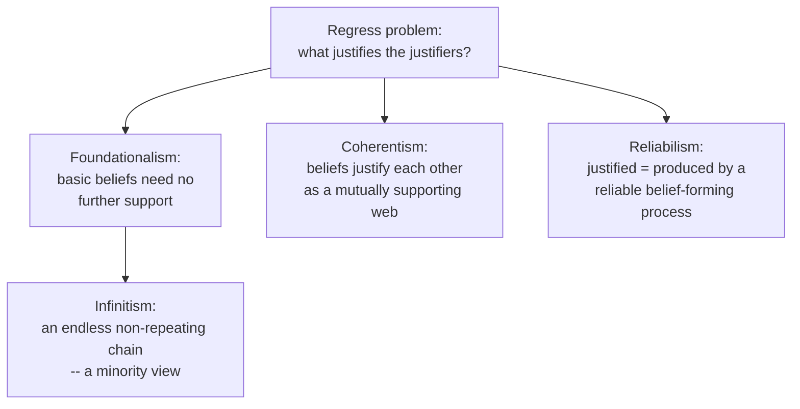

# Epistemology

**Epistemology** is the theory of knowledge: it asks what knowledge is, where it comes
from, how far it extends, and what makes a belief justified. Where
[metaphysics.md](metaphysics.md) asks *what there is*, epistemology asks *how we could
ever know it* — the two are the twin pillars of theoretical philosophy, and much of the
history of the subject is a negotiation between them.

## What is knowledge? The JTB analysis and Gettier

The traditional answer, traceable to Plato's *Theaetetus* (see
[plato-republic.md](plato-republic.md) for Plato's broader epistemic project), is that
knowledge is **justified true belief (JTB)**. To *know* that p, on this view, requires
three things:

1. **Belief** — you actually accept that p.
2. **Truth** — p is in fact the case.
3. **Justification** — you have adequate grounds for believing p.

In 1963 Edmund Gettier published two short counterexamples showing JTB is not
*sufficient*. In a **Gettier case** a belief is true and justified, yet the justification
connects to the truth only by luck, so we hesitate to call it knowledge. (Classic form:
you justifiably believe "the person who gets the job has ten coins in their pocket" on the
basis of evidence about one candidate, but it turns out *you* get the job and *you* happen
to have ten coins — true and justified, but not knowledge.) The **Gettier problem**
launched a decades-long search for a fourth condition or a replacement analysis: a "no
false lemmas" clause, causal theories, reliabilism, and safety/sensitivity conditions
have all been proposed. No repair commands consensus, and some conclude the concept of
knowledge simply resists tidy analysis.

## Sources of knowledge: rationalism vs empiricism

A second axis concerns *where* justified belief comes from.

- **Rationalism** (Descartes, Spinoza, Leibniz) holds that substantial knowledge can be
  had by reason alone, independent of the senses. Descartes' method of doubt and his
  *cogito* ("I think, therefore I am") aim for certainty reached from the armchair — see
  [descartes-meditations-on-first-philosophy.md](descartes-meditations-on-first-philosophy.md).
- **Empiricism** (Locke, Berkeley, Hume) holds that all substantive knowledge traces back
  to sense experience — the mind begins as a *tabula rasa*.

The distinction is often drawn in terms of two orthogonal pairs:

| Distinction | Contrast | Belongs to |
| --- | --- | --- |
| **A priori / a posteriori** | justified *independently of* experience vs *through* experience | epistemology (how justified) |
| **Analytic / synthetic** | true by meaning alone vs true in virtue of the world | semantics ([philosophy-of-language.md](philosophy-of-language.md)) |
| **Necessary / contingent** | could not have been otherwise vs merely happens to be | [metaphysics.md](metaphysics.md) |

Kant's great synthesis argued for **synthetic a priori** knowledge — substantive truths
(mathematics, the causal structure of experience) knowable in advance because the mind
imposes them on all possible experience; see
[kant-critique-of-pure-reason.md](kant-critique-of-pure-reason.md). Later, Quine attacked
the analytic/synthetic distinction itself, blurring the neat map.

## Skepticism

**Skepticism** presses the question of whether we know anything at all. The strongest
arguments are *closure*-based: I can't rule out that I am a brain in a vat (or dreaming, or
deceived by an evil demon), so I can't know the ordinary things that entail I'm *not* in
such a scenario. Responses include Descartes' foundationalist reconstruction, Moore's
common-sense refusal ("here is a hand"), contextualism (the standards for "knows" shift
with context), and relevant-alternatives theories (you needn't rule out far-fetched
possibilities). Skepticism is less a doctrine to be adopted than a stress test every
theory of justification must survive.

## The structure of justification

If beliefs are justified by other beliefs, what stops the regress? The main structural
answers:

- **Foundationalism** stops the regress at *basic* beliefs (sense experience, self-evident
  truths) that are justified non-inferentially.
- **Coherentism** rejects any privileged foundation: justification is holistic, a matter of
  how well a belief fits the overall web. The worry is that a coherent story can still be
  detached from reality.
- **Reliabilism** shifts from internal reasons to the *process*: a belief is justified if
  produced by a reliable mechanism (good eyesight, sound inference), whether or not the
  believer can articulate why. This is an *externalist* theory — it also offers one popular
  Gettier fix.

The deep fault line here is **internalism vs externalism**: must the justifiers be
accessible to the believer's own reflection, or can they be facts about the world the
believer needn't know? Assessing arguments for these positions is itself an exercise in
[../logic/informal-logic-and-argumentation.md](../logic/informal-logic-and-argumentation.md).

## Bayesian epistemology

A modern, formal turn treats justification as a matter of *degree*. On **Bayesian
epistemology**, rational belief is a probability (a *credence*) between 0 and 1, and
learning is **conditionalization** — updating credences by Bayes' rule as evidence
arrives. This reframes classic problems: confirmation becomes probability-raising,
coherence becomes obedience to the probability axioms, and the value of evidence becomes
quantifiable. It connects epistemology directly to statistical inference; see
[../statistics/bayesian-inference.md](../statistics/bayesian-inference.md). Critics note it
struggles with the *problem of old evidence*, with where priors come from, and with the
idealization that agents are logically omniscient — but as a normative model of rational
learning it is unusually precise.

## Why it matters

Epistemology sets the terms for every other inquiry: what counts as evidence in
[philosophy-of-science.md](philosophy-of-science.md), how we should weigh testimony and
disagreement, and — increasingly — how we should think about knowledge in artificial
systems that form "beliefs" from data (see [../ai/index.md](../ai/index.md)). A theory of
knowledge is, in the end, a theory of when we are entitled to be confident.

## References

- [Descartes, *Meditations on First Philosophy*](descartes-meditations-on-first-philosophy.md) — the founding text of modern epistemology: method of doubt, the *cogito*, and a foundationalist reconstruction of knowledge.
- [Kant, *Critique of Pure Reason*](kant-critique-of-pure-reason.md) — the synthesis of rationalism and empiricism and the theory of synthetic a priori knowledge.
