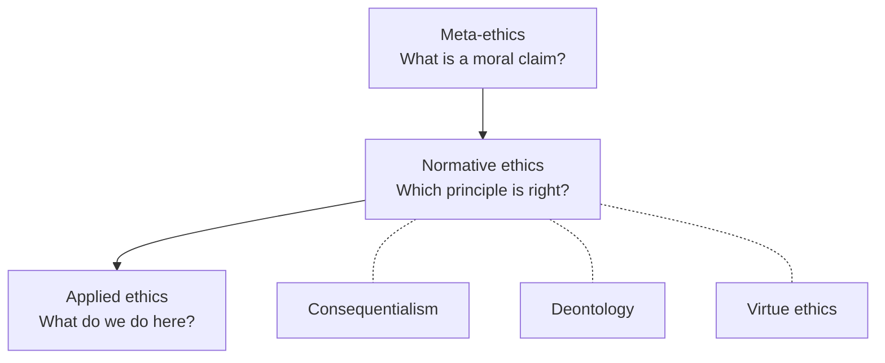

# Ethics

Ethics (moral philosophy) is the systematic study of how we ought to act — what makes an
action right or wrong, a character good or bad, an outcome better or worse. It is
usually divided into three layers that sit at different levels of abstraction:
**meta-ethics** (what moral claims *are*), **normative ethics** (which general
principles we should live by), and **applied ethics** (what those principles imply for a
concrete problem).

## Meta-ethics: what moral claims are

Before asking *which* actions are right, meta-ethics asks whether that question even has
a fact-shaped answer.

- **Moral realism** holds that there are objective moral facts, true independent of what
  anyone believes — "torturing the innocent for fun is wrong" is true the way "2+2=4" is
  true.
- **Anti-realism** denies mind-independent moral facts. Its variants include
  *subjectivism* (moral claims report attitudes), *emotivism/expressivism* (they express
  feelings or endorsements rather than state facts), and *error theory* (moral claims aim
  at facts but all fail, because there are none).
- The **is–ought gap** (Hume): you cannot validly derive a prescriptive conclusion
  ("we *ought* to X") purely from descriptive premises ("X *is* the case"). A related
  worry is Moore's *naturalistic fallacy* — the mistake of defining "good" in terms of
  some natural property. These arguments are why ethics resists reduction to plain
  empirical science, and why value questions in engineering and AI cannot be settled by
  measurement alone.

## Normative ethics: the three main frameworks

Normative theories answer "what should I do?" by locating moral worth in different
things: the *outcome*, the *act/rule*, or the *agent*.

| Framework | Locus of value | Core test | Signature difficulty |
|---|---|---|---|
| Consequentialism | Results | Which act produces the best outcomes? | Can justify sacrificing individuals |
| Deontology | Acts / duties | Does the act respect binding rules and rights? | Rigid; can forbid clearly good outcomes |
| Virtue ethics | Character | What would a person of good character do? | Vague on hard cases; culturally variable |

### Consequentialism / utilitarianism
Rightness depends on results. **Utilitarianism** (Bentham, then Mill) says the right act
is the one that maximizes aggregate well-being — "the greatest good for the greatest
number." Bentham's version is hedonic (pleasure minus pain); Mill distinguished higher
from lower pleasures. Strengths: impartial, quantifiable, action-guiding. Objections: it
can license harming a few for the many, and demands we always optimize. See
[political-philosophy.md](political-philosophy.md) for Mill's parallel work on liberty.

### Deontology
Rightness depends on conforming to duties and respecting rights, whatever the
consequences. Kant's **categorical imperative** is the paradigm: act only on a maxim you
could will to become a universal law, and always treat humanity **as an end, never merely
as a means**. Duties bind unconditionally, not because they pay off. This is the ancestor
of modern rights talk. The framework grounds much of
[../engineering/engineering-ethics.md](../engineering/engineering-ethics.md) — duties of
honesty, safety, and non-manipulation hold even when a shortcut would "work." Kant's moral
theory presupposes the account of reason developed in
[kant-critique-of-pure-reason.md](kant-critique-of-pure-reason.md).

### Virtue ethics
Rather than asking which *act* is right, virtue ethics asks what a person of excellent
**character** would do, and how to become such a person. Aristotle's
[aristotle-nicomachean-ethics.md](aristotle-nicomachean-ethics.md) is the founding text:
the good life is *eudaimonia* (flourishing), reached by cultivating virtues — courage,
justice, temperance, practical wisdom — as stable dispositions, each a mean between
excess and deficiency. The Stoics gave virtue ethics its most practice-oriented form; see
[stoicism-and-practical-philosophy.md](stoicism-and-practical-philosophy.md).

## Applied ethics

Applied ethics brings the frameworks to bear on concrete domains: bioethics, business
ethics, environmental ethics, and — increasingly — technology and AI. In practice most
serious moral reasoning is *pluralist*: it weighs consequences, respects rights, and asks
what a person of good character would do, rather than mechanically applying one theory.

## Why it matters: ethics and AI

Ethics is now load-bearing for computing. **AI alignment** — getting systems to pursue
what we actually value — is a direct descendant of these debates: the is–ought gap warns
that you cannot read values off data; consequentialism underwrites reward-based
optimization (and inherits its failure modes, like reward hacking and repugnant
trade-offs); deontology motivates hard constraints and rights the system may not violate;
virtue ethics inspires framing models as agents whose *dispositions* we shape. The
governance side of this is developed in [../ai-governance/index.md](../ai-governance/index.md),
and the specific practice of building AI is treated in
[philosophy-of-ai.md](philosophy-of-ai.md). Related foundations:
[free-will-and-determinism.md](free-will-and-determinism.md) (whether responsibility even
makes sense) and [existentialism-and-meaning.md](existentialism-and-meaning.md) (choosing
values without a given foundation).

## References

- Cross-field: [../ai-governance/index.md](../ai-governance/index.md),
  [../engineering/engineering-ethics.md](../engineering/engineering-ethics.md),
  [../personal-development/mans-search-for-meaning.md](../personal-development/mans-search-for-meaning.md),
  [../economics/index.md](../economics/index.md)
- Anchoring works: [aristotle-nicomachean-ethics.md](aristotle-nicomachean-ethics.md),
  [kant-critique-of-pure-reason.md](kant-critique-of-pure-reason.md)
