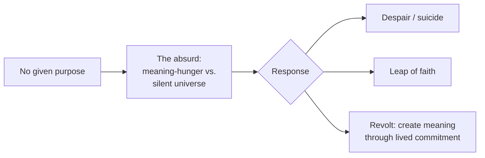

# Existentialism and Meaning

Existentialism is the tradition that begins from concrete, first-person existence rather
than abstract systems, and asks how to live when no external authority hands us a purpose.
Its rallying phrase, from Sartre, is **"existence precedes essence"**: unlike a
manufactured tool, which is designed for a purpose before it exists, a human being first
exists and only *then* defines what it is through choices. There is no pre-given human
nature to fulfill — we are "condemned to be free."

## The core claims

- **Radical freedom and responsibility.** Because no fixed essence or cosmic script
  determines us, we are wholly responsible for who we become. This is exhilarating and
  crushing at once. It stands opposed to hard determinism (see
  [free-will-and-determinism.md](free-will-and-determinism.md)); existentialists take the
  lived experience of choice as the starting datum rather than a problem to explain away.
- **Anxiety (*angst*)** is the mood in which this freedom becomes vivid — not fear of a
  particular object, but dread before the openness of one's own possibilities.
  Kierkegaard called anxiety "the dizziness of freedom." Heidegger tied it to
  *being-toward-death* — authentic existence means owning one's finitude rather than
  fleeing into the anonymous "they" (*das Man*).
- **Authenticity vs. bad faith.** Sartre's **bad faith** (*mauvaise foi*) is
  self-deception in which we deny our freedom — pretending our roles, circumstances, or
  "nature" force our hand, so we don't have to own our choices. Authenticity is the honest
  acknowledgment of freedom and responsibility.

## Key thinkers

| Thinker | Contribution |
|---|---|
| Kierkegaard | Founder; the "leap of faith," anxiety, the primacy of the individual over the crowd |
| Nietzsche | "God is dead"; the collapse of inherited values; creating one's own |
| Heidegger | *Being and Time*; authenticity, being-toward-death, the "they" |
| Sartre | "Existence precedes essence"; radical freedom, bad faith |
| de Beauvoir | Ethics of freedom; existentialist analysis of gender and situation |
| Camus | The absurd; revolt, freedom, and passion as the response |

## The absurd and the search for meaning

Camus names the **absurd** as the collision between our craving for meaning and a universe
that offers none. His question in *The Myth of Sisyphus* — "should I commit suicide?" — is
whether life is worth living without inherent meaning. His answer is neither despair nor a
"leap" to religion, but **revolt**: to live fully and lucidly *in spite of* the absurd.
"One must imagine Sisyphus happy" — meaning is *made*, in the living, not discovered.

This is the philosophical backdrop to a lived answer: Viktor Frankl's account of finding
purpose even in a concentration camp argues that meaning is chosen and enacted, not
supplied — see [../personal-development/mans-search-for-meaning.md](../personal-development/mans-search-for-meaning.md).
It also converges, from a very different starting point, with the ancient practical
tradition that we control our judgments and responses if nothing else:
[stoicism-and-practical-philosophy.md](stoicism-and-practical-philosophy.md).

## Why it matters

Existentialism reframes the question "what is the meaning of life?" from a puzzle to be
solved into a task to be performed. Where [ethics.md](ethics.md) asks which values are
right, existentialism asks how to commit to *any* values authentically once we admit no
one hands them to us — a stance with real weight for anyone building a life or a body of
work by deliberate choice rather than default.

## References

- Cross-field: [../personal-development/mans-search-for-meaning.md](../personal-development/mans-search-for-meaning.md)
- Related concepts: [free-will-and-determinism.md](free-will-and-determinism.md),
  [stoicism-and-practical-philosophy.md](stoicism-and-practical-philosophy.md),
  [ethics.md](ethics.md)
