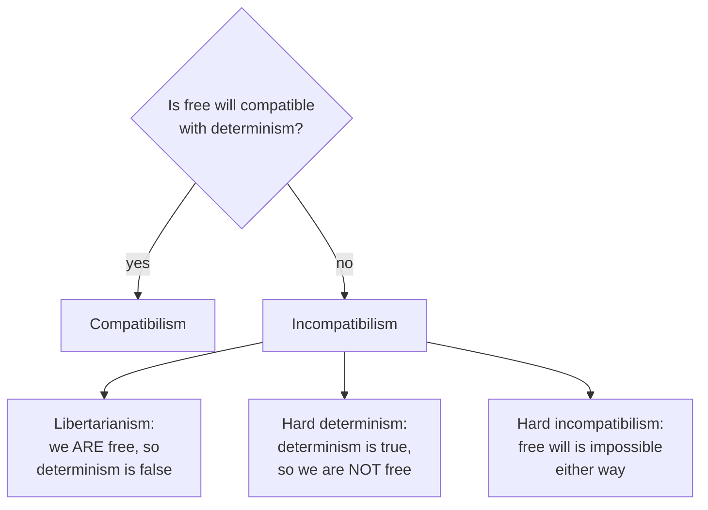

# Free Will and Determinism

Are our choices genuinely *up to us*? The **free will problem** asks whether human agents
have the kind of control over their actions that grounds praise, blame, desert, and
responsibility — and whether such control is compatible with the world being a causal
system. It sits at the intersection of [metaphysics.md](metaphysics.md) (what causation and
possibility are), [ethics.md](ethics.md) (what responsibility requires), and, increasingly,
neuroscience (what the brain is actually doing when we "decide"; see
[../neuroscience/index.md](../neuroscience/index.md)).

## Determinism

**Determinism** is the thesis that every event, including every human choice, is
necessitated by prior states of the world together with the laws of nature. Given the past
and the laws, only one future is possible. Note what determinism is *not*: it is not
fatalism (the idea that outcomes occur regardless of what you do), and it is not
predictability in practice. It is a claim about metaphysical necessitation. A related worry
survives even if physics is *indeterministic*: if some choices are the product of quantum
randomness, that looks no more like *free* agency than clockwork does — mere chance is not
control.

## The core dilemma

The classic argument sets two intuitions against each other:

1. If determinism is true, I could never have done otherwise, so I am not free.
2. If determinism is false (my actions are undetermined), then my actions are random, so I
   am not free either.

This is the shape of the whole debate — positions are defined by which horn they grasp.

## The main positions

- **Libertarian free will** (metaphysical libertarianism — unrelated to the political term)
  holds that we do have free will *and* that this requires determinism to be false. Genuine
  agency involves an origination that breaks the causal chain — often located in
  *agent-causation* (the agent, not a prior event, is the source of the action). The
  standing objection is the *intelligibility problem*: how can an undetermined choice be
  anything but a lucky accident? Libertarians owe an account of control that is neither
  necessitated nor random.

- **Hard determinism** accepts determinism and concludes we are *not* free and not
  ultimately morally responsible. Blame and desert, on this view, rest on an illusion —
  though our practices might be rebuilt around forward-looking aims (deterrence,
  rehabilitation) rather than backward-looking desert.

- **Compatibilism** (Hume, Frankfurt, Dennett) — the majority view among philosophers —
  denies the dilemma's first horn. Freedom, it argues, is not the absence of causation but
  the *right kind* of causation: an act is free when it flows from the agent's own desires
  and deliberation, unconstrained by coercion, compulsion, or manipulation. "Could have done
  otherwise" is read *conditionally* — you would have acted differently had you chosen
  differently — not as a demand to have violated the laws of nature. Harry Frankfurt sharpened
  this with **hierarchical** accounts (freedom is willing the desires you want to have) and
  with cases arguing responsibility doesn't even require alternative possibilities.

- **Hard incompatibilism** (Pereboom) grasps both horns: free will of the responsibility-
  grounding kind is impossible whether or not determinism holds — determined action isn't up
  to us, and undetermined action is mere luck. Like the hard determinist, the hard
  incompatibilist argues our moral and legal practices can and should be revised accordingly.

## Implications for moral responsibility

The stakes are practical. Desert-based punishment, moral praise and blame, guilt, gratitude,
and the reactive attitudes (resentment, indignation) all seem to presuppose that agents
*could* have done otherwise and are the true sources of their acts. P.F. Strawson's
influential move was to argue that these **reactive attitudes** are so deeply woven into
human relationships that no metaphysical thesis about determinism could — or should —
dislodge them; responsibility is grounded in our practices, not in a prior metaphysics. The
debate thus feeds straight back into [ethics.md](ethics.md): a theory of the good and the
right needs some workable notion of an accountable agent.

## The neuroscience angle: Libet and after

Experimental work has pushed the question into the lab. In the 1980s Benjamin **Libet**
found that a measurable brain signal — the *readiness potential* — precedes a subject's
reported conscious decision to move by a few hundred milliseconds, suggesting the brain
"initiates" the act before the person is aware of deciding. Some read this as empirical
evidence against free will. But the interpretation is contested on several fronts: the
readiness potential may reflect ordinary decision *build-up* rather than a fixed commitment
(later work suggests it can be a stochastic accumulation of noise); the reported timing is
notoriously unreliable; Libet himself proposed a residual power to *veto* the impending act
("free won't"); and the simple flick-of-the-wrist paradigm may not model deliberate,
reason-guided choice at all. The neuroscience sharpens the questions without settling them —
see [../neuroscience/index.md](../neuroscience/index.md) for how decision and action are
implemented in neural circuits. A parallel question is now emerging for artificial agents:
if a system's outputs are fixed by weights and inputs, in what sense — if any — could it
"choose"? (See [../ai/index.md](../ai/index.md).)

## Why it matters

Almost every institution that assigns responsibility — law, morality, everyday
relationships — rests on some assumption about free agency. Whether that assumption is
metaphysically well-founded, merely pragmatic, or an illusion we cannot live without is one
of philosophy's most consequential open questions.

## References

- [Aristotle, *Nicomachean Ethics*](aristotle-nicomachean-ethics.md) — the earliest systematic treatment of voluntary action, choice, and the conditions of moral responsibility.
- [Kant, *Critique of Pure Reason*](kant-critique-of-pure-reason.md) — the account of freedom as compatible with a causally determined phenomenal world (the third antinomy).
