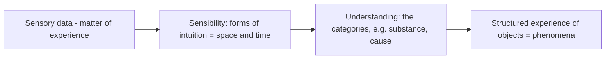

# Critique of Pure Reason (Kant)

Immanuel Kant's *Critique of Pure Reason* (1781; heavily revised 1787) is one of the most
influential and difficult works in Western philosophy. It responds to a crisis: rationalists
claimed reason alone could know reality (God, soul, cosmos), while Hume's empiricism seemed
to show that even causation is only habit, threatening both science and metaphysics. Kant's
aim is a *critique of reason by reason itself* — to map exactly what human understanding can
and cannot know.

## The core question: synthetic a priori knowledge

Kant sorts judgments along two axes:

- **Analytic vs. synthetic** — whether the predicate is already contained in the subject
  ("all bachelors are unmarried" is analytic; "the cat is on the mat" is synthetic, adding
  information).
- **A priori vs. a posteriori** — whether knowable independent of experience, or only
  through it.

The hard cases are **synthetic a priori** judgments: substantive claims (they add
information) that are nonetheless necessary and knowable in advance of experience — such as
"7 + 5 = 12" or "every event has a cause." Kant's driving question: *how is synthetic a
priori knowledge possible?* His answer reshapes epistemology and metaphysics. See
[epistemology.md](epistemology.md).

## The Copernican revolution

Kant's move is to reverse the usual assumption. Instead of the mind conforming to objects,
**objects conform to the mind's ways of knowing**. Just as Copernicus explained the heavens
by factoring in the observer's motion, Kant explains experience by factoring in the
knower's contributions.

Two faculties cooperate to build experience: **sensibility** supplies the pure forms of
**space and time** (the *a priori* frame of all perception), and the **understanding**
supplies the **categories** — twelve pure concepts such as substance and causation. The
central argument (the *transcendental deduction*) shows the categories are not optional
add-ons but *necessary conditions* of having any unified experience at all: without them,
there could be no coherent objects and no self-conscious "I think" to accompany our
representations. This is why synthetic a priori knowledge is possible — it describes the
structure the mind necessarily imposes.

## Phenomena, noumena, and transcendental idealism

The price is a limit. We can know only **phenomena** — things *as they appear* to us,
structured by space, time, and the categories. We cannot know **noumena** — *things in
themselves*, as they are independent of our cognition. This is **transcendental idealism**:
appearances are empirically real but transcendentally ideal (dependent on our forms of
cognition). Interpreters split over whether this posits two worlds (appearances vs. things
in themselves) or two aspects of one world. See [metaphysics.md](metaphysics.md).

The consequence for metaphysics is decisive: traditional attempts to prove claims about God,
the immortal soul, or the cosmos as a whole overreach, applying the categories beyond
possible experience — and collapse into contradiction (the *antinomies*). Metaphysics as a
science of things-in-themselves is impossible; but a disciplined critique secures the ground
for Newtonian science and reserves space for morality and faith.

## References

- [The Critique of Pure Reason — Kant (Project Gutenberg, Meiklejohn translation)](https://www.gutenberg.org/ebooks/4280)
- Background: [Immanuel Kant (Stanford Encyclopedia of Philosophy)](https://plato.stanford.edu/entries/kant/)
