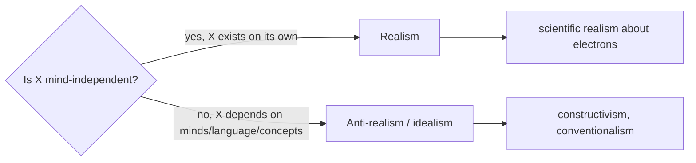

# Metaphysics

**Metaphysics** is the study of the most general features of reality: what exists, what
kinds of things there are, and what they are fundamentally like. It asks the questions that
no special science asks because every special science presupposes their answers — what is a
thing, what is a cause, what is it for something to persist through change. Where
[epistemology.md](epistemology.md) asks *how we can know*, metaphysics asks *what there is
to be known*. The name is an accident of cataloguing (Aristotle's editors placed these
books *after* the *Physics*, *ta meta ta physika*), but the subject is central: Aristotle
himself called it "first philosophy."

## Being and ontology

**Ontology** is the inventory question: what exists? Candidates run from the concrete
(tables, electrons, people) to the abstract (numbers, sets, propositions) to the disputed
(possible worlds, moral facts, holes, God). A recurring strategy is to distinguish the
*fundamental* entities from those that merely *depend on* them — to give the world's "ground
floor" and show how everything else is built from it. Ontological disputes are rarely about
whether we can *talk* about a thing and more about whether it is a genuine addition to
being or a convenient fiction.

## Universals and particulars

Two red apples share something — redness. Is that shared feature a real entity?

- **Realism about universals** (Plato, Aristotle): properties are real, repeatable
  entities. For Plato they exist in a separate realm of Forms
  ([plato-republic.md](plato-republic.md)); for Aristotle they exist *in* the things that
  instantiate them.
- **Nominalism**: only particular objects exist; "redness" is just a name (*nomen*) or a
  set of resembling particulars. There is no extra thing over and above the red things.

This ancient dispute — the **problem of universals** — still shapes debates about the
metaphysics of properties, sets, and mathematical objects.

## Causation

What is it for one event to *cause* another? Hume's challenge is the pivot: observing the
world, we find only *constant conjunction* (B regularly follows A) and *temporal priority*,
never a perceivable "necessary connection." Major theories try to recover more:

- **Regularity / Humean** — causation just *is* lawlike regular succession.
- **Counterfactual** (Lewis) — C causes E when, had C not occurred, E would not have.
- **Probabilistic** — causes raise the probability of their effects.
- **Interventionist / manipulability** — C causes E if intervening on C changes E; this is
  the modern account behind causal modeling and connects to
  [../statistics/bayesian-inference.md](../statistics/bayesian-inference.md) and causal
  inference in statistics.

Hume's problem also seeds a distinct epistemic worry — the **problem of induction** —
taken up in [philosophy-of-science.md](philosophy-of-science.md).

## Identity and persistence

What makes something *the same thing* over time? The **Ship of Theseus** — every plank
replaced, then the old planks reassembled — dramatizes the puzzle: which ship is the
original? Distinct notions of identity are at stake: *numerical* identity (one and the same
object) versus *qualitative* identity (exactly similar). Two broad views of persistence:

- **Endurantism** — objects are wholly present at each moment and persist by *enduring*
  through time.
- **Perdurantism** — objects are four-dimensional "worms" with temporal parts, persisting by
  *having different parts* at different times.

**Personal identity** — what makes you the same person across a lifetime — is the most
charged instance, feeding directly into [free-will-and-determinism.md](free-will-and-determinism.md)
and moral responsibility.

## Modality: possibility and necessity

**Modal metaphysics** studies what *could* be and what *must* be — the necessary, the
possible, the contingent. The dominant framework analyzes these in terms of **possible
worlds**: p is necessary if true in all possible worlds, possible if true in at least one.
Whether such worlds are real concrete places (Lewis's *modal realism*) or useful
abstractions divides the field. The formal machinery of this reasoning lives in
[../logic/informal-logic-and-argumentation.md](../logic/informal-logic-and-argumentation.md)
and, more technically, in modal logic (see [../logic/index.md](../logic/index.md)).

## Time

Is time a series of equally real moments, or does only the present exist?

- **A-theory / presentism** — the present is metaphysically special; the passage of time
  (past → present → future) is real and objective.
- **B-theory / eternalism** — all times are equally real ("earlier than"/"later than" are
  the only real temporal relations); "now" is like "here," an indexical, not a privileged
  fact. This "block universe" fits neatly with relativity physics.

## Mind and body

Whether mental states are physical states of the brain, non-physical, or something else is
itself a metaphysical question — the **mind–body problem** — treated in its own note:
[philosophy-of-mind.md](philosophy-of-mind.md). Kant's transcendental idealism, which
holds that space, time, and causation are forms the mind imposes rather than features of
things-in-themselves, is a landmark attempt to fix the limits of metaphysical knowledge;
see [kant-critique-of-pure-reason.md](kant-critique-of-pure-reason.md).

## The realism debate

Cutting across all of the above is a single question: are the entities in question
**mind-independent** or in some way constituted by us?

The same realism/anti-realism template recurs across philosophy — about universals, moral
facts, mathematical objects, and unobservable scientific entities (see the scientific
realism debate in [philosophy-of-science.md](philosophy-of-science.md)). That structural
recurrence is part of why metaphysics is "first" philosophy: its questions are load-bearing
for everything downstream.

## Why it matters

Every domain smuggles in metaphysical commitments — a physics assumes a theory of time and
causation, an ethics assumes something about persons and freedom, an AI system assumes a
stance on what its represented "objects" are. Making those commitments explicit is what
metaphysics does, and doing it badly quietly corrupts the inquiries built on top.

## References

- [Aristotle, *Nicomachean Ethics*](aristotle-nicomachean-ethics.md) — companion to Aristotle's *Metaphysics*; his substance/form/matter framework and account of causes underlie the Western metaphysical tradition.
- [Kant, *Critique of Pure Reason*](kant-critique-of-pure-reason.md) — the critical limits of metaphysics and the transcendental account of space, time, and causation.
