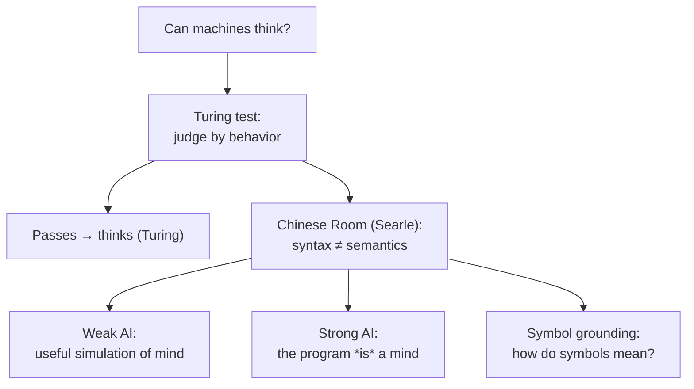

# Philosophy of AI

**Philosophy of AI** asks whether machines can *think*, *understand*, or *be conscious* — and
what those words even mean once a machine is fast and fluent enough to imitate a mind. It
inherits the [mind-body problem](philosophy-of-mind.md): if the mind is a functional program
(functionalism), a machine running the right program should have a mind; if consciousness has
an irreducible subjective side (the hard problem), fluency guarantees nothing. Large language
models have made these once-abstract debates concrete and urgent
([../ai/large-language-models.md](../ai/large-language-models.md),
[../ai/index.md](../ai/index.md)).

## Can machines think? The Turing test

Alan Turing, in
[computing-machinery-and-intelligence.md](turing-computing-machinery-and-intelligence.md),
proposed replacing the unanswerable "Can machines think?" with an operational one: the
**imitation game**. A human interrogator exchanges text with a hidden human and a hidden
machine; if the interrogator cannot reliably tell which is which, the machine is granted
thinking status. Turing's move is deliberately **behaviorist**: he sidesteps inner experience
and judges by outward performance, defusing objections in advance (the "theological," the
"heads in the sand," Lady Lovelace's "it only does what we tell it").

Critics reply that the test measures **imitation, not cognition**. A system could pass by
clever mimicry with nothing "going on inside." The test is a sufficient-seeming *behavioral*
criterion that may say nothing about understanding or experience — exactly the gap the next
argument exploits.

## Syntax vs semantics: Searle's Chinese Room

John Searle's **Chinese Room** is the most famous rebuttal. Imagine Searle, who knows no
Chinese, locked in a room with a giant rulebook. Chinese symbols come in; he looks them up and
follows purely formal rules to produce Chinese symbols out. To outsiders the room answers in
fluent Chinese and passes the Turing test — yet Searle understands nothing. He manipulates
**syntax** (symbol shapes) with no access to **semantics** (meaning). The moral: running a
program is **not sufficient for understanding**, because "the syntax is not sufficient for the
semantics." A digital computer, being purely syntactic, could never thereby understand.

The standard replies map the debate:

- **Systems reply** — Searle-in-the-room doesn't understand, but the *whole system* (person +
  rulebook + room) does. Searle: let him memorize the rulebook and work outdoors; still no
  understanding.
- **Robot reply** — put the program in a body with sensors and effectors, grounding symbols in
  the world. This concedes Searle's core point: pure symbol-shuffling isn't enough; you need a
  causal link to the world. That link is the **symbol-grounding problem** (Harnad): how do a
  system's internal symbols acquire meaning rather than merely being defined by other
  ungrounded symbols? See [philosophy-of-language.md](philosophy-of-language.md).
- **Brain-simulator reply** — simulate the neuron-by-neuron activity of a Chinese speaker.
  Searle: simulating the *form* of neural activity still leaves out whatever the biology
  actually does to produce meaning.

## Strong vs weak AI

Searle's distinction frames the field:

- **Weak AI** — AI is a powerful *tool* and a *model* of cognition; running it *simulates*
  thinking, the way a weather model simulates a storm without being wet. Almost no one disputes
  weak AI.
- **Strong AI** — the appropriately programmed computer literally *has* a mind: it understands,
  believes, and (perhaps) experiences. This is what functionalism licenses and what the Chinese
  Room denies.

A simulation objection sharpens the split: a perfect simulation of digestion won't digest a
pizza, so why expect a simulation of thinking to think? Defenders answer that cognition, unlike
digestion, may just *be* information processing — in which case the simulation is the real
thing.

## Machine consciousness and the frame problem

- **Machine consciousness.** Passing behavioral tests is silent on the **hard problem**
  ([philosophy-of-mind.md](philosophy-of-mind.md)): is there *something it is like* to be the
  system, or only sophisticated behavior with the lights off? We have no agreed test for
  phenomenal experience in any system other than ourselves — the **other-minds problem** made
  acute by machines that talk about their "feelings."
- **The frame problem.** Originally a technical AI puzzle — how does a system know *which* facts
  change and which stay fixed when it acts, without checking everything? — it became a
  philosophical worry about **relevance**: humans effortlessly zero in on what matters in an
  open-ended situation, and it is unclear how any formal system does this without an
  intractable search. It is a standing challenge to symbolic AI and a lens on what general
  intelligence requires.

## What LLMs do and don't settle

Modern [large language models](../ai/large-language-models.md) are, in one reading, the Chinese
Room realized at scale: vast statistical machinery over token sequences, ungrounded except
through text. They **do** show that fluent, contextually apt, seemingly-understanding behavior
is achievable by "mere" syntax — which is either a triumph over Searle or a vindication of him,
depending on whether you think behavior settles the question. They **do not** settle whether
they understand, mean, or experience: those are exactly the syntax-vs-semantics, symbol-
grounding, and hard-problem questions that predate them. Because the stakes are now practical —
deployment, autonomy, moral status — these questions feed directly into
[AI governance](../ai-governance/index.md), which must decide how to treat systems whose inner
lives we cannot verify.

## Why it matters

Philosophy of AI turns hype and dread into precise questions: *behavior vs understanding*
(Turing vs Searle), *simulation vs instantiation* (weak vs strong AI), *grounding* (how symbols
mean), and *experience* (the hard problem, now for machines). How we answer shapes what we
build, what we trust it with, and whether we owe it anything.

## References

This is a `Concept` note synthesizing a field, with no single source. Its canonical anchor is
[computing-machinery-and-intelligence.md](turing-computing-machinery-and-intelligence.md); see
the [philosophy index](index.md) for related concepts.
