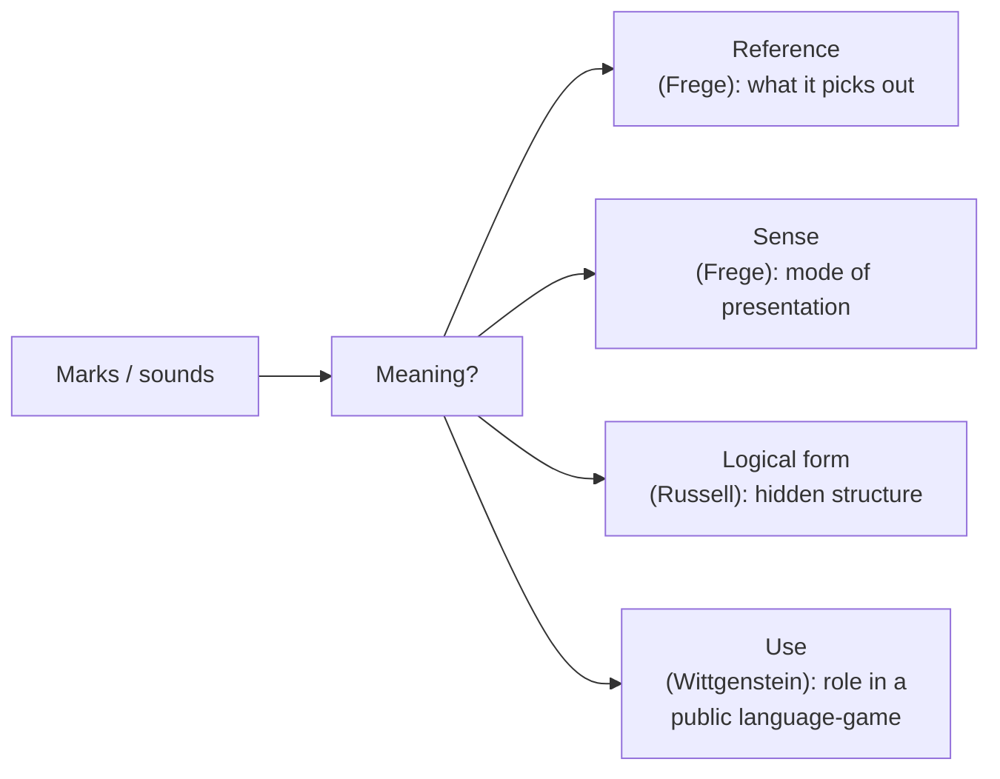

# Philosophy of Language

**Philosophy of language** asks how words, sentences, and utterances come to *mean* anything
at all. A string of marks or sounds is just physical noise; yet "the cat is on the mat" is
*about* a cat, can be true or false, and can be understood by someone who has never seen this
particular cat. What is meaning, how does language hook onto the world, and what is it to
understand a sentence? These questions sit at the crossroads of
[philosophy-of-mind.md](philosophy-of-mind.md) (meaning seems to depend on minds),
[../linguistics/semantics.md](../linguistics/semantics.md) (the systematic study of
sentence meaning), and [../linguistics/pragmatics.md](../linguistics/pragmatics.md) (meaning
in use and context).

## Sense and reference: Frege

Gottlob Frege noticed a puzzle. "The morning star is the morning star" is trivially true;
"the morning star is the evening star" is an astronomical discovery — yet both names pick out
the same object, Venus. If meaning were just *reference* (the object named), the two
sentences would say the same thing. So Frege distinguished:

- **Reference** (*Bedeutung*) — the object a term picks out.
- **Sense** (*Sinn*) — the *mode of presentation*, the way the object is given.

"Morning star" and "evening star" share a reference but differ in sense, which is why the
identity was informative. Sense is what a competent speaker grasps; it is the bridge between
the mind and the world, and it makes meaning more than mere pointing.

## Descriptions: Russell

Bertrand Russell tackled a companion puzzle. "The present king of France is bald" — but there
is no king of France. Is the sentence false, meaningless, or does it commit us to a ghostly
non-existent king? Russell's **theory of definite descriptions** analyzes "the F is G" as a
quantified claim: *there is exactly one F, and it is G*. On that reading the sentence is
simply **false** (there is no such unique F), no ghost required. The lesson — that surface
grammar can hide the real logical form — became a template for analytic philosophy:
dissolve philosophical confusions by giving sentences their proper logical analysis. The
machinery is that of [../logic/index.md](../logic/index.md).

## Two pictures of meaning: Wittgenstein

Ludwig Wittgenstein held two influential and opposed views across his career.

- **The picture theory** (early, *Tractatus*): a proposition is a *picture* of a possible
  state of affairs; it means by sharing a logical structure with the fact it depicts. Meaning
  is representation.
- **Meaning as use** (late, *Philosophical Investigations*): "the meaning of a word is its
  use in the language." Words are tools; their meaning is the role they play in shared
  **language-games** and **forms of life**, not a mental picture or an inner object.

The late view drives the **private-language argument**: there could be no language whose
words referred to purely private sensations knowable only to one speaker, because there would
be no standard of correct use — no difference between "using the word rightly" and merely
"seeming to." Meaning is essentially **public and rule-governed**, a point with sharp
consequences for whether an isolated system can mean anything on its own.

## Doing things with words: speech acts

J. L. Austin observed that many utterances don't *describe* the world but *act* in it:
saying "I promise," "I name this ship," or "you're fired" **does** something. He distinguished
three layers of an utterance:

- **Locutionary** — the act of saying (the words and their literal sense/reference).
- **Illocutionary** — what you do *in* saying it (promising, warning, asserting, ordering).
- **Perlocutionary** — the effect *on* the hearer (persuading, alarming, convincing).

John Searle systematized **speech-act theory** and tied it back to intentionality: the force
of an utterance derives from the speaker's communicative intentions. This is the philosophical
foundation of [../linguistics/pragmatics.md](../linguistics/pragmatics.md), where meaning is
what a speaker conveys in context, over and above literal
[../linguistics/semantics.md](../linguistics/semantics.md).

## Do large language models understand?

These debates cut directly at
[large language models](../ai/large-language-models.md). An LLM manipulates word forms with
extraordinary fluency, producing text that passes for meaningful. But on Frege's terms, does
it grasp *sense*, or only distributions over forms? On Wittgenstein's, does it participate in
a public language-game and a form of life, or merely echo one? On Searle's, can it perform a
genuine speech act — actually *promise* — without communicative intent? The **symbol-grounding
problem** presses this: the model's symbols may be systematically related to each other yet
never anchored to the world they are ostensibly about. Whether statistical mastery of usage
*is* understanding, or only its convincing shadow, is the live question that
[philosophy-of-ai.md](philosophy-of-ai.md) takes up head-on.

## Why it matters

If meaning is use, and use is public and world-embedded, then meaning is not something a mind
or a machine can conjure in isolation — a constraint on any account of mind
([philosophy-of-mind.md](philosophy-of-mind.md)) and on any claim that a language model
understands. Philosophy of language turns the vague worry "does it *really* know what it's
saying?" into precise, testable questions.

## References

This is a `Concept` note synthesizing a field, with no single source. See the
[philosophy index](index.md) and the linked linguistics notes for related concepts.
