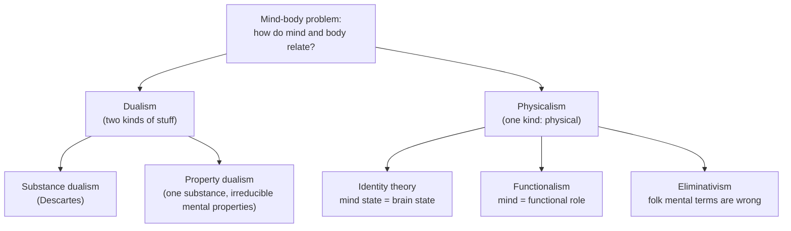

# Philosophy of Mind

**Philosophy of mind** asks what the mind *is* and how it relates to the physical body,
especially the brain. Its organizing question — the **mind-body problem** — is deceptively
simple: I have thoughts, sensations, and experiences; I also have a three-pound organ of wet
tissue. What is the relationship between the two? Are they the same thing described two ways,
two different kinds of stuff, or something stranger? Every position in the field is an answer
to that question, and the answers shape how we think about machines that might also have
minds ([philosophy-of-ai.md](philosophy-of-ai.md)).

## The mind-body problem

The modern statement of the problem is Descartes'. In his
[meditations-on-first-philosophy.md](descartes-meditations-on-first-philosophy.md) he argues
that mind and body are distinct **substances**: the body is *res extensa* (extended stuff,
occupying space), while the mind is *res cogitans* (thinking stuff, unextended). This is
**substance dualism** — the view that reality contains two fundamentally different kinds of
thing. Its lasting difficulty is the **interaction problem**: if mind is non-physical, how
does deciding to raise your arm move physical muscle? Descartes' own answer (the pineal
gland) satisfied nobody, and the gap has haunted dualism ever since.

The dominant modern reply is **physicalism** (or materialism): there is only physical stuff,
and mental states are, in some sense, physical states of the brain. The debate then becomes
*which* sense.

## Physicalist positions

- **Identity theory** holds each mental state is *identical* to a brain state, the way water
  is identical to H₂O. Its weakness is **multiple realizability**: pain in a human, an
  octopus, and (perhaps) a silicon system need not share any single brain state, so mind
  cannot be *identical* to one specific physical arrangement.
- **Functionalism** answers that a mental state is defined by its **functional role** — its
  causal relations to inputs, outputs, and other mental states — not by its physical makeup.
  Pain is whatever is caused by damage, causes avoidance, and produces distress, regardless
  of substrate. This is the philosophical charter for the idea that **the mind is software**
  and the brain is hardware: run the same program on different machines and you get the same
  mind. Functionalism is what makes strong AI ([philosophy-of-ai.md](philosophy-of-ai.md))
  even coherent as a hypothesis.
- **Eliminative materialism** goes further: our everyday "folk psychology" of beliefs and
  desires is a proto-theory that mature neuroscience may simply discard, the way we discarded
  phlogiston.

## Consciousness and the hard problem

Even a complete functional or neural story seems to leave something out. David Chalmers
distinguishes the **easy problems** of consciousness — explaining discrimination,
integration, reportability, attention (all, in principle, mechanistic) — from the **hard
problem**: why is there *something it is like* to undergo these processes at all? Why is
neural activity accompanied by subjective experience rather than proceeding "in the dark"?

Two touchstones sharpen this:

- **Qualia** — the raw felt qualities of experience: the redness of red, the ache of a pain.
  Frank Jackson's *knowledge argument* imagines Mary, a scientist who knows every physical
  fact about color vision but has only seen black and white; when she first sees red, does
  she learn something new? If yes, physical facts do not exhaust the facts.
- Thomas Nagel's **"What Is It Like to Be a Bat?"** argues that even complete knowledge of
  bat echolocation would not tell us what the bat's experience is *like from the inside*.
  Consciousness has an irreducibly first-person, subjective character that objective
  third-person science may not capture.

These arguments motivate **property dualism** (one substance, but mental properties that
don't reduce to physical ones) and keep the hard problem alive against confident
physicalism. A rival research program, **predictive processing**, tries to close the gap from
the science side — treating perception and even the sense of self as the brain's best
generative model of its causes (see
[../neuroscience/predictive-coding-and-cognition.md](../neuroscience/predictive-coding-and-cognition.md)
and the [../neuroscience/index.md](../neuroscience/index.md) hub).

## Intentionality

A second feature that seems to mark the mental is **intentionality** (Brentano's term): the
*aboutness* of mental states. My belief is *about* the weather; my desire is *for* coffee.
Physical states — a rock, a puddle — are not obviously "about" anything. Explaining how mere
matter can represent, mean, or point beyond itself is a central task, and it connects
directly to whether symbol-manipulating machines genuinely represent or only appear to (the
**symbol-grounding problem**, taken up in
[philosophy-of-language.md](philosophy-of-language.md) and
[philosophy-of-ai.md](philosophy-of-ai.md)).

## Why it matters

The mind-body problem is not idle. If functionalism is right, minds are substrate-independent
and machine minds are possible in principle. If the hard problem is real, no amount of
functional engineering guarantees experience — which bears on how we treat both AI systems
and each other. The nature of mind also constrains
[free-will-and-determinism.md](free-will-and-determinism.md): whether choices are "up to us"
depends on what a mind is and how it fits into physical causation. And self-reference offers
a third path — Hofstadter's suggestion (in
[../systems-thinking/i-am-a-strange-loop.md](../systems-thinking/i-am-a-strange-loop.md) and
[../systems-thinking/self-reference-and-strange-loops.md](../systems-thinking/self-reference-and-strange-loops.md))
that the "I" is a **strange loop**, a pattern that arises when a system models itself, rather
than a substance or a mystery.

## References

This is a `Concept` note synthesizing a field, with no single source. Its canonical anchor is
[meditations-on-first-philosophy.md](descartes-meditations-on-first-philosophy.md); see the
[philosophy index](index.md) for related concepts.
