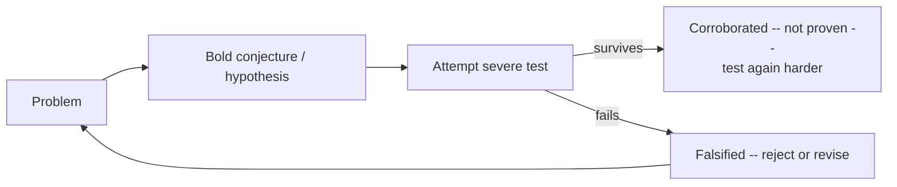
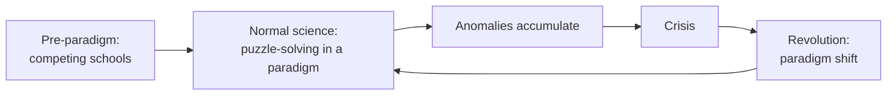

# Philosophy of Science

**Philosophy of science** examines what science is, how it works, and why (or whether) its
results deserve special trust. It is applied [epistemology.md](epistemology.md): science is
our most successful knowledge-producing enterprise, so understanding its logic tells us a
great deal about justification in general. The field's central questions are what marks
science off from non-science, how theories are confirmed, how scientific knowledge changes,
and whether our best theories are *true* or merely *useful*.

## The demarcation problem

What separates science from pseudoscience, metaphysics, or myth? This is the **demarcation
problem**. Logical positivists proposed the **verifiability criterion** — a statement is
scientifically meaningful only if it can be empirically verified — but this proved too
strict (it condemns universal laws, which no finite evidence can fully verify) and too
vague. Popper offered *falsifiability* (below) instead. Most philosophers now doubt any
single sharp criterion exists; demarcation is better treated as a cluster of features
(testability, openness to revision, fit with other knowledge) than a bright line.

## The problem of induction

Science generalizes: from finite observations to universal laws. But **Hume's problem of
induction** shows this cannot be justified without circularity. Why expect the future to
resemble the past? Only because it has done so before — which is itself an inductive
inference. There is no non-circular, purely logical guarantee that induction is reliable.
Every account of scientific confirmation must reckon with this; it is the ghost that haunts
the whole field. (The metaphysical side of Hume's worry — about causation itself — lives in
[metaphysics.md](metaphysics.md).)

## Popper's falsificationism

Karl Popper's response was radical: science does *not* proceed by confirming theories at
all. No number of confirming instances can prove a universal law, but a single
counterexample can refute it. So the mark of science is **falsifiability** — a genuine
scientific theory makes risky, prohibitive predictions that *could* be shown false. Science
advances by *conjectures and refutations*: bold hypotheses, then ruthless attempts to break
them. Marxism and psychoanalysis, Popper charged, are pseudoscientific precisely because
they can accommodate any observation and so forbid nothing.

Falsificationism connects tightly to statistical practice: rejecting a null hypothesis is a
descendant of the same "try to refute" logic — see
[../statistics/hypothesis-testing.md](../statistics/hypothesis-testing.md). Its main
weakness is the **Duhem–Quine thesis**: hypotheses are never tested in isolation but only
together with auxiliary assumptions, so a failed prediction never tells you *which* premise
to blame. Falsification is rarely as clean as the schema suggests.

## Kuhn's paradigms and revolutions

Thomas Kuhn's *The Structure of Scientific Revolutions* offered a historical, sociological
picture that broke with Popper. Science, Kuhn argued, is mostly **normal science**:
puzzle-solving within an accepted **paradigm** — a shared framework of theory, methods, and
exemplary problems. Anomalies accumulate; when they reach a crisis, a **scientific
revolution** replaces the old paradigm with a new one — a *paradigm shift*. Crucially, rival
paradigms are **incommensurable**: they carve up problems and even meanings differently, so
choosing between them is not a matter of neutral evidence alone. The full account is in
[kuhn-structure-of-scientific-revolutions.md](kuhn-structure-of-scientific-revolutions.md).

## Lakatos: research programmes

Imre Lakatos tried to reconcile Popper's rationalism with Kuhn's history. Science, he said,
consists of **research programmes** with a protected *hard core* of central assumptions and
a *protective belt* of auxiliary hypotheses that absorb refutations. A programme is
**progressive** if its modifications predict novel facts, and **degenerating** if they only
patch anomalies after the fact. This gives a rational criterion for theory choice that
respects the messiness Kuhn documented — you compare programmes over time, not theories at a
moment.

## Scientific realism vs anti-realism

Do our best theories give us *truth about unobservable reality* (quarks, fields, genes), or
just empirically adequate machinery for predicting observations?

- **Scientific realism** — mature theories are approximately true and their unobservable
  entities really exist. The flagship argument is the **no-miracles argument**: the
  predictive success of science would be a miracle if its theories weren't at least
  approximately true.
- **Anti-realism** (instrumentalism, van Fraassen's *constructive empiricism*) — theories
  are tools; we should believe only that they are *empirically adequate*, staying agnostic
  about the unobservable. The flagship counter is the **pessimistic meta-induction**: the
  history of science is a graveyard of once-successful theories now known false (phlogiston,
  caloric, the ether), so why expect today's to survive?

## Theory-ladenness of observation

A thread running through Kuhn and much later work: there is no theory-neutral observation.
What a scientist *sees* — a track in a cloud chamber as an electron, a shadow as a tumor —
is shaped by prior theory and training. **Theory-ladenness** undercuts the empiricist dream
of a pure evidential bedrock and reinforces the point from
[epistemology.md](epistemology.md) that justification is holistic. It has a sharp modern
echo in AI evaluation, where "objective" measurement is itself an artifact of chosen
criteria — as when a language model is used to grade other models' outputs; see
[../ai-platform/evals-llm-as-a-judge.md](../ai-platform/evals-llm-as-a-judge.md).

## Why it matters

The philosophy of science supplies the standards by which we distinguish knowledge from its
imitations — a live concern wherever data-driven claims carry weight, from public policy to
machine learning. Its debates over confirmation, revolution, and realism are not academic
curiosities but the operating manual for taking evidence seriously.

## References

- [Kuhn, *The Structure of Scientific Revolutions*](kuhn-structure-of-scientific-revolutions.md) — paradigms, normal science, revolutions, and incommensurability; the most influential work in the field.
