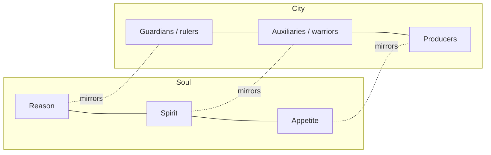

# Republic (Plato)

Plato's *Republic* (c. 375 BCE) is a Socratic dialogue that begins with a narrow
question — *what is justice, and why be just?* — and expands into a sweeping account
of the soul, the state, knowledge, and reality. Its guiding move is an analogy: justice
in the individual is easier to read at the larger scale of a city, so Socrates builds an
ideal state in speech and then reads the soul off it.

## Justice as harmony

Against Thrasymachus (justice is "the advantage of the stronger") and Glaucon's challenge
(justice is only a grudging social contract that no one would keep if they could get away
with injustice), Socrates argues that justice is intrinsically good — good for its own
sake, not merely for its rewards.

His answer rests on a **tripartite** structure that appears in both soul and city.
Socrates argues from cases of inner conflict (a thirsty person who refuses to drink; a man
angry at his own base desires) that the soul has three distinct parts:

Justice is not one part dominating but each part **doing its own work** in proper order —
reason ruling, spirit enforcing, appetite obeying. A just soul is a well-ordered soul; a
just city is a well-ordered city. Injustice is internal civil war. This is why justice
pays: it is psychic health, and health is worth having independently of reputation.

## The ideal state and the philosopher-king

The best city is ruled by those who *know* the good — philosophers. Because only
philosophers have knowledge (not mere opinion), only they can rule wisely. Famously they
must be *compelled* to rule: they would rather contemplate, but justice and the city's law
require them to descend and govern. The dialogue also proposes radical arrangements for the
guardian class — communal property, shared families, and (strikingly for its time) equal
education and rule for women. See [political-philosophy.md](political-philosophy.md).

## The theory of Forms

The distinction between knowledge and opinion turns on Plato's **theory of Forms**: beyond
the many perceptible beautiful things stands the single imperceptible *Form* of Beauty
itself — eternal, unchanging, the object of genuine knowledge. Perceptible particulars only
*participate* in Forms and are objects of mere belief. The Form of the **Good** is the
highest Form, the source of both the reality and the intelligibility of everything else, as
the sun is the source of both growth and visibility. This is a metaphysical claim about what
is truly real and an epistemological claim about what can truly be known. See
[metaphysics.md](metaphysics.md) and [epistemology.md](epistemology.md).

## The allegory of the cave

The most famous image in Western philosophy (Book VII) dramatizes the ascent from opinion
to knowledge. Prisoners chained in a cave take flickering shadows on the wall for reality.
One is freed, painfully turns toward the fire, then climbs out into sunlight — first seeing
reflections, then objects, finally the sun itself (the Good). The ascent is education; the
return to the cave, to free the others, is the philosopher's obligation to rule. The cave
compresses the whole argument: most people live among shadows (appearances), education is a
turning-around of the soul toward what is real, and knowledge of the Good grounds the
authority to govern.

## References

- [Republic — Plato (Project Gutenberg, Jowett translation)](https://www.gutenberg.org/ebooks/1497)
- Background: [Plato's Ethics and Politics in *The Republic* (Stanford Encyclopedia of Philosophy)](https://plato.stanford.edu/entries/plato-ethics-politics/)
