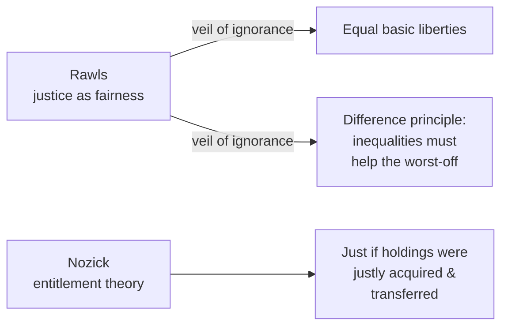

# Political Philosophy

Political philosophy studies how people ought to live together under shared power. Its
central questions are **legitimacy** (what, if anything, gives the state the right to
rule and coerce?), **justice** (how should benefits, burdens, and rights be
distributed?), and **liberty** (how much freedom must individuals have, and where may the
collective override it?). It is normative ethics scaled up to the level of institutions,
so it sits next to [ethics.md](ethics.md).

## Justifying authority: the social contract

Why should anyone obey the state? The dominant modern answer is the **social contract**:
legitimate authority derives from the (real or hypothetical) consent of the governed. The
three canonical versions start from different pictures of the pre-political "state of
nature."

| Thinker | State of nature | What we contract for | Resulting state |
|---|---|---|---|
| Hobbes | "War of all against all"; life "nasty, brutish, and short" | Security; escape from fear | Strong, near-absolute sovereign (*Leviathan*) |
| Locke | Broadly peaceful, but rights insecure | Protection of life, liberty, property | Limited government by consent; right of revolution |
| Rousseau | Free but corrupted by society | To be governed by the "general will" | Popular sovereignty; democratic self-rule |

Locke's version — government as a limited trustee of natural rights, revocable when it
betrays that trust — shaped modern constitutionalism and rights language. Plato offers an
older, non-contractual answer in [plato-republic.md](plato-republic.md): the just state
mirrors the well-ordered soul and is governed by those who know the good, not by consent.

## Liberty

Mill's *On Liberty* defends the **harm principle**: the only legitimate ground for
coercing an adult against their will is to prevent harm to others — not for their own
good. This underwrites free speech, freedom of lifestyle, and a strong presumption
against paternalism. Isaiah Berlin later distinguished **negative liberty** (freedom
*from* interference) and **positive liberty** (freedom *to* realize one's capacities),
a distinction that still frames debates over what the state owes its citizens.

## Justice

Twentieth-century political philosophy was reorganized by two rival theories of
distributive justice.

- **Rawls** argues we should choose principles of justice from behind a **veil of
  ignorance** — not knowing our own class, talents, or luck. Rational choosers so
  situated would guarantee equal basic liberties and permit inequalities only where they
  benefit the least advantaged (the *difference principle*). Justice is fairness.
- **Nozick** counters that justice is about *process*, not patterns: a distribution is
  just if it arose from just acquisition and voluntary transfer, and redistributive
  taxation to enforce a pattern violates individual rights. This is the libertarian
  challenge to Rawlsian egalitarianism.

## Rights, the state, and power

Rights function as trumps that limit what majorities and governments may do to
individuals; their deontological backbone comes from Kant (see [ethics.md](ethics.md)).
Distinct from the *justification* of authority is the empirical study of **power and
legitimacy** — why people actually accept rule (Weber's traditional, charismatic, and
legal-rational authority) — which connects to [../sociology/index.md](../sociology/index.md).

## Why it matters

Political philosophy sets the terms for real institutional design. Where markets fail to
allocate justly — externalities, public goods, monopoly — economics and political theory
meet: see [../economics/market-failure-and-externalities.md](../economics/market-failure-and-externalities.md).
The questions also recur in technology: who legitimately governs AI systems, how rights
constrain automated decisions, and how power concentrates — themes carried into
[../ai-governance/index.md](../ai-governance/index.md) and
[philosophy-of-ai.md](philosophy-of-ai.md).

## References

- Cross-field: [../economics/market-failure-and-externalities.md](../economics/market-failure-and-externalities.md),
  [../sociology/index.md](../sociology/index.md),
  [../ai-governance/index.md](../ai-governance/index.md)
- Anchoring work: [plato-republic.md](plato-republic.md)
