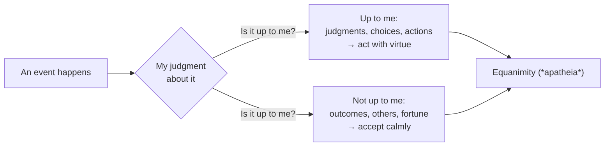

# Stoicism and Practical Philosophy

Much of ancient philosophy was not a body of theory to contemplate but a **way of life** — a
set of exercises for living well, facing adversity, and dying without terror. Pierre Hadot
called these "**spiritual exercises**": philosophy as therapy for the soul, meant to be
*practiced*, not just believed. **Stoicism** and **Epicureanism** are the two great surviving
schools of this practical tradition, and they connect directly to
[ethics.md](ethics.md) (what is the good?) and to the search for meaning taken up by
[existentialism-and-meaning.md](existentialism-and-meaning.md).

## Stoicism

Founded by Zeno of Citium (c. 300 BCE) and later carried by three Roman voices — the freed
slave **Epictetus**, the statesman **Seneca**, and the emperor **Marcus Aurelius** (whose
private journal survives as [meditations.md](../personal-development/meditations.md)) —
Stoicism rests on a few load-bearing ideas.

- **The dichotomy of control.** Epictetus opens the *Enchiridion* with it: some things are
  "up to us" (our judgments, desires, aversions, and voluntary actions) and some are not (our
  body, reputation, wealth, others' choices, outcomes). Serenity comes from investing our
  concern *only* in what is up to us and accepting the rest. Distress arises not from events
  but from our **judgments** about events.
- **Virtue is the sole good.** The only thing unconditionally good is a well-functioning
  rational character — wisdom, justice, courage, temperance. Health, wealth, and reputation
  are "**preferred indifferents**": naturally worth pursuing, but not *good*, because they
  don't make you a good person and can't be relied on for happiness.
- **Live according to nature (and reason).** The cosmos is rationally ordered (the *logos*);
  humans are rational, social animals. To live well is to align one's reason with the reason
  of the whole and to treat all people as fellow members of a single community
  (cosmopolitanism).

## Epicureanism

The rival school, founded by **Epicurus**, agrees philosophy's job is a tranquil life but
locates the good differently: in **pleasure**, understood not as indulgence but as the
*absence of pain in the body (aponia) and disturbance in the mind (ataraxia)*. Its practical
program:

- Distinguish desires that are **natural and necessary** (food, shelter, friendship) from
  those that are natural-but-unnecessary (luxury) and empty (fame, unlimited wealth); satisfy
  the first, moderate the rest.
- Dissolve the two great fears with physics and logic: fear of the gods (who, Epicurus argued,
  are indifferent to us) and **fear of death** — "when death is, we are not; when we are,
  death is not," so it is nothing to us.
- Prize **friendship** and modest, examined living over ambition.

Stoic and Epicurean advice often converges on the surface (both counsel calm, both distrust
craving) but diverges at the root: for the Stoic the good is *virtue* and pleasure is
irrelevant to it; for the Epicurean the good *is* (rightly understood) pleasure.

## Practical / therapeutic philosophy

What unites these schools is the stance that philosophy should **change how you live**, not
just what you know. Its tools are exercises: journaling (Marcus), rehearsing hardship in
advance (*premeditatio malorum*), the view from above (imagining one's troubles from a cosmic
scale), voluntary discomfort, and the daily examination of one's judgments. This is philosophy
as a discipline of attention and habit — closer to training than to argument.

## The modern revival

Stoicism especially has re-entered popular life, for two reasons worth naming. First, its
core mechanism — *events are neutral; our judgments cause our suffering; judgments can be
retrained* — is essentially the premise of **cognitive behavioral therapy**, whose founders
explicitly credited the Stoics. Second, the dichotomy of control is a portable, secular
resilience tool that fits a stressful, low-agency modern life. The risk in the revival is
**"broicism"**: reducing a demanding ethical system (where virtue and justice are the point)
to a productivity hack for staying calm — keeping the equanimity while quietly dropping the
ethics that were supposed to justify it.

## Why it matters

Practical philosophy is the bridge from abstract [ethics.md](ethics.md) to lived conduct: it
takes the question "what is the good life?" and answers with exercises you can do tomorrow.
Where [existentialism-and-meaning.md](existentialism-and-meaning.md) says meaning must be
*created* in a universe that supplies none, the Stoic and Epicurean reply is older and calmer:
meaning is found in living virtuously (or tranquilly) *within* the nature of things, and the
work of a life is to train yourself to do so.

## References

This is a `Concept` note synthesizing a tradition, with no single source. Its living exemplar
in HAL is Marcus Aurelius' [meditations.md](../personal-development/meditations.md); see the
[philosophy index](index.md) for related concepts.
