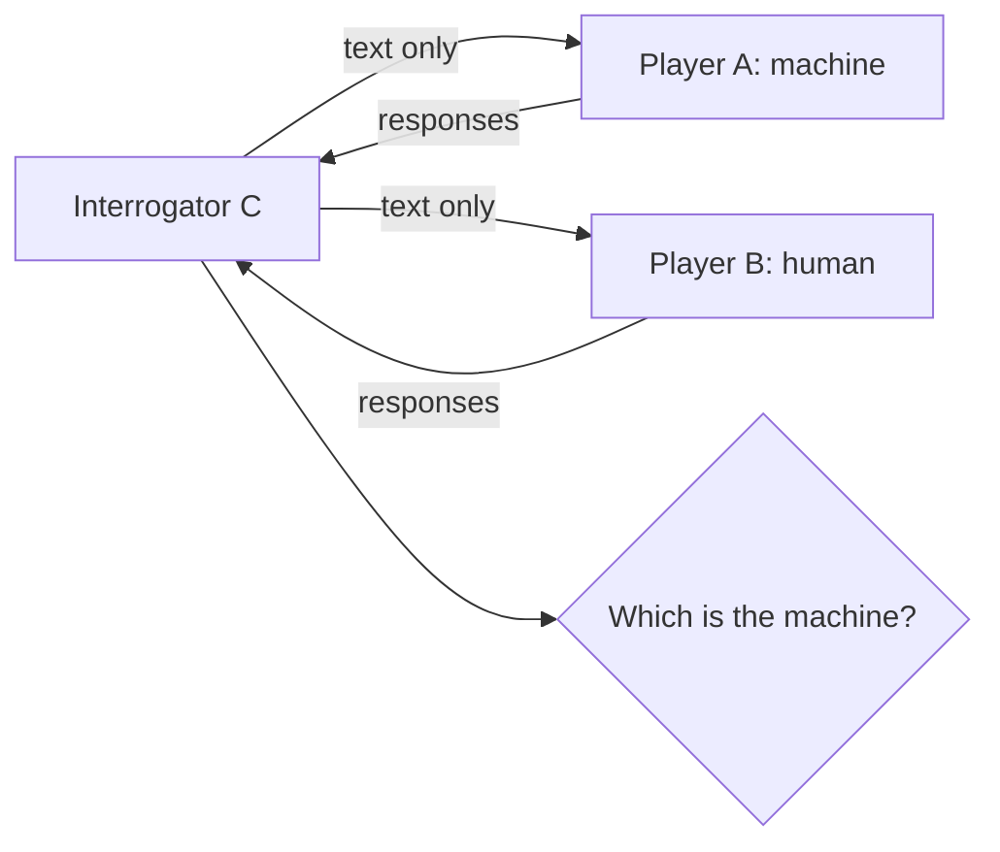

# Computing Machinery and Intelligence (Turing)

Alan Turing's 1950 paper "Computing Machinery and Intelligence," published in the journal
*Mind*, is the founding document of the philosophy of artificial intelligence. It asks the
question "Can machines think?" — and, finding that question too vague and loaded with
prejudice about the words "machine" and "think," replaces it with a concrete, operational
test. See [philosophy-of-ai.md](philosophy-of-ai.md).

## The imitation game (the Turing test)

Turing reframes "Can machines think?" as "Can a machine succeed at the **imitation game**?"

An interrogator communicates by text (to remove appearance and voice as clues) with two
hidden participants — one human, one machine — and must decide which is which. If a machine
can carry on the conversation so that the interrogator does no better than chance at
unmasking it, over repeated trials against a knowing interrogator, the machine passes.
Crucially the test is **behavioral**: it sidesteps the metaphysics of consciousness and
asks only whether a machine can *do* what a thinking thing does in conversation. Turing
predicted that by 2000 machines would fool an average interrogator ~30% of the time in a
five-minute exchange.

## Objections and replies

Much of the paper's lasting value is Turing's disciplined survey of objections, with
replies. Among the nine he considers:

- **The Theological Objection** — thinking requires a soul God gives only to humans. Turing
  finds this a weak restriction on divine power.
- **The Mathematical Objection** — Gödel-style limits show formal systems have unanswerable
  questions. Turing replies that humans face limits too; it is not shown that ours are
  fewer.
- **The Argument from Consciousness** — a machine only passing the test doesn't *feel*
  anything. Turing notes this "other minds" worry applies equally to other people, whom we
  nonetheless credit with thought on behavioral grounds.
- **Lady Lovelace's Objection** — a machine can "only do what we tell it," never originate
  anything. Turing replies that machines can surprise us and, via learning, do the
  unforeseen.
- **Argument from Continuity of the Nervous System** — the brain is not a discrete-state
  machine. Turing argues a discrete machine can approximate a continuous one closely enough
  to be indistinguishable to an interrogator.

## Learning machines

Turing's constructive proposal is prescient: rather than program an adult mind directly,
build a **child machine** and *educate* it through a training process. This anticipates
machine learning and frames intelligence as something acquired, not hand-coded — a lineage
that runs directly to today's [large language models](../ai/large-language-models.md), whose
conversational fluency has revived and complicated every question Turing raised about
behavior, understanding, and thought. The philosophical stakes — whether passing a
behavioral test constitutes real understanding — connect to the mind–body problem and later
challenges like Searle's Chinese Room. See [philosophy-of-mind.md](philosophy-of-mind.md).

## References

- [Computing Machinery and Intelligence — Turing, *Mind* LIX(236): 433–460 (1950)](https://doi.org/10.1093/mind/LIX.236.433)
- Background: [The Turing Test (Stanford Encyclopedia of Philosophy)](https://plato.stanford.edu/entries/turing-test/)
