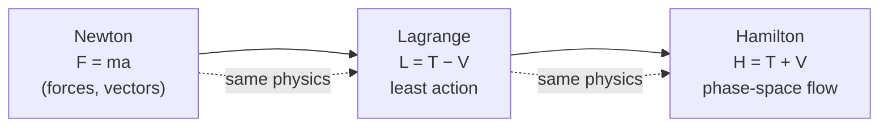

# Classical Mechanics

Classical mechanics is the physics of how macroscopic objects move under forces — the
framework that carries you from a rolling ball to planetary orbits. Built by Newton in the
17th century and reformulated with far more power by Lagrange and Hamilton in the 18th and
19th, it is the historical bedrock of physics and still the correct theory for everything
that is neither too fast (see [relativity](relativity.md)) nor too small (see
[quantum mechanics](quantum-mechanics.md)). Its mathematical language is the differential
equation (see [../math/differential-equations.md](../math/differential-equations.md)).

## Newton's three laws

Newton framed motion in terms of **force**. The three laws:

1. **Inertia.** A body keeps its velocity (including zero) unless a net force acts. There
   is no "natural" state of rest — only unaccelerated motion, which singles out *inertial
   frames*.
2. **$F = ma$.** The net force equals the rate of change of momentum, $\vec{F} =
   \dfrac{d\vec{p}}{dt}$; for constant mass, $\vec{F} = m\vec{a}$. This is the working
   engine: specify the forces and you get a second-order differential equation for the
   trajectory.
3. **Action–reaction.** Every force is one half of a pair: if $A$ pushes $B$ with
   $\vec{F}$, then $B$ pushes $A$ with $-\vec{F}$. This is what makes total
   [momentum conserved](energy-and-conservation.md).

Given forces and initial position and velocity, the second law is an initial-value problem
whose solution is the entire past and future trajectory — the content of Newtonian
**determinism**.

## The Lagrangian reformulation

Newton's force-vectors become awkward the moment you have constraints (a bead on a wire, a
pendulum). Lagrange's move is to work with **energy** instead. Define the **Lagrangian**

$$ L = T - V, $$

the kinetic energy minus the potential energy (see
[energy-and-conservation.md](energy-and-conservation.md)), expressed in whatever
*generalized coordinates* $q_i$ suit the problem. The trajectory is the one that makes the
**action** $S = \int L\,dt$ stationary — the *principle of least action*. Carrying out that
variational condition (a calculus-of-variations argument, see
[../math/multivariable-calculus.md](../math/multivariable-calculus.md)) yields the
**Euler–Lagrange equations**

$$ \frac{d}{dt}\frac{\partial L}{\partial \dot q_i} - \frac{\partial L}{\partial q_i} = 0. $$

Same physics as Newton, but coordinate-free, constraint-friendly, and — crucially — it
exposes the deep link between symmetries and conservation laws (see
[symmetry-and-conservation-laws.md](symmetry-and-conservation-laws.md)).

## The Hamiltonian reformulation and phase space

Hamilton recasts the theory again, trading the coordinate-velocity pair $(q,\dot q)$ for the
coordinate-momentum pair $(q,p)$, where $p_i = \partial L/\partial \dot q_i$. The
**Hamiltonian** $H(q,p)$ is (for typical systems) the total energy $T+V$, and the dynamics
become a pair of first-order equations, beautifully symmetric:

$$ \dot q_i = \frac{\partial H}{\partial p_i}, \qquad \dot p_i = -\frac{\partial H}{\partial q_i}. $$

The state of the system is now a single point in **phase space**, the $2N$-dimensional
space of all $(q,p)$. Time evolution is a flow that moves that point along a trajectory. This
picture is the launching pad for [statistical mechanics](statistical-mechanics-and-entropy.md)
(ensembles are clouds of points in phase space) and for [quantum mechanics](quantum-mechanics.md)
(where $q$ and $p$ become non-commuting operators).

## Determinism and its limits

Because the equations are deterministic, Laplace imagined a demon who, knowing every
position and momentum, could compute all of the future. Two things puncture the fantasy.
First, quantum mechanics denies the demon exact simultaneous $q$ and $p$. Second — and
entirely within classical mechanics — most systems are **chaotic**: their trajectories
depend so sensitively on initial conditions that any measurement error blows up
exponentially, making long-term prediction impossible in practice (see
[../systems-thinking/chaos-and-nonlinear-dynamics.md](../systems-thinking/chaos-and-nonlinear-dynamics.md)).
Determinism in principle is not predictability in practice.

## Domain of validity

Classical mechanics is an approximation, superb within its range and wrong outside it. It
fails as speeds approach $c$ (relativity takes over) and as actions approach Planck's
constant $\hbar$ (quantum mechanics takes over). Knowing where a model breaks is part of
using it well — a general lesson about
[modeling and abstraction](../engineering/modeling-and-abstraction.md).

## Why it matters

It is the theory that works for bridges, engines, spacecraft, and everyday life, and it is
the conceptual scaffolding — energy, momentum, phase space, least action, symmetry — on which
every later theory is built. The Lagrangian and Hamiltonian formulations in particular
survive intact into field theory and quantum mechanics.

## References

- [Classical Mechanics](taylor-classical-mechanics.md) — John R. Taylor, the standard undergraduate text
- [The Feynman Lectures on Physics](feynman-lectures-on-physics.md) — Feynman, Leighton & Sands
- [Fundamentals of Physics](halliday-resnick-walker-fundamentals-of-physics.md) — Halliday, Resnick & Walker
