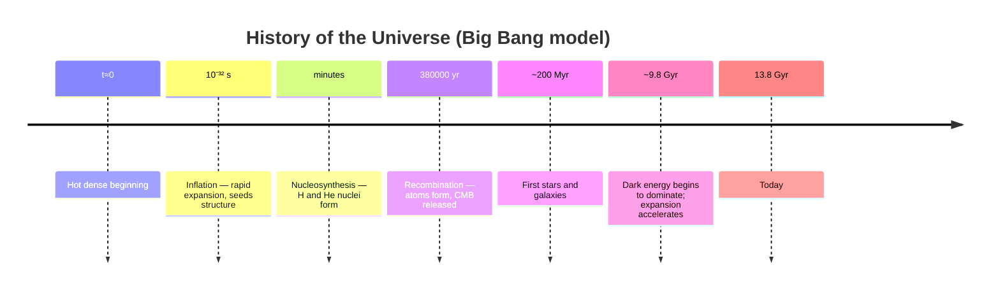

# Cosmology

Cosmology is the study of the universe as a whole — its origin, large-scale structure,
composition, and fate. It applies Einstein's [general relativity](relativity.md) to the
entire cosmos and connects the physics of the very large to the physics of the very small,
since the early universe was a hot, dense soup governed by
[particle physics and the Standard Model](particle-physics-and-the-standard-model.md).

## Cosmic expansion and Hubble's law

In the 1920s, observations showed that distant galaxies recede from us with a velocity
proportional to their distance:

```
v = H₀ · d
```

where `H₀` is the Hubble constant. This is not galaxies flying through space from a center;
it is **space itself expanding**, stretching the light of distant objects toward longer
(redder) wavelengths — the cosmological redshift. Running the expansion backward implies the
universe was once arbitrarily hot and dense.

## The Big Bang

The **Big Bang** is the model of an expanding universe that began ~13.8 billion years ago
from an extremely hot, dense state (not an explosion in space, but an expansion of space).
Its major evidential pillars:



- **Cosmic Microwave Background (CMB)**: when the universe cooled enough for electrons and
  nuclei to combine into neutral atoms (~380,000 years in), it became transparent, releasing
  the light we now see as a nearly uniform ~2.7 K glow in every direction. Its tiny
  temperature fluctuations are the seeds of all later structure and are the sharpest data set
  in cosmology.
- **Primordial abundances**: the observed ratios of hydrogen, helium, and lithium match what
  Big Bang nucleosynthesis predicts.

## The dark sector

Multiple independent observations (galaxy rotation curves, gravitational lensing, the CMB)
show that ordinary matter is a small fraction of the total:

| Component | Fraction of energy budget | Nature |
|---|---|---|
| Dark energy | ~68% | Drives accelerating expansion; behaves like a cosmological constant Λ |
| Dark matter | ~27% | Gravitates but does not emit light; not in the [Standard Model](particle-physics-and-the-standard-model.md) |
| Ordinary matter | ~5% | Atoms — stars, gas, planets, us |

- **Dark matter** is inferred from gravity: galaxies rotate too fast, and clusters bend
  light too strongly, to be held together by visible matter alone. Its constituent particle
  is unknown — one of the clearest signs of physics beyond the Standard Model.
- **Dark energy** was discovered in 1998 when distant supernovae revealed the expansion is
  **accelerating**, not slowing. It behaves like an energy density of empty space (the
  cosmological constant Λ).

## The standard cosmological model (ΛCDM)

The prevailing model is **ΛCDM**: a universe dominated by a cosmological constant (Λ, dark
energy) and Cold Dark Matter, with ordinary matter and radiation as minor components, in a
geometrically flat, expanding spacetime that began hot and dense. With only a handful of
parameters it fits the CMB, the expansion history, and the large-scale distribution of
galaxies — a remarkable success, even though the physical nature of Λ and dark matter
remains unknown.

## Fate of the cosmos

Because dark energy now dominates and drives accelerating expansion, the leading forecast is
eternal expansion: galaxies beyond our local group recede and redshift out of view, star
formation eventually ceases, and the universe drifts toward a cold, dark, dilute state (the
"heat death"). This depends on dark energy remaining constant — one of the open questions the
model cannot yet settle.

## Why it matters

Cosmology is where the fundamental theories of physics face their largest-scale test, and
where their biggest unknowns — dark matter, dark energy, the initial conditions — are laid
bare. It ties [relativity](relativity.md), particle physics, and thermodynamics into a single
narrative of cosmic history.

## References

- [Griffiths — Introduction to Quantum Mechanics](griffiths-introduction-to-quantum-mechanics.md)
- [The Feynman Lectures on Physics](feynman-lectures-on-physics.md)
