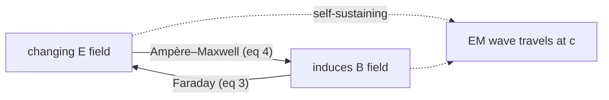

# Electromagnetism

Electromagnetism is the theory of how electric charges and currents create **fields**
that in turn exert forces on other charges. Its crowning achievement is the discovery
that electricity, magnetism, and light are three faces of a single phenomenon — the
first great *unification* in physics, and the template for every unification since.

## Fields, not action-at-a-distance

The central move of the field picture (Faraday, then Maxwell) is to stop thinking of
charges as tugging on each other across empty space and instead say: a charge fills the
space around it with an **electric field** `E`, and a *moving* charge (a current) fills
space with a **magnetic field** `B`. Another charge feels only the field *at its own
location*. The **Lorentz force law** packages both effects:

```
F = q(E + v × B)
```

The electric part pushes along `E`; the magnetic part pushes *sideways* (perpendicular
to both the velocity `v` and `B`), which is why magnetic forces do no work and why
charged particles spiral in magnetic fields.

## Maxwell's four equations

All of classical electromagnetism reduces to four equations relating `E` and `B` to
their sources. Stated in words, then in integral form:

| # | In words | Integral form |
|---|----------|---------------|
| 1 | **Gauss's law** — electric field lines begin and end on charge; charge is the source of `E`. | `∮ E·dA = Q_enc/ε₀` |
| 2 | **Gauss's law for magnetism** — no magnetic monopoles; `B` lines have no ends, they always close on themselves. | `∮ B·dA = 0` |
| 3 | **Faraday's law** — a changing magnetic flux drives a circulating electric field (this is how generators and transformers work). | `∮ E·dl = −dΦ_B/dt` |
| 4 | **Ampère–Maxwell law** — currents *and* a changing electric flux drive a circulating magnetic field. | `∮ B·dl = μ₀I_enc + μ₀ε₀ dΦ_E/dt` |

The last term of equation 4 — the **displacement current** `μ₀ε₀ dΦ_E/dt` — is Maxwell's
own addition, and it is the linchpin. In differential form the same four laws read
`∇·E = ρ/ε₀`, `∇·B = 0`, `∇×E = −∂B/∂t`, `∇×B = μ₀J + μ₀ε₀ ∂E/∂t`. Reading these
fluently requires the vector calculus of [multivariable calculus](../math/multivariable-calculus.md):
divergence (`∇·`, field lines' sources) and curl (`∇×`, field lines' circulation).

## The unification: light is an electromagnetic wave

Take equations 3 and 4 in empty space (no charges, no currents) and combine them. Each
field's curl feeds the other's time derivative, and the algebra collapses to a
**wave equation**:

```
∇²E = μ₀ε₀ ∂²E/∂t²      ⇒      wave speed  c = 1/√(μ₀ε₀)
```

Plugging in the *electrical* and *magnetic* constants `ε₀` and `μ₀`, both measured with
no reference to light at all, yields ≈ 3×10⁸ m/s — exactly the measured speed of light.
Maxwell's conclusion (1860s) was inescapable and revolutionary: **light is an
electromagnetic wave**, a self-propagating ripple in which a changing `E` regenerates
`B` and vice versa. Radio, microwaves, infrared, visible light, X-rays, and gamma rays
are the same wave at different frequencies. The wave mechanics — superposition,
interference, polarization — are developed in [waves and optics](waves-and-optics.md).



That EM signals propagate at `c` is the physical bedrock under long-distance signalling
and the timing constraints of [computer networks](../computer-science/computer-networks.md).

## Potentials and gauge freedom

It is often cleaner to derive `E` and `B` from a scalar potential `V` and a vector
potential `A`: `E = −∇V − ∂A/∂t`, `B = ∇×A`. Crucially, different `(V, A)` pairs give the
*same* physical fields — you can shift them by a **gauge transformation** without changing
anything observable. This redundancy, called **gauge freedom**, looks like a bookkeeping
convenience but turns out to be profound: demanding *local* gauge symmetry is the modern
principle from which the electromagnetic interaction (and its quantum, the photon) is
*derived*. This is the seed of gauge field theory, taken up in
[symmetry and conservation laws](symmetry-and-conservation-laws.md).

## Why it matters

Electromagnetism governs essentially all of everyday physics above the nuclear scale:
chemistry, materials, light, electronics, and the structure of atoms. It is one of
[the four fundamental forces](the-four-fundamental-forces.md), and historically the one
whose unification set the agenda for physics: find the deeper symmetry, and separate
forces merge. It was also the theory whose clash with Newtonian mechanics — the fact
that `c` came out the *same* in Maxwell's equations regardless of the observer's motion —
forced Einstein to [relativity](relativity.md).

## References

- Griffiths — see [Introduction to Electrodynamics](griffiths-introduction-to-electrodynamics.md)
- Feynman — see [The Feynman Lectures on Physics](feynman-lectures-on-physics.md) (Vol. II)
- Halliday, Resnick & Walker — see [Fundamentals of Physics](halliday-resnick-walker-fundamentals-of-physics.md)
