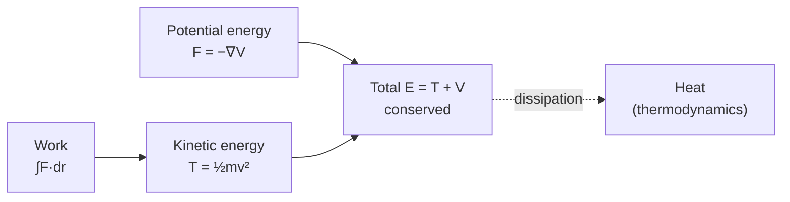

# Energy and Conservation

Energy is the single most useful bookkeeping quantity in physics: a number attached to a
system that gets shuffled between forms but, for an isolated system, never changes its
total. That constancy — **conservation** — turns hard dynamical problems (see
[classical-mechanics.md](classical-mechanics.md)) into simple accounting, and the deepest
reason it holds ties conservation to the [symmetries](symmetry-and-conservation-laws.md) of
nature.

## Work, kinetic energy, potential energy

**Work** is force acting through a displacement:

$$ W = \int \vec{F}\cdot d\vec{r}. $$

The **work–energy theorem** says the net work on a body equals the change in its **kinetic
energy** $T = \tfrac12 m v^2$ — motion energy. When a force is *conservative* (its work
depends only on endpoints, not path — gravity, springs, the electrostatic force), it can be
written as the gradient of a **potential energy** $V$: $\vec{F} = -\nabla V$. Potential energy
is stored, positional energy — a raised mass, a stretched spring, separated charges (see
[electromagnetism.md](electromagnetism.md)).

**Power** is simply the rate of energy transfer, $P = dW/dt = \vec{F}\cdot\vec{v}$, measured
in watts.

## Conservation of energy

For a system with only conservative forces, the total mechanical energy

$$ E = T + V $$

is constant along the motion. This is exactly the Hamiltonian of
[classical mechanics](classical-mechanics.md), and its constancy is what lets you solve, say,
a pendulum's speed at the bottom without touching the equations of motion — you just equate
$E$ at two instants. When friction or other dissipative forces act, mechanical energy is not
lost but converted to heat; the *total* energy including thermal energy is still conserved
(this is the first law of [thermodynamics.md](thermodynamics.md)).

## Conservation of momentum

**Momentum** $\vec{p} = m\vec{v}$ obeys its own conservation law: the total momentum of a
system is constant if no *external* force acts. This follows directly from Newton's third
law — internal action–reaction pairs cancel — and it is what governs collisions, rocket
propulsion, and recoil. Angular momentum $\vec{L} = \vec{r}\times\vec{p}$ is conserved
likewise when no external torque acts, which is why a spinning skater speeds up as she pulls
her arms in.

## Why conservation laws are so powerful

A conservation law is a constraint that holds *no matter what the detailed dynamics are*.
That makes it a shortcut (you skip integrating the forces) and a safety net (any candidate
process that violates it is impossible — no need to check the mechanism). Their power has a
profound source: **Noether's theorem** shows every continuous symmetry of a system yields a
conserved quantity. Energy conservation comes from the fact that the laws of physics do not
change over *time*; momentum conservation from their invariance under *spatial translation*;
angular momentum from *rotational* invariance. Conservation is not a lucky accident but the
shadow of symmetry — developed in full in
[symmetry-and-conservation-laws.md](symmetry-and-conservation-laws.md).

## Why it matters

Energy and momentum accounting is the physicist's first tool: it is often faster and more
robust than solving the dynamics, it generalizes cleanly from mechanics to
[thermodynamics](thermodynamics.md), [electromagnetism](electromagnetism.md), and
[relativity](relativity.md) (where mass itself is a form of energy, $E = mc^2$), and its link
to symmetry is one of the unifying ideas of all of physics.

## References

- [Classical Mechanics](taylor-classical-mechanics.md) — John R. Taylor
- [The Feynman Lectures on Physics](feynman-lectures-on-physics.md) — Feynman's chapters on energy and its conservation are canonical
- [Fundamentals of Physics](halliday-resnick-walker-fundamentals-of-physics.md) — Halliday, Resnick & Walker
