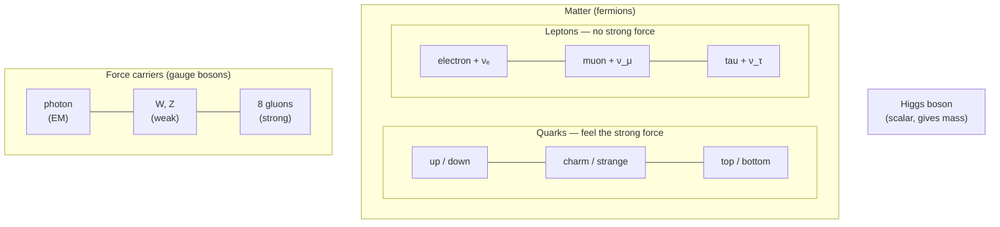

# Particle Physics and the Standard Model

Particle physics asks what everything is ultimately made of, and by what rules those pieces
interact. Its answer is the **Standard Model** — a quantum field theory, built on
[symmetry](symmetry-and-conservation-laws.md), that classifies all known elementary
particles and describes three of [the four fundamental forces](the-four-fundamental-forces.md)
(electromagnetic, weak, strong). It is the most rigorously tested theory in science, yet
demonstrably incomplete.

## The fundamental constituents

Matter is built from two families of **fermions** (spin-½ particles), each in three
generations of increasing mass. Forces are carried by **bosons**.

- **Quarks** (six flavors) carry color charge and combine into composites: three quarks make
  a proton or neutron (baryons), a quark–antiquark pair makes a meson. Only the up and down
  quarks and the electron make up ordinary matter; the heavier generations are unstable.
- **Leptons** include the electron, muon, tau, and their three **neutrinos**. Electrons and
  the Pauli exclusion principle shape [atomic structure](../chemistry/atomic-structure.md).
- **Gauge bosons** mediate the forces: the photon (electromagnetism), W and Z (weak force),
  and eight gluons (strong force).
- **The Higgs boson** (discovered at the LHC in 2012) is the excitation of the Higgs field,
  whose nonzero value throughout space gives the W, Z, and fermions their mass. Its discovery
  completed the particle roster.

## Why it is a quantum field theory

Each particle is an excitation of an underlying field, and interactions come from requiring
the theory to be invariant under local **gauge symmetries** — a direct application of the
deep link between [symmetry and conservation laws](symmetry-and-conservation-laws.md). The
theory rests on the formalism of [quantum mechanics](quantum-mechanics.md) extended to
fields, and its predictions (e.g. the electron's magnetic moment) match experiment to more
than ten decimal places.

## The best-tested theory — and its gaps

Every particle the Standard Model predicts has been found, and no collider experiment has
contradicted it. Yet it is known to be incomplete:

| Known gap | What the Standard Model cannot do |
|---|---|
| Gravity | It contains no description of [gravity](the-four-fundamental-forces.md); it is not a theory of everything |
| Dark matter | ~85% of matter is invisible and unaccounted for (see [cosmology](cosmology.md)) |
| Dark energy | The accelerating expansion of the universe has no place in it |
| Neutrino mass | It originally predicted massless neutrinos, but they oscillate, so they must have mass |
| Matter–antimatter asymmetry | It cannot explain why the universe is made of matter, not equal parts antimatter |
| Free parameters | ~19 constants (masses, mixing angles) are inputs, not explained |

These gaps are why particle physics remains active: they point beyond the Standard Model
toward new physics.

## Why it matters

The Standard Model is the inventory and rulebook of physical reality at the smallest scale —
the foundation on which nuclear physics, chemistry, and [cosmology](cosmology.md) are built.
Its precision is a triumph; its gaps define the frontier.

## References

- [Griffiths — Introduction to Quantum Mechanics](griffiths-introduction-to-quantum-mechanics.md)
- [The Feynman Lectures on Physics](feynman-lectures-on-physics.md)
