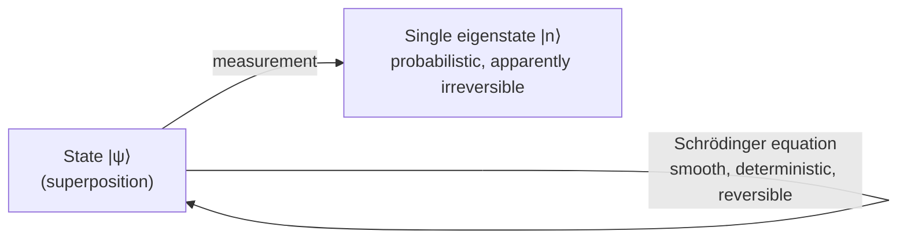

# Quantum Mechanics

Quantum mechanics is the framework that governs matter and energy at atomic and
subatomic scales. It replaces the deterministic trajectories of
[classical mechanics](classical-mechanics.md) with a probabilistic description in which a
system's state is a vector in a complex vector space, and observable quantities emerge
only when that state is measured. It is the most precisely verified theory in physics,
underpinning chemistry, solid-state electronics, lasers, and modern computing.

## The quantum revolution

Around 1900–1927 a chain of experiments broke classical physics:

- **Blackbody radiation** (Planck, 1900): energy is exchanged in discrete packets
  `E = hν`, introducing Planck's constant `h`.
- **Photoelectric effect** (Einstein, 1905): light itself is quantized into photons.
- **Atomic spectra** (Bohr, 1913): electrons occupy discrete energy levels; light is
  emitted at frequencies set by the level differences. This quantization is the origin of
  the discrete orbitals of [atomic structure](../chemistry/atomic-structure.md).
- **Wave–particle duality** (de Broglie, 1924): matter has a wavelength `λ = h/p`.
  Electrons diffract like [waves](waves-and-optics.md); photons deposit energy like
  particles. Neither picture alone is complete.

## The wavefunction and the Schrödinger equation

A quantum state is described by a **wavefunction** `ψ`. In the position representation
`ψ(x,t)` is a complex-valued field whose squared magnitude is a probability density
(Born rule): the probability of finding the particle in `[x, x+dx]` is `|ψ(x,t)|² dx`. The
wavefunction lives in a **Hilbert space** — a complex vector space with an inner product —
so the machinery of [linear algebra](../math/linear-algebra.md) (vectors, operators,
eigenvalues, orthonormal bases) *is* the language of the theory.

Its time evolution is the **Schrödinger equation**, a linear
[differential equation](../math/differential-equations.md):

```
iℏ ∂ψ/∂t = Ĥ ψ
```

where `ℏ = h/2π` and `Ĥ` is the Hamiltonian operator (total energy). Because it is linear,
sums of solutions are solutions — the mathematical root of superposition. The
time-independent version `Ĥψ = Eψ` is an eigenvalue problem whose solutions are the
allowed energy levels; the "quantization" of energy is just the discreteness of the
spectrum of `Ĥ` under boundary conditions (e.g. a particle in a box, or the hydrogen atom).

## Superposition and observables

Observables (position, momentum, energy, spin) are represented by **Hermitian operators**.
Their eigenvalues are the only possible measurement outcomes, and their eigenvectors form a
basis. Any state is a **superposition** — a weighted sum — of those eigenvectors:

```
|ψ⟩ = Σ cₙ |n⟩ ,   probability of outcome n = |cₙ|²
```

Superposition is not ignorance about a hidden value; the system genuinely has no definite
value until measured. The canonical demonstration is the double-slit experiment: single
particles build up an interference pattern, as if each passes through both slits and
interferes with itself.

## The uncertainty principle

Some pairs of observables (position/momentum, energy/time) do not commute, so no state can
have a sharp value for both simultaneously:

```
Δx · Δp ≥ ℏ/2
```

This is a structural feature of the Hilbert-space formalism (a Fourier-transform relation
between position and momentum representations), not a limit of instruments.

## Measurement and collapse

The theory has two evolution rules that sit awkwardly together:



Between measurements the state evolves smoothly and reversibly. Upon measurement it appears
to **collapse** to a single eigenstate, with probabilities given by the Born rule. Why and
how this happens — the **measurement problem** — is the source of the interpretive debates
below.

## Entanglement

When two systems interact, their joint state may not factor into a product of individual
states — they become **entangled**. Measuring one instantly fixes the correlated property
of the other, however far apart they are. Bell's theorem and the experiments confirming it
show these correlations are stronger than any theory of local hidden variables allows;
entanglement is a real, non-classical resource, and the basis of quantum computing and
quantum cryptography.

## Interpretations (briefly)

- **Copenhagen**: the wavefunction encodes knowledge/probabilities; measurement causes
  collapse; asking "what is really happening" between measurements is not meaningful.
- **Many-worlds**: there is no collapse — the Schrödinger equation always holds, and every
  outcome occurs in a branching wavefunction of the universe. Both reproduce identical
  predictions; the disagreement is about interpretation, not experiment.

## Why it matters

Quantum mechanics is the operating system beneath chemistry and materials: it explains the
periodic table and [chemical bonding](../chemistry/chemical-bonding.md), semiconductors and
transistors, superconductivity, and lasers. Its relativistic extension, quantum field
theory, describes three of [the four fundamental forces](the-four-fundamental-forces.md) and
is the setting for [particle physics and the Standard Model](particle-physics-and-the-standard-model.md).
The clean linear-algebraic structure and probabilistic reasoning also make it a rich source
of analogy for [AI](../ai/index.md) and appear in the theory of quantum computation.

## References

- [Griffiths — Introduction to Quantum Mechanics](griffiths-introduction-to-quantum-mechanics.md)
- [The Feynman Lectures on Physics](feynman-lectures-on-physics.md)
