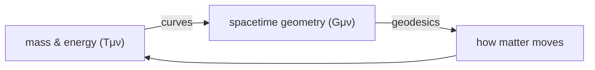

# Relativity

Relativity is Einstein's reworking of space, time, and gravity. It comes in two layers:
**special relativity** (1905), which fixes how motion, space, and time relate when there
is no gravity, and **general relativity** (1915), which reinterprets gravity itself as
the *curvature of spacetime*. Both overturn intuitions inherited from
[classical mechanics](classical-mechanics.md) while preserving it as a low-speed,
weak-gravity limit.

## Special relativity: two postulates

1. **Principle of relativity** — the laws of physics are identical in every
   non-accelerating (inertial) frame. There is no experiment that reveals absolute
   motion.
2. **Constancy of `c`** — the speed of light in vacuum is the *same* for every observer,
   regardless of how fast the source or the observer is moving.

The second postulate is the shocker, and it was forced by
[electromagnetism](electromagnetism.md): Maxwell's equations predict one speed for light,
independent of any frame. Holding `c` fixed for everyone means space and time must
themselves stretch and squeeze. The consequences:

- **Relativity of simultaneity** — two events simultaneous for one observer are not for
  another moving relative to the first. "Now" is not universal.
- **Time dilation** — a moving clock runs slow by the **Lorentz factor**
  `γ = 1/√(1 − v²/c²)`. Fast-moving muons reaching the ground, and GPS satellite clocks,
  confirm it daily.
- **Length contraction** — a moving object is shortened along its motion by the same `γ`.
- **Mass–energy equivalence** — `E = mc²`: mass *is* a form of energy. This is the source
  of the energy released in fission, fusion, and the Sun, and it ties into
  [energy and conservation](energy-and-conservation.md).

### Spacetime

Minkowski recast all of this geometrically: space and time are one four-dimensional
**spacetime**, and observers merely slice it differently into "space" and "time." What is
absolute is the **spacetime interval** between two events,

```
Δs² = (cΔt)² − Δx² − Δy² − Δz²
```

which every observer agrees on. The minus sign is the whole difference between spacetime
and ordinary geometry — it sorts event pairs into *timelike* (causally connectable) and
*spacelike* (not), enforcing that nothing outruns `c`.

## General relativity: gravity is geometry

Special relativity has no place for gravity. Einstein's way in was the
**equivalence principle**: standing on Earth is locally indistinguishable from
accelerating in a rocket at `g`. Gravity is not a force in the Newtonian sense — it is
what you feel when spacetime is curved and you try to travel straight through it.

- Mass and energy **curve** spacetime.
- Freely-falling objects follow **geodesics** — the straightest possible paths through
  that curved geometry. Planets orbit not because a force tugs them but because they are
  coasting along the valleys mass has carved.

John Wheeler's summary is exact: *spacetime tells matter how to move; matter tells
spacetime how to curve.* The machinery is Einstein's field equations,
`G_μν = 8πG/c⁴ · T_μν`, relating curvature (left) to energy and momentum (right).



Confirmed predictions include the bending of starlight by the Sun, the precession of
Mercury's orbit, gravitational time dilation, black holes, and gravitational waves
(directly detected in 2015). General relativity is the framework for the large-scale
universe, and thus the foundation of [cosmology](cosmology.md) — the expanding-spacetime
models of the Big Bang are its solutions.

## The conceptual shifts

| Newtonian view | Relativistic view |
|----------------|-------------------|
| Absolute, universal time | Time is relative; simultaneity is frame-dependent |
| Space and time separate | One unified spacetime |
| Gravity is a force across space | Gravity is curvature of spacetime |
| Mass and energy distinct | `E = mc²` — they are the same currency |
| Any speed reachable | `c` is an unbreakable cosmic speed limit |

## Why it matters

Relativity is not an exotic correction — it is the correct description of space and time,
with classical mechanics as its approximation. It is intimately bound to
[symmetry and conservation laws](symmetry-and-conservation-laws.md): the invariance of the
spacetime interval (Lorentz symmetry) is precisely the symmetry that special relativity
demands of every physical law. Practically, it underwrites GPS, particle accelerators,
nuclear energy, and our entire picture of cosmic history.

## References

- Feynman — see [The Feynman Lectures on Physics](feynman-lectures-on-physics.md) (Vol. I & II)
- Halliday, Resnick & Walker — see [Fundamentals of Physics](halliday-resnick-walker-fundamentals-of-physics.md)
