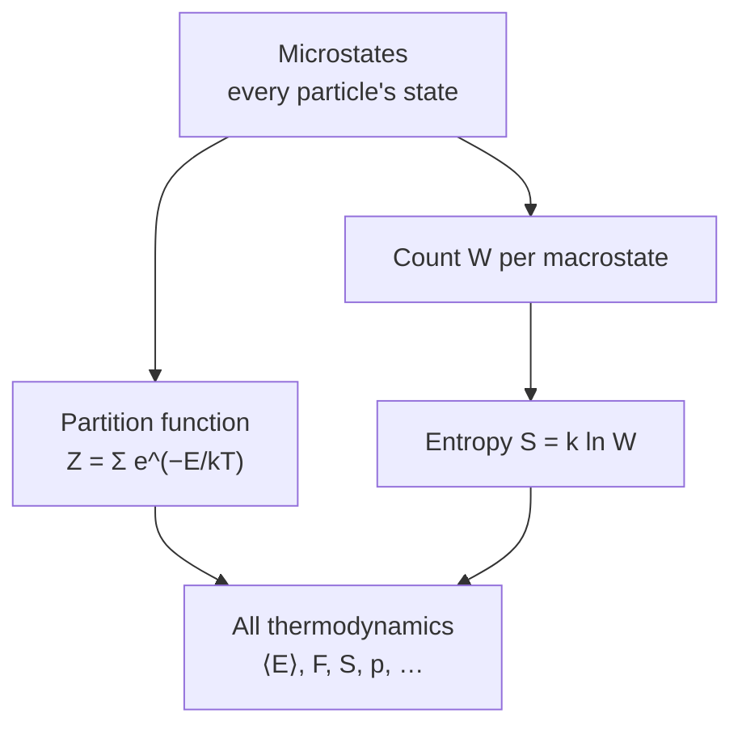

# Statistical Mechanics and Entropy

Statistical mechanics is the bridge from the microscopic world of atoms to the macroscopic
laws of [thermodynamics.md](thermodynamics.md). Thermodynamics *asserts* that entropy
increases and that temperature exists; statistical mechanics *derives* both by treating a
macroscopic system as an enormous collection of particles and applying probability (see
[../statistics/index.md](../statistics/index.md)). It is where the abstract entropy of the
second law becomes something you can literally count.

## Microstates and macrostates

A **microstate** is a complete specification of every particle's state — every position and
momentum, a single point in the phase space of [classical mechanics](classical-mechanics.md)
(or a full quantum state). A **macrostate** is what you actually measure: total energy,
volume, temperature, pressure. The key observation is that a single macrostate is compatible
with an astronomically large number of microstates. Let $W$ (or $\Omega$) be the number of
microstates consistent with a given macrostate.

The **fundamental postulate** is that an isolated system in equilibrium is equally likely to
be in any of its accessible microstates. Everything follows: the macrostate you observe is
overwhelmingly the one with the most microstates behind it, simply because there are so many
more ways to be in it.

## Boltzmann's entropy

Boltzmann identified entropy with the log of that count:

$$ S = k_B \ln W, $$

with $k_B$ the Boltzmann constant. This single equation is the foundation of the whole field
(it is carved on his tombstone). Entropy is not a mysterious fluid — it is a *measure of
multiplicity*, of how many microscopic arrangements produce the same macroscopic appearance.
The second law's $dS \ge 0$ becomes almost trivial: systems evolve toward macrostates with
more microstates because those are vastly more probable. A gas fills its container not by any
force but because "spread out" corresponds to overwhelmingly more microstates than "bunched
in a corner."

## The partition function and temperature

For a system in contact with a heat bath at temperature $T$, the probability of a microstate
with energy $E_i$ is the **Boltzmann distribution**

$$ P(E_i) = \frac{e^{-E_i/k_B T}}{Z}, \qquad Z = \sum_i e^{-E_i/k_B T}. $$

The normalizer $Z$ is the **partition function**, and it is the workhorse of the theory:
once you have $Z$, every thermodynamic quantity is a derivative of it (average energy
$\langle E\rangle = -\partial \ln Z/\partial \beta$ with $\beta = 1/k_BT$; free energy
$F = -k_B T \ln Z$, connecting straight back to [thermodynamics.md](thermodynamics.md)).
Temperature emerges here as a **statistical** quantity: $1/T = \partial S/\partial E$ — it
governs how sharply probability falls off with energy. High $T$ means many energy levels are
populated; low $T$ crowds the system into its lowest states.

## Entropy is information

Boltzmann's $S = k_B \ln W$ has the exact form of Shannon's entropy from
[../math/information-theory.md](../math/information-theory.md). This is no coincidence.
Gibbs's more general expression $S = -k_B \sum_i P_i \ln P_i$ is, up to the constant $k_B$,
Shannon's $H = -\sum p_i \log p_i$. Both measure the same thing: *how much you do not know*
about the microstate given the macrostate. Thermodynamic entropy is the number of bits of
microscopic information hidden beneath a macroscopic description. This equivalence is the
deep reason Maxwell's demon fails (erasing information costs entropy — Landauer's principle)
and why entropy, information, and uncertainty are one idea wearing three hats. The arrow of
time in [thermodynamics.md](thermodynamics.md) is, in this light, the tendency to lose
information about initial conditions.

## Why it matters

Statistical mechanics explains *why* the laws of thermodynamics hold rather than merely
stating them, gives entropy a concrete meaning as microstate-counting, and unifies heat,
probability, and information into a single framework. It is the template for reasoning about
any system with vast numbers of components — from magnets and gases to neural networks and
economies — and its entropy is literally the same quantity that governs
[compression and communication](../math/information-theory.md).

## References

- [An Introduction to Thermal Physics](schroeder-thermal-physics.md) — Daniel Schroeder, which develops thermodynamics and statistical mechanics together
- [Elements of Information Theory](../math/cover-thomas-information-theory.md) — Cover & Thomas, for the entropy–information link
- [The Feynman Lectures on Physics](feynman-lectures-on-physics.md) — Feynman on statistical mechanics
