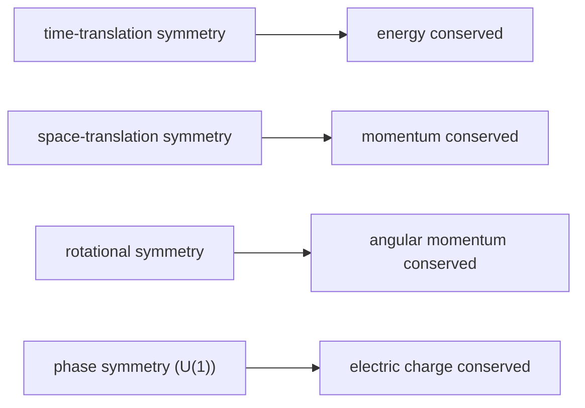

# Symmetry and Conservation Laws

Symmetry is arguably the deepest organizing principle in physics. A **symmetry** is any
change you can make to a system that leaves its physics unchanged — a transformation the
laws don't notice. The astonishing discovery of the 20th century is that symmetries are
not merely aesthetic: *every continuous symmetry secretly enforces a conservation law*,
and demanding certain symmetries *generates the forces themselves*. Physicists chase
symmetry because it is the most reliable path to the underlying laws.

## Noether's theorem

Emmy Noether (1918) proved the bridge between the two ideas exactly:

> **For every continuous symmetry of a physical system, there is a corresponding
> conserved quantity.**

The correspondences are the pillars of physics:

| Continuous symmetry (nothing changes if you…) | Conserved quantity |
|-----------------------------------------------|---------------------|
| shift the experiment in **time** (laws same today and tomorrow) | **energy** |
| shift it in **space** (laws same here and there) | **linear momentum** |
| **rotate** it (laws same in every direction) | **angular momentum** |
| shift the **phase** of the quantum wavefunction | **electric charge** |

This reframes conservation laws — which can look like arbitrary bookkeeping in
[energy and conservation](energy-and-conservation.md) — as *consequences* of the
uniformity and isotropy of space and time. Conservation of energy is not a lucky
accident; it is the statement that the laws of physics do not change over time.

The mathematics of "continuous symmetry" is **group theory** — Lie groups in particular —
so the whole subject is built on the structures of
[abstract algebra](../math/abstract-algebra.md). A symmetry group's generators *are* the
conserved quantities.

## Gauge symmetry: symmetry that builds forces

Some symmetries are **global** (do the same thing everywhere at once). The radical step is
to demand a symmetry hold **locally** — independently at every point in spacetime. Insisting
on such a *local gauge symmetry* forces the theory to introduce a new field to "connect"
neighbouring points and keep the laws consistent. That connecting field turns out to be a
**force-carrying field**:

- Local `U(1)` phase symmetry → the electromagnetic field and the **photon**
  (this is the gauge freedom noted in [electromagnetism](electromagnetism.md)).
- Local `SU(2)` symmetry → the weak force and its `W`/`Z` bosons.
- Local `SU(3)` symmetry → the strong force and the **gluons**.

So [the four fundamental forces](the-four-fundamental-forces.md) (bar gravity) are not
independent inventions — each is *the price of demanding a local symmetry*. This gauge
principle is the entire architecture of
[particle physics and the Standard Model](particle-physics-and-the-standard-model.md),
which is literally labelled by its symmetry group `SU(3) × SU(2) × U(1)`.

## Spontaneous symmetry breaking

A law can be perfectly symmetric while its actual *state* is not — a pencil balanced on
its tip obeys rotationally symmetric physics but must fall in *some* direction, breaking
the symmetry once it lands. This is **spontaneous symmetry breaking**. It is how the
**Higgs mechanism** works: the underlying electroweak symmetry is exact, but the vacuum
settles into a lopsided state, and particles acquire mass as a result. It also explains
phase transitions like magnetization (the atoms could point any way, but below a critical
temperature they collectively pick one).

## Why physicists chase symmetry

- **It constrains the possible laws.** Requiring a theory to respect known symmetries
  (Lorentz invariance, gauge invariance) rules out almost every candidate — symmetry does
  much of the theorist's work.
- **It unifies.** Distinct forces merge when you find the larger symmetry that contains
  them (the electroweak unification of electromagnetism and the weak force).
- **It predicts.** Symmetry arguments predicted new particles (the `W`/`Z`, the Higgs,
  the Ω⁻) before they were found.

Symmetry-and-invariance thinking reaches beyond physics: the same idea — what stays fixed
under transformation — underlies invariants in control systems and homeostasis in
[cybernetics](../systems-thinking/cybernetics.md).

## Why it matters

Symmetry turned physics from a catalogue of separate laws into a search for a single
underlying structure. Conservation laws, the fundamental forces, the masses of particles,
and the direction of every unification program all trace back to it. When a physicist
faces an unknown, the first question is almost always: *what is the symmetry here?*

## References

- Feynman — see [The Feynman Lectures on Physics](feynman-lectures-on-physics.md)
  (Vol. I, "Symmetry in Physical Laws")
- Halliday, Resnick & Walker — see [Fundamentals of Physics](halliday-resnick-walker-fundamentals-of-physics.md)
