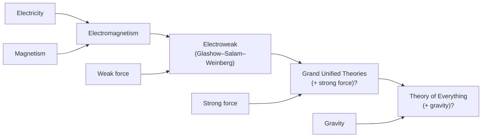

# The Four Fundamental Forces

Every interaction observed in nature reduces to four fundamental forces. Three of them are
described by quantum field theories in which the force is carried by exchanged particles
(**gauge bosons**); the fourth, gravity, is described geometrically by
[general relativity](relativity.md) and still lacks a complete quantum description. A
central project of modern physics is showing these forces are facets of a single underlying
interaction — **unification**.

## The four forces at a glance

| Force | Relative strength | Range | Carrier(s) | What it does |
|---|---|---|---|---|
| Strong | ~1 | ~10⁻¹⁵ m (nuclear) | 8 gluons | Binds quarks into protons/neutrons; binds nuclei |
| Electromagnetism | ~10⁻² | infinite (1/r²) | photon | Atoms, chemistry, light, electronics |
| Weak | ~10⁻⁶ | ~10⁻¹⁸ m | W⁺, W⁻, Z⁰ bosons | Radioactive β-decay; fusion in stars |
| Gravity | ~10⁻³⁹ | infinite (1/r²) | graviton (hypothetical) | Structure of stars, galaxies, spacetime |

Strengths are rough ratios at typical particle-physics energies; they shift with energy
scale, which is what makes unification plausible.

## The four forces individually

- **Gravity** is by far the weakest, yet dominates at large scales because it is always
  attractive and infinite in range, so it accumulates over huge masses. Newton described it
  as a force; Einstein's [relativity](relativity.md) recast it as the curvature of
  spacetime. It has no accepted quantum theory — reconciling it with quantum mechanics
  (quantum gravity) is the deepest open problem in physics.

- **Electromagnetism** unifies electricity, magnetism, and light (see
  [electromagnetism](electromagnetism.md)). Its quantum theory, quantum electrodynamics
  (QED), is the prototype gauge theory and the most accurately tested theory ever. Infinite
  range, mediated by the massless photon. It governs atoms and all of chemistry.

- **The strong force** binds quarks into protons and neutrons and holds nuclei together
  against electromagnetic repulsion. Its quantum theory is quantum chromodynamics (QCD); the
  charge is "color," carried by gluons. Uniquely, it grows stronger with distance
  (**confinement**), so quarks are never seen in isolation.

- **The weak force** is responsible for flavor-changing processes — beta decay, and the
  first step of hydrogen fusion powering the Sun. It is short-ranged precisely because its
  carriers (the W and Z bosons) are massive, a mass they acquire via the Higgs mechanism.

## The quest for unification

Physics has repeatedly discovered that seemingly distinct forces are one:

- **Electroweak unification** (1960s–70s) merged electromagnetism and the weak force into a
  single interaction that splits into two below a symmetry-breaking energy — confirmed by the
  discovery of the W and Z bosons and later the Higgs. This is settled physics and part of
  the [Standard Model](particle-physics-and-the-standard-model.md).
- **Grand Unified Theories (GUTs)** propose that the strong force joins the electroweak
  force at extremely high energy. Attractive but so far unconfirmed (they generically predict
  proton decay, not yet observed).
- **Quantum gravity / a "theory of everything"** would fold gravity in as well. Candidates
  such as string theory and loop quantum gravity remain speculative and untested.

## Why it matters

The four forces are the causal vocabulary of the entire physical world: which reactions
happen, how fast, and what structures — from nuclei to galaxies — can form. The unification
program is the throughline of theoretical physics, and its unfinished chapter (quantum
gravity) marks the current frontier.

## References

- [Griffiths — Introduction to Quantum Mechanics](griffiths-introduction-to-quantum-mechanics.md)
- [The Feynman Lectures on Physics](feynman-lectures-on-physics.md)
