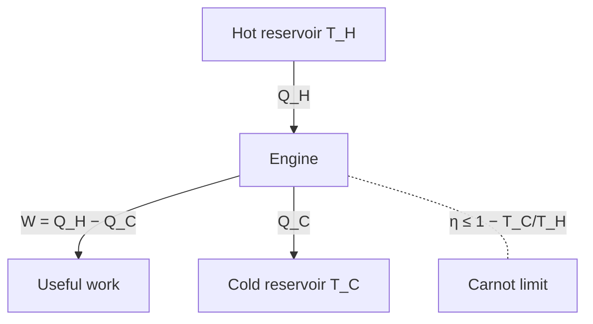

# Thermodynamics

Thermodynamics is the science of heat, work, and energy in bulk matter — a theory built
entirely from a handful of macroscopic laws that hold regardless of what the microscopic
constituents are doing. That agnosticism is its strength: the same four laws govern steam
engines, refrigerators, chemical reactions, and black holes. Where thermodynamics states the
rules, [statistical mechanics](statistical-mechanics-and-entropy.md) explains *why* they
hold by counting microscopic states.

## The four laws

- **Zeroth law.** If $A$ is in thermal equilibrium with $B$ and $B$ with $C$, then $A$ is
  with $C$. This transitivity is what lets **temperature** be a well-defined single number
  and lets thermometers work.
- **First law.** Energy is conserved once you count heat: $dU = \delta Q - \delta W$, where
  $U$ is internal energy, $\delta Q$ is heat added, and $\delta W$ is work done by the
  system. Heat and work are two channels for the same conserved energy (see
  [energy-and-conservation.md](energy-and-conservation.md)).
- **Second law.** The **entropy** $S$ of an isolated system never decreases: $dS \ge 0$.
  Heat flows spontaneously from hot to cold, never the reverse, and no process can be
  perfectly efficient.
- **Third law.** As temperature $\to 0$, entropy approaches a constant (zero for a perfect
  crystal). Absolute zero is unreachable in finitely many steps.

## Temperature, heat, and work

**Temperature** is what equalizes at equilibrium; thermodynamically it is defined by
$1/T = \partial S/\partial U$. **Heat** is energy transferred because of a temperature
difference; **work** is energy transferred through an ordered macroscopic variable (a moving
piston, $\delta W = p\,dV$). The first law's whole content is that these are interchangeable
forms of one conserved quantity — but the second law says they are not *symmetrically*
interchangeable: work converts fully to heat, heat only partially back to work.

## Entropy and free energy

Macroscopically, entropy is defined by $dS = \delta Q_{\text{rev}}/T$ for a reversible heat
exchange — a state function measuring irreversibility and unavailable energy. In a lab you
rarely hold a system isolated; you hold temperature or pressure fixed. Then the quantity that
is minimized at equilibrium (and that bounds the useful work you can extract) is a **free
energy** — the Helmholtz free energy $F = U - TS$ at fixed $T,V$, or the Gibbs free energy
$G = U + pV - TS$ at fixed $T,p$. Free energy is energy discounted by the entropy the process
must pay for.

## Heat engines and the Carnot limit

A heat engine takes heat $Q_H$ from a hot reservoir, dumps $Q_C$ to a cold one, and delivers
the difference as work. The second law caps its efficiency. The ideal **Carnot** engine,
running reversibly between temperatures $T_H$ and $T_C$, achieves the maximum:

$$ \eta_{\text{Carnot}} = 1 - \frac{T_C}{T_H}. $$

No engine between the same two temperatures can beat it, and only a reversible one reaches
it. This is a hard physical ceiling — not an engineering limitation to be overcome but a
consequence of entropy.

## The arrow of time

The microscopic laws of [mechanics](classical-mechanics.md) and
[electromagnetism](electromagnetism.md) run the same forwards and backwards — they have no
built-in direction of time. Yet the world plainly does: eggs break but don't unbreak, heat
spreads but doesn't spontaneously concentrate. The second law's $dS \ge 0$ *is* that arrow.
Its origin is statistical: there are overwhelmingly more disordered microstates than ordered
ones, so systems drift toward disorder simply by probability, a story completed in
[statistical-mechanics-and-entropy.md](statistical-mechanics-and-entropy.md).

## Why it matters

Thermodynamics sets the fundamental limits on every engine, refrigerator, power plant, and
chemical process, tells you which reactions and processes can happen at all (via free
energy), and gives the deepest physical account of why time has a direction. It is a model of
how a robust theory can be built from macroscopic laws without committing to the microscopic
details underneath.

## References

- [An Introduction to Thermal Physics](schroeder-thermal-physics.md) — Daniel Schroeder, the standard modern text
- [The Feynman Lectures on Physics](feynman-lectures-on-physics.md) — Feynman on the laws of thermodynamics
- [Fundamentals of Physics](halliday-resnick-walker-fundamentals-of-physics.md) — Halliday, Resnick & Walker
