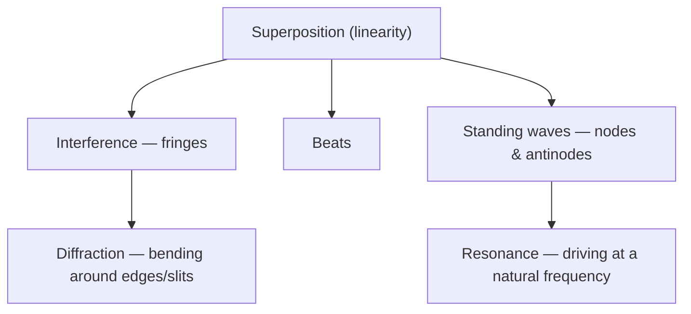

# Waves and Optics

A **wave** is a disturbance that carries energy and information through a medium (or
through empty space) *without* carrying the medium along with it. The same handful of
ideas — the wave equation, superposition, interference, resonance — describe sound on a
string, ripples on water, light, and even the probability amplitudes of
[quantum mechanics](quantum-mechanics.md). Optics is the special case where the wave is
light.

## The wave equation

A one-dimensional wave of displacement `y(x, t)` obeys

```
∂²y/∂t²  =  v² ∂²y/∂x²
```

a second-order partial [differential equation](../math/differential-equations.md) whose
solutions are any function of the form `y = f(x − vt)` (a shape gliding right at speed
`v`) or `f(x + vt)` (gliding left). The workhorse solution is the sinusoid
`y = A sin(kx − ωt)`, described by:

- **amplitude** `A` — the height of the disturbance (energy ∝ `A²`),
- **wavelength** `λ` and **wavenumber** `k = 2π/λ` — spatial period,
- **frequency** `f` and **angular frequency** `ω = 2πf` — temporal period,
- linked by `v = fλ = ω/k`.

Electromagnetic waves fall straight out of Maxwell's equations with `v = c`; see
[electromagnetism](electromagnetism.md).

## Superposition — the master principle

Because the wave equation is *linear*, when two waves overlap their displacements simply
**add**. Everything distinctive about wave behaviour follows from this one fact:

- **Interference** — two waves in step (crest on crest) reinforce → *constructive*; a
  half-wavelength out of step (crest on trough) cancel → *destructive*. Young's
  double-slit experiment turns this into visible bright/dark fringes and is the classic
  proof that light is a wave.
- **Beats** — two nearly equal frequencies add to a slow throbbing at the difference
  frequency.
- **Standing waves** — a wave and its reflection superpose into a fixed pattern of
  **nodes** (never move) and **antinodes** (maximum swing). A string or air column only
  supports standing waves whose wavelengths *fit* the boundaries, so it sings at a
  discrete set of frequencies — the fundamental and its **harmonics**. This is
  quantization by boundary conditions, and it is exactly the mechanism behind the
  discrete energy levels of [quantum mechanics](quantum-mechanics.md).



## Diffraction and resonance

**Diffraction** is the bending and spreading of a wave as it passes an edge or a slit
comparable in size to `λ`. It sets the ultimate resolution limit of every optical
instrument: you cannot resolve detail finer than roughly `λ`, which is why microscopes
hit a wall and why electron microscopes (tiny quantum wavelength) see further.

**Resonance** happens when a system is driven at one of its natural (standing-wave)
frequencies: energy pours in and the amplitude builds dramatically. It explains musical
instruments, the tuning of a radio, laser cavities, and — destructively — bridges shaken
apart by wind.

## Light as a wave, and the road to photons

Treating light as a wave explains reflection, refraction (bending at a boundary, and thus
lenses and rainbows), interference, diffraction, and polarization — the whole of classical
optics. But two experiments cracked the picture at the turn of the 20th century:

- **Blackbody radiation** — the spectrum of hot objects could only be fit if energy came
  in discrete lumps (Planck, `E = hf`).
- **Photoelectric effect** — light ejects electrons in a way that depends on *frequency*,
  not intensity, as if light arrives as particles (Einstein's **photons**).

So light is *both* a wave and a stream of quanta — **wave–particle duality** — and
resolving that is the entry point to [quantum mechanics](quantum-mechanics.md), where
every particle acquires a wavelength and the wave equation reappears as the Schrödinger
equation.

## Why it matters

Waves are the universal language for anything periodic or propagating: acoustics, optics,
signal processing, seismology, and communications all rest on this framework. Fourier's
insight — that any signal is a *superposition of sinusoids* — makes the wave picture the
foundation of how information travels, connecting to signalling in
[computer networks](../computer-science/computer-networks.md).

## References

- Feynman — see [The Feynman Lectures on Physics](feynman-lectures-on-physics.md) (Vol. I)
- Halliday, Resnick & Walker — see [Fundamentals of Physics](halliday-resnick-walker-fundamentals-of-physics.md)
- Griffiths — see [Introduction to Electrodynamics](griffiths-introduction-to-electrodynamics.md) (EM waves)
