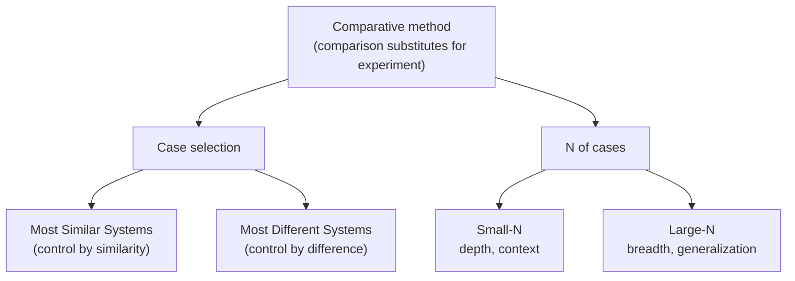

# Comparative Politics

**Comparative politics** is the subfield that studies political phenomena *across* political
systems — regimes, institutions, parties, movements, and states — by comparing them. Its distinctive
contribution is less a subject matter than a **method**: it treats countries (or subnational units, or
periods) as cases whose similarities and differences let us test explanations for why political
outcomes vary. Whereas [international-relations.md](international-relations.md) studies interactions
*between* states, comparative politics looks *inside* them and sets them side by side.

## The comparative method

Political scientists rarely run controlled experiments on whole countries, so comparison substitutes
for the laboratory. Building on J.S. Mill's logic of inference, two designs are foundational:

| Design | Cases are... | Logic | Watch out for |
|--------|-------------|-------|---------------|
| **Most Similar Systems (MSS)** | alike on many dimensions, differ on outcome | isolate the *one* difference that co-varies with the outcome | rarely truly "similar"; omitted variables |
| **Most Different Systems (MDS)** | different on most dimensions, share an outcome | find the *one* shared factor present across them | few cases, many possible causes |

Comparativists work along a spectrum from **small-N** (few cases studied in depth — rich context,
weak generalization) to **large-N** (many cases analyzed statistically — strong generalization, thin
context). A central methodological hazard is **selection bias**: choosing cases on the value of the
outcome (e.g., studying only successful revolutions) distorts inference. Careful case selection,
mixed methods, and attention to statistical inference from samples — see
[../statistics/index.md](../statistics/index.md) — are the standard responses.

## Democratization

A major research program asks how and why regimes move toward — or away from — democracy. Contending
families of explanation include:

- **Modernization theory:** economic development (wealth, urbanization, education) is associated with
  democracy. A refined version holds that development may not *cause* transitions but helps democracy
  *survive* once established.
- **Transitions / agency approaches:** transitions turn on elite bargaining, splits between hardliners
  and reformers, and pacts, rather than structural preconditions.
- **Structural approaches:** class coalitions, the strength of the bourgeoisie or organized labor, and
  the balance of social forces shape whether democracy takes hold.

Regime change connects directly to how regimes are classified — democratic, authoritarian, and the
**hybrid** types in between (competitive authoritarianism, electoral autocracy) — treated in
[forms-of-government.md](forms-of-government.md), and to the backsliding debate in
[democracy-and-elections.md](democracy-and-elections.md).

## State capacity

**State capacity** is the ability of a state to actually implement its decisions across its territory
— to tax, keep order, deliver services, and enforce law. It is analytically separate from *regime
type*: a state can be democratic yet weak, or authoritarian yet highly capable. Charles Tilly's
observation that "war made the state, and the state made war" links the historical development of
capacity to the fiscal-military demands of survival. Weak capacity is central to explaining state
fragility and failure. State-building is deeply intertwined with the economic institutions studied in
[political-economy.md](political-economy.md).

## Political development: why some states thrive and others fail

The largest question in the subfield is why some countries build prosperous, well-governed orders
while others remain poor, unstable, or repressive. Influential lines of argument include:

- **Institutional explanations:** *inclusive* institutions — secure property rights, broad political
  participation, constraints on rulers — foster investment and growth, whereas *extractive*
  institutions concentrate power and wealth in a narrow elite and entrench underdevelopment.
- **The order-and-sequencing view:** durable political order rests on the interplay of a capable
  state, the rule of law (see [constitutions-and-rule-of-law.md](constitutions-and-rule-of-law.md)),
  and accountability; the *sequence* in which these emerge matters for stability.
- **Geographic, cultural, and colonial-legacy accounts** offer competing or complementary factors.

These debates are unresolved, and the honest scholarly position is that outcomes are
**multi-causal** — no single variable explains development, and correlation-versus-causation problems
are pervasive. Because political and social structures are entangled, the sociological literature on
institutions and collective behavior is a natural companion; see
[../sociology/index.md](../sociology/index.md).

## Related notes

- [forms-of-government.md](forms-of-government.md) — the regime typologies comparativists compare.
- [the-state-and-sovereignty.md](the-state-and-sovereignty.md) — what a "state" is.
- [political-economy.md](political-economy.md) — institutions, growth, and distribution.
- [democracy-and-elections.md](democracy-and-elections.md) — democratization and backsliding.
- [../sociology/index.md](../sociology/index.md) — social structure and institutions.

## References

This is a synthesized `Concept` note drawing on the political-science canon rather than a single
source. Related canonical works are catalogued in the field folder's `index.md`.
