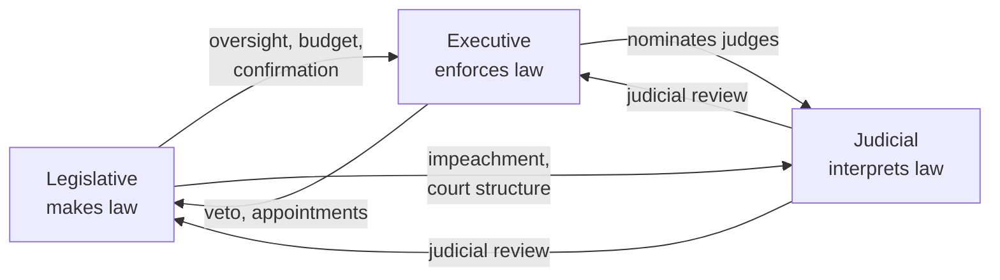

# Constitutions and the Rule of Law

If [the-state-and-sovereignty.md](the-state-and-sovereignty.md) explains why the state holds a
monopoly on legitimate coercion, this note concerns the countervailing question: **how is that power
constrained?** Constitutionalism is the doctrine — and the set of institutions — that subordinates
the exercise of political power to enduring, publicly known rules. The intellectual lineage runs
through John Locke, whose account of natural rights, government by consent, and the right to resist
arbitrary power supplied a founding vocabulary for limited government; see
[locke-two-treatises-of-government.md](locke-two-treatises-of-government.md).

## Constitutions

A **constitution** is the fundamental law that establishes a polity's institutions, allocates powers
among them, and specifies the relationship between the state and those it governs. Constitutions may
be **codified** (a single written document, as in the United States) or **uncodified** (dispersed
across statutes, judicial decisions, and convention, as in the United Kingdom). They are usually
**entrenched** — harder to amend than ordinary law — so that basic arrangements are insulated from
transient majorities. Scholars distinguish a constitution's *formal* text from its *living* operation:
constitutional practice is shaped as much by unwritten norms and conventions as by the words on the
page, which is why erosion of norms is central to debates over democratic backsliding in
[democracy-and-elections.md](democracy-and-elections.md).

## Separation of powers and checks and balances

The classic remedy against concentrated power, elaborated by Montesquieu, is to divide government
into distinct functions and set them against one another.

- **Separation of powers** assigns lawmaking, execution, and adjudication to different branches.
- **Checks and balances** give each branch partial control over the others (veto, oversight,
  confirmation, impeachment, judicial review), so that "ambition counters ambition." Pure separation
  and heavy checking trade off against each other: more veto points mean stronger constraint but also
  more potential for gridlock — a recurring theme in [comparative-politics.md](comparative-politics.md)
  when contrasting presidential and parliamentary designs (see [forms-of-government.md](forms-of-government.md)).

## Judicial review

**Judicial review** is the power of courts to assess whether laws and executive acts conform to the
constitution and to invalidate those that do not. Emblematically associated with *Marbury v. Madison*
(1803) in the U.S., it exists in many forms worldwide — some systems use dedicated constitutional
courts, others diffuse the power across ordinary courts, and a few (in the Westminster tradition)
historically minimized it in favor of parliamentary sovereignty. A standing scholarly debate concerns
the **counter-majoritarian difficulty**: unelected judges overturning the acts of elected
majorities. Defenders argue courts protect rights and the rules of the game *from* majorities;
critics worry about democratic legitimacy and judicial overreach. This tension is explored normatively
in [../philosophy/political-philosophy.md](../philosophy/political-philosophy.md).

## Rule of law vs. rule *by* law

A crucial and often-blurred distinction:

| | **Rule of law** | **Rule by law** |
|---|---|---|
| Law binds | rulers *and* ruled alike | the ruled, but not effectively the rulers |
| Function of law | constraint on power | instrument of power |
| Requirements | generality, publicity, prospectivity, stability, equal application, independent adjudication | formal legality only |

Under the **rule of law**, law is a genuine limit on government: rules are general, public,
prospective, stable, applied equally, and enforced by independent courts. Under **rule *by* law**, a
regime governs *through* legal forms but treats law as a tool of control rather than a constraint on
itself — a pattern flagged in analyses of backsliding, where leaders weaponize technically legal
procedures. The distinction matters because the *presence* of laws, courts, and even constitutions
does not by itself establish constitutionalism.

## Rights and their protection

Constitutions typically enumerate **rights** — civil and political liberties, and sometimes social and
economic guarantees — and establish mechanisms to protect them (bills of rights, judicial
enforcement, independent institutions, international human-rights regimes). Scholars distinguish
*negative* rights (freedoms *from* state interference) from *positive* rights (entitlements *to*
state provision), and debate whether rights are best secured by entrenched text and courts or by
robust democratic politics and culture. The Lockean claim that certain rights precede and limit
government — see [locke-two-treatises-of-government.md](locke-two-treatises-of-government.md) —
remains the touchstone for the negative-rights tradition.

## Related notes

- [locke-two-treatises-of-government.md](locke-two-treatises-of-government.md) — natural rights, consent, limited government.
- [the-state-and-sovereignty.md](the-state-and-sovereignty.md) — the power that constitutions constrain.
- [forms-of-government.md](forms-of-government.md) — how designs distribute and check power.
- [power-authority-and-legitimacy.md](power-authority-and-legitimacy.md) — what makes constrained rule authoritative.
- [../philosophy/political-philosophy.md](../philosophy/political-philosophy.md) — normative justification of constitutional limits.

## References

This is a synthesized `Concept` note drawing on the political-science canon rather than a single
source. Its anchoring work is catalogued in the field folder — see
[locke-two-treatises-of-government.md](locke-two-treatises-of-government.md).
