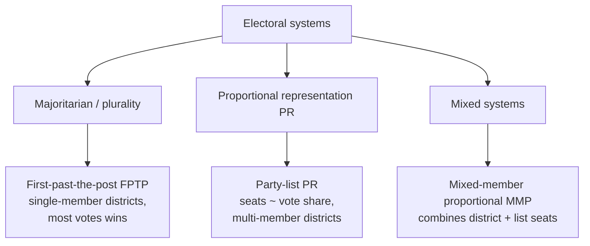

# Democracy and Elections

**Democracy** — from the Greek *dēmos* (people) and *kratos* (rule) — is a family of political
arrangements in which the authority to govern derives, directly or indirectly, from the governed.
Political scientists study democracy on two levels: as a body of **normative theory** (what
democracy is *for*, and what makes it legitimate) and as a set of **institutions and machinery**
(how popular authority is actually organized, measured, and translated into government). This note
treats both, staying descriptive rather than prescriptive.

## Models of democracy

Scholars distinguish competing conceptions of what democracy demands. These are ideal types; real
systems blend them.

| Model | Core claim | Emphasis | Representative concern |
|-------|-----------|----------|------------------------|
| **Liberal / representative** | The people choose rulers through free, fair, competitive elections; rights constrain majorities | Accountability, individual rights, limited government | Guarding against tyranny of the majority |
| **Participatory** | Legitimacy grows with the breadth and depth of citizen involvement, not just voting | Civic engagement, self-development through participation | Passive or disengaged citizenries |
| **Deliberative** | Legitimacy rests on reasoned public discussion among free and equal citizens, not mere aggregation of preferences | Quality of reasoning, mutual justification | Manipulation, uninformed voting |

Robert Dahl's influential framework treats large-scale democracy as an aspirational ideal and calls
the *actually existing* competitive systems **polyarchies** — rule by the many, characterized by
broad suffrage, contestation, and a set of institutional guarantees (free expression, associational
autonomy, alternative information sources). See [dahl-on-democracy.md](dahl-on-democracy.md).
Alexis de Tocqueville's earlier observation that democratic culture reaches beyond formal
institutions into everyday habits, associations, and mores anticipates the participatory tradition —
see [tocqueville-democracy-in-america.md](tocqueville-democracy-in-america.md).

## Suffrage and representation

**Suffrage** — who may vote — has expanded historically from narrow propertied electorates toward
near-universal adult franchise, and its scope remains a live question (e.g., voting age, residency,
felony disenfranchisement, non-citizen voting). **Representation** concerns how the preferences of
the represented map onto the actions of representatives. Hanna Pitkin's classic distinctions are
standard:

- **Formalistic** — the authorization and accountability that elections confer.
- **Descriptive** — whether the legislature *mirrors* the electorate's demographic makeup.
- **Substantive** — whether representatives *act in the interest of* the represented.
- **Symbolic** — what the representative stands for in the eyes of the represented.

These can pull apart: a body can be descriptively representative yet substantively unresponsive, or
vice versa.

## Electoral systems

The rule that converts votes into seats is not neutral machinery — it shapes party systems, coalition
patterns, and even how citizens vote.

- **First-past-the-post (FPTP):** single-member districts, plurality winner. Simple, produces a clear
  district representative, and tends toward stable single-party majorities — but it can manufacture
  majorities from vote pluralities, wastes votes cast for losers, and disadvantages geographically
  dispersed minorities.
- **Proportional representation (PR):** seat shares track vote shares across multi-member districts.
  More faithful to the aggregate distribution of opinion and friendlier to smaller parties, but
  typically yields multiparty legislatures and coalition governments.

**Duverger's law** is the most-cited generalization here: plurality-rule single-member systems tend
toward **two-party** competition, while PR tends to sustain **multiparty** systems. The mechanisms are
(1) a *mechanical* effect — FPTP under-rewards third parties in seats — and (2) a *psychological*
effect — voters and donors anticipate wasted votes and abandon uncompetitive parties (strategic
voting). Like most social-science regularities it is a tendency, not a determinism; exceptions
(regionally concentrated third parties) are well documented. How systems channel behavior connects to
[political-behavior-and-participation.md](political-behavior-and-participation.md).

## Democratic backsliding: the scholarly debate

A prominent contemporary debate concerns **democratic backsliding** — the incremental erosion of
democratic quality, often by elected leaders working *through* legal and constitutional forms rather
than by overt coup. Researchers point to executive aggrandizement, capture of courts and referees,
delegitimization of opposition and media, and manipulation of electoral rules. Debates within the
literature include: how to *measure* backsliding without importing partisan bias; whether it is
genuinely increasing globally or an artifact of measurement; and how much elections still constrain
incumbents once informal norms weaken. This bridges to
[constitutions-and-rule-of-law.md](constitutions-and-rule-of-law.md) (formal constraints on power) and
[forms-of-government.md](forms-of-government.md) (regime classification, including hybrid and
competitive-authoritarian types). Measuring public support for democracy and detecting erosion relies
on survey methods; see [political-behavior-and-participation.md](political-behavior-and-participation.md)
and, on inference from samples, [../statistics/experimental-design-and-ab-testing.md](../statistics/experimental-design-and-ab-testing.md).

## Related notes

- [dahl-on-democracy.md](dahl-on-democracy.md) — polyarchy and the institutional guarantees.
- [tocqueville-democracy-in-america.md](tocqueville-democracy-in-america.md) — democratic culture and mores.
- [forms-of-government.md](forms-of-government.md) — regime types and classification.
- [political-behavior-and-participation.md](political-behavior-and-participation.md) — how citizens actually vote.
- [../philosophy/political-philosophy.md](../philosophy/political-philosophy.md) — normative foundations of self-rule.

## References

This is a synthesized `Concept` note drawing on the political-science canon rather than a single
source. The anchoring works are catalogued in the field folder — see
[dahl-on-democracy.md](dahl-on-democracy.md) and
[tocqueville-democracy-in-america.md](tocqueville-democracy-in-america.md).
