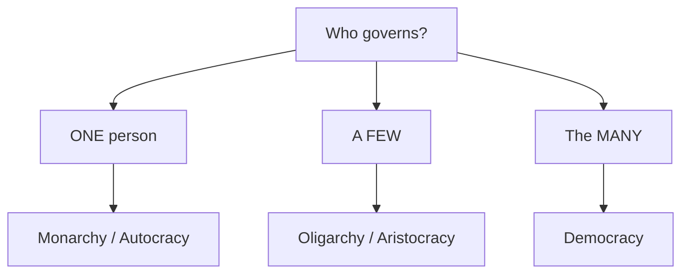
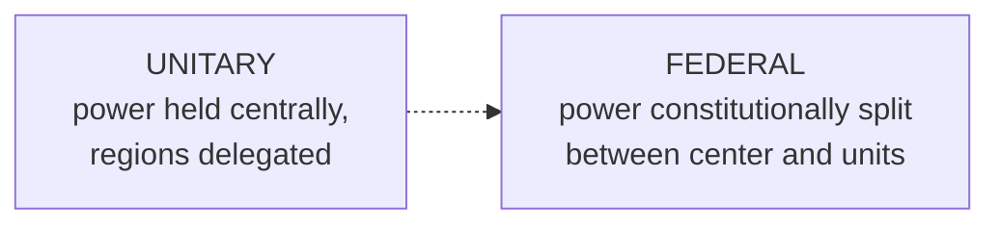

# Forms of Government

A **form of government** (or **regime type**) describes *who holds power* and *how it is
organized and constrained*. Classifying regimes is one of political science's oldest
tasks — Aristotle already sorted governments by the number of rulers (one, few, many) and
by whether they ruled in the common interest or their own. Modern comparative work refines
the same impulse; see [comparative politics](comparative-politics.md).

## The classic axis: who rules

- **Monarchy** — rule by a single hereditary sovereign. Modern monarchies are usually
  *constitutional* (a ceremonial crown atop an elected government) rather than *absolute*.
- **Oligarchy** — rule by a small group, often defined by wealth, birth, or party
  membership.
- **Theocracy** — rule justified by and organized around religious authority, where
  clerical law is the ultimate source of legitimacy.
- **Democracy** — rule by the people (see below).

## The modern axis: how power is constrained

Contemporary scholars care less about the raw number of rulers than about **contestation
and constraint** — whether power is limited by law, elections, and rights. This yields a
spectrum:

| Regime | Contestation | Constraint on rulers |
|---|---|---|
| **Liberal democracy** | Free, fair, competitive elections | Strong — rule of law, rights, checks |
| **Electoral / illiberal democracy** | Elections held | Weak — rights and checks eroded |
| **Authoritarianism** | Limited or managed; no real turnover | Ruler(s) largely unconstrained |
| **Totalitarianism** | None | State seeks total control of society |

- **Democracy** rests on popular sovereignty and comes in two broad modes:
  **direct** (citizens decide policy themselves, as in referendums or ancient Athens) and
  **representative** (citizens elect officials to decide for them — the near-universal
  modern form). It is developed in [democracy and elections](democracy-and-elections.md).
- **Authoritarianism** concentrates power in a leader or party and suppresses meaningful
  political competition, but typically leaves large areas of private life alone.
- **Totalitarianism** is the extreme case (theorized by Hannah Arendt and others): a single
  ideology, mass party, secret police, and the ambition to reshape society and the
  individual entirely — historically embodied by the mid-century fascist and Stalinist
  states studied in [political theory and ideologies](political-theory-and-ideologies.md).

The tools of rule — coercion, consent, and their mix — connect regime type to
[power, authority, and legitimacy](power-authority-and-legitimacy.md), and the state's
underlying capacity to [the state and sovereignty](the-state-and-sovereignty.md).

## How democratic government is structured

Two structural choices cut across democracies:

**1. Executive–legislative relations**

| | **Parliamentary** | **Presidential** |
|---|---|---|
| Executive origin | Chosen by and from the legislature | Separately elected by voters |
| Survival | Depends on legislative confidence | Fixed term, independent of legislature |
| Separation | Fused branches | Separated branches (checks and balances) |
| Example logic | UK, Germany, Japan | US, Brazil, most of Latin America |

*Semi-presidential* systems (e.g. France) blend the two: an elected president shares power
with a prime minister answerable to parliament.

**2. Territorial distribution of power**

- **Unitary** states (France, Japan) locate sovereignty in the central government, which
  may delegate to regions but can also reclaim that authority.
- **Federal** states (US, Germany, India) constitutionally divide power between a national
  government and subnational units, each with guaranteed spheres of authority.

## Why classification is hard

Real regimes are hybrids and change over time, so scholars use *continuous* measures and
*mixed* categories ("competitive authoritarianism," "hybrid regimes") rather than clean
boxes. Classification is contested because the criteria are partly normative — how much
rights protection is "enough" for democracy? The empirical measurement of these types is a
core task of [comparative politics](comparative-politics.md).

## References

- Aristotle's typology of constitutions — [../philosophy/political-philosophy.md](../philosophy/political-philosophy.md)
- Related: [democracy-and-elections.md](democracy-and-elections.md), [comparative-politics.md](comparative-politics.md), [political-theory-and-ideologies.md](political-theory-and-ideologies.md)
