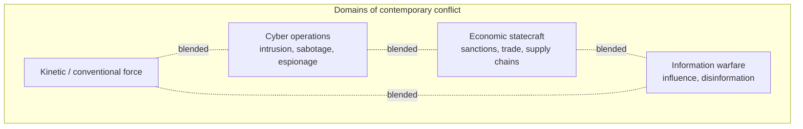

# Geopolitics and Security

Geopolitics studies how **geography and power interact** to shape the strategy and rivalry
of states, and security studies examines how states pursue survival and safety in a world
without a central authority. The two fit together: geography sets much of the terrain on
which security competition plays out, and the concepts here are the applied, material
counterpart to the theory in [international-relations](international-relations.md). This
note describes competing analytic traditions even-handedly; it does not endorse any state's
strategy.

## Classical geopolitical theory

Early geopolitical thinkers tried to reduce world politics to the logic of physical space —
often overreaching, and their ideas have at times been misused to justify expansionism, so
they are read today with caution rather than as doctrine.

- **Sea power** (Mahan) — control of the maritime commons and chokepoints confers global
  reach and commercial dominance.
- **Heartland theory** (Mackinder) — control of the Eurasian interior ("who rules the
  Heartland commands the World-Island") is the pivot of world power.
- **Rimland** (Spykman) — a rejoinder: the populous coastal belt ringing Eurasia, not its
  interior, is the decisive arena.

The durable insight is not any single prediction but that **geography confers enduring
advantages and constraints** — chokepoints, buffer zones, resource endowments, distance —
that outlast particular governments.

## National security and strategy

*National security* is traditionally the protection of a state's survival, territory, and
core interests; the concept has broadened to include economic, energy, cyber, and even
environmental security. **Strategy** is the reasoned linking of *ends* (goals), *ways*
(methods), and *means* (resources). *Grand strategy* is a state's highest-level theory of
how to use all its instruments — military, economic, diplomatic, informational — to secure
its interests over the long run. Strategy is inherently interactive: it must anticipate a
thinking adversary who is adapting in turn, which is why strategic problems so often take
the game-theoretic shape discussed in [international-relations](international-relations.md).

## Deterrence

**Deterrence** is the attempt to prevent an adversary from acting by convincing them the
costs will exceed the gains. It requires *capability* (the means to inflict cost) and
*credibility* (the adversary must believe you will use them). Two variants:

- **Deterrence by punishment** — threatening unacceptable retaliation (the logic of nuclear
  *mutual assured destruction*, where neither side can escape devastating response).
- **Deterrence by denial** — making the adversary's objective too hard to achieve in the
  first place.

Deterrence is fundamentally about credible commitment and signaling under uncertainty — the
same problems of information and commitment that explain the outbreak of war.

## Alliances

**Alliances** aggregate capability and share the burden of security. They deter adversaries
and reassure partners, but they carry characteristic risks: *entrapment* (being dragged into
a partner's conflict) and *abandonment* (a partner failing to honor its commitment when it
counts). Alliance politics is shot through with the *collective-action* and *free-riding*
problems analyzed in [political-economy](political-economy.md): partners may under-invest in
the shared good of defense, relying on the strongest member to carry the load.

## The changing nature of conflict

Conflict is increasingly waged below the threshold of open war, blurring the line between
war and peace — often called *hybrid* or *gray-zone* competition.

- **Cyber** conflict lets actors impose cost and steal information with ambiguous
  attribution and low risk of open war, complicating deterrence (whom do you retaliate
  against, and how much?).
- **Economic** statecraft — sanctions, tariffs, export controls, control of critical supply
  chains — turns [political-economy](political-economy.md) into an instrument of coercion.
- **Information** warfare targets the beliefs and cohesion of adversary populations,
  intersecting with [political-behavior-and-participation](political-behavior-and-participation.md)
  and the integrity of [democracy-and-elections](democracy-and-elections.md).

## Technology as a strategic domain

Technological leadership has become a central axis of security competition. Control of
advanced computing, semiconductors, and **artificial intelligence** is now treated as a
strategic asset — for military capability, economic strength, and influence. AI raises
distinctive security questions: autonomy in weapons systems, the speed and scale of
cyber and information operations, and the difficulty of verification and arms control when
the underlying capability is software that diffuses easily. These concerns motivate the
emerging governance efforts catalogued in [ai-governance](../ai-governance/index.md) and,
because the technology crosses borders freely, they are inseparable from the diplomacy and
institution-building studied in [international-relations](international-relations.md).

## Related notes

- [international-relations](international-relations.md) — the theory of state interaction
- [the-state-and-sovereignty](the-state-and-sovereignty.md) — what security ultimately protects
- [political-economy](political-economy.md) — economic instruments and burden-sharing
- [comparative-politics](comparative-politics.md) — how regime type shapes strategy
- [ai-governance](../ai-governance/index.md) — governing technology as a strategic domain

## References

This is a synthesized Concept note drawing on the shared body of knowledge in geopolitics
and security studies rather than a single source.
