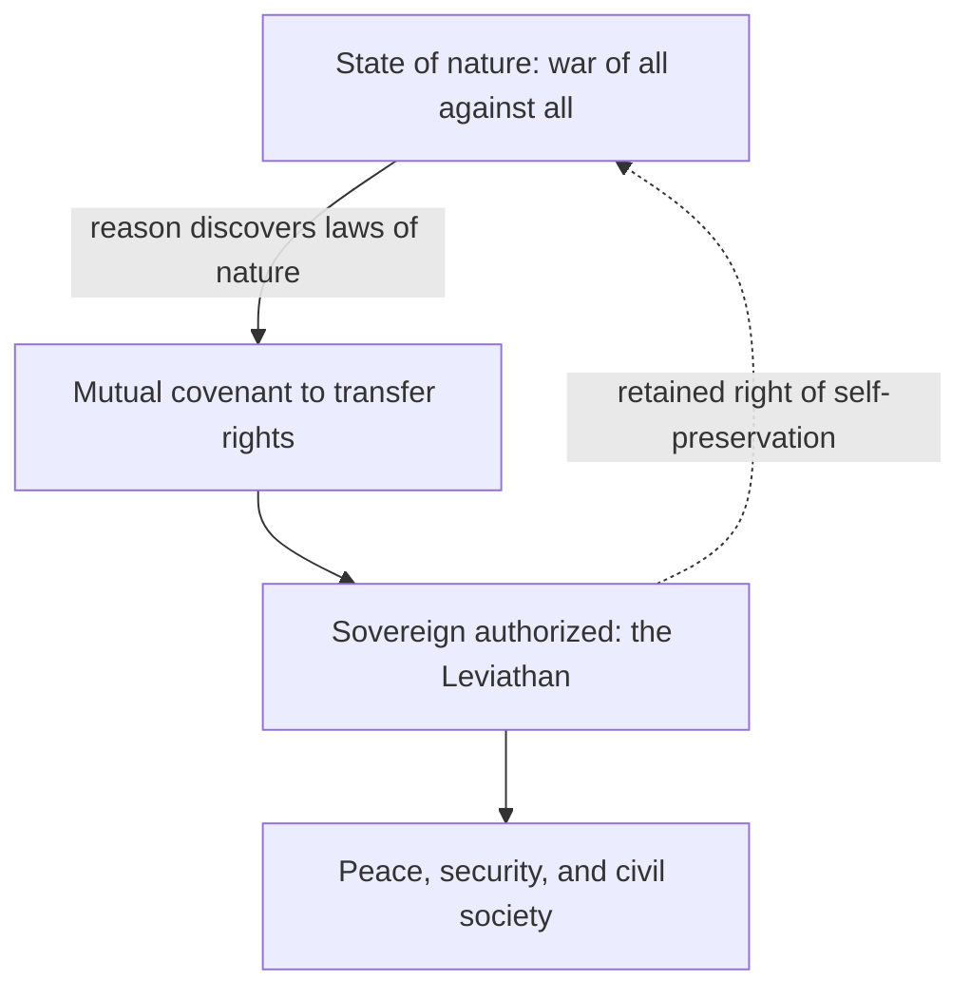

# Leviathan (Hobbes)

Thomas Hobbes's *Leviathan, or The Matter, Forme and Power of a Common-Wealth Ecclesiasticall and Civil* (1651) is a foundational work of modern political philosophy and the first fully developed statement of **social-contract theory**. Written against the backdrop of the English Civil War, it seeks to derive the necessity of a strong, unified sovereign from a systematic account of human nature, reasoning from first principles in the manner of the emerging natural sciences Hobbes admired.

## The argument, in sequence

Hobbes builds a chain of reasoning from psychology up to political obligation:

1. **Materialist psychology.** Human beings are matter in motion; their actions are driven by appetites and aversions. There is no summum bonum (highest good); desire is perpetual, and each person seeks self-preservation and the means to secure future satisfaction — including power over others.
2. **The state of nature.** Absent a common authority, people live in a condition of rough natural equality where each has a "right to everything." Scarcity, competition, mistrust, and the pursuit of glory produce a "war of every man against every man." In this condition there is no industry, culture, or security, and life is famously "solitary, poor, nasty, brutish, and short."
3. **The laws of nature.** Reason discovers precepts that counsel peace — chiefly, to seek peace where possible and to lay down one's unlimited right to all things provided others do the same. But these are prudential theorems, not enforceable while everyone remains judge in their own case; covenants without a sword are "but words."
4. **The covenant.** To escape the state of nature, individuals mutually authorize a single sovereign — a person or assembly — transferring their right of self-governance to it. This act generates the commonwealth: the "Leviathan," an "artificial man" or "mortal god" whose power is the aggregated power of all.
5. **Sovereignty.** The sovereign's authority is, on Hobbes's argument, effectively absolute and indivisible: it makes law, judges disputes, commands the militia, and even settles doctrine, because a divided or limited sovereign reopens the door to the anarchy the contract was meant to end. Subjects retain only the inalienable right to resist direct threats to their own lives, since self-preservation was the reason for the covenant in the first place.

The later books turn to religion and ecclesiastical power, arguing that spiritual and temporal authority must be unified under the civil sovereign to prevent the clashing jurisdictions Hobbes blamed for civil strife.

## Place in the canon

*Leviathan* inaugurates the modern tradition that grounds political authority not in divine right or natural hierarchy but in the **consent of individuals** and the rational pursuit of self-preservation. Its abstractions — the state of nature, the social contract, artificial sovereignty — set the terms of debate for Locke, Rousseau, and Kant, each of whom accepted the contractarian frame while rejecting Hobbes's absolutist conclusions. Hobbes is thus read simultaneously as a founder of liberal method (starting from free, equal individuals) and as a defender of illiberal, near-absolute sovereignty — a tension that keeps the work central to debates about the origins and limits of state power. His analysis remains a touchstone in political theory and international-relations realism.

The work anchors the modern conception of [the-state-and-sovereignty.md](the-state-and-sovereignty.md), and its contractarian derivation of authority is developed alongside [../philosophy/political-philosophy.md](../philosophy/political-philosophy.md). Its account of legitimate command connects to [power-authority-and-legitimacy.md](power-authority-and-legitimacy.md).

## References

- [Leviathan — Project Gutenberg](https://www.gutenberg.org/ebooks/3207)
