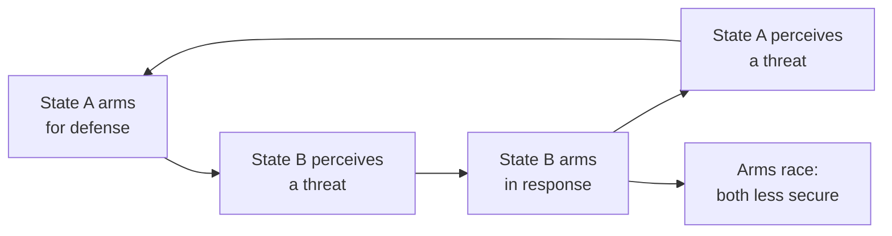

# International Relations

International relations (IR) is the subfield of political science that studies how
actors in the international system interact. Its central actors are sovereign states
(see [the-state-and-sovereignty](the-state-and-sovereignty.md)), but the field also
takes seriously non-state actors: international organizations, multinational firms,
transnational advocacy networks, insurgent and terrorist groups, and — increasingly —
technology platforms. The organizing puzzle of the field is that, unlike domestic
politics, the international system has **no overarching sovereign** to enforce rules or
adjudicate disputes. This condition is called *anarchy* (not chaos, but the absence of a
central authority), and the major theoretical traditions are largely disagreements about
what anarchy implies.

## The major theoretical traditions

The three dominant "paradigms" offer competing answers to why states behave as they do.
They are lenses, not laws; scholars mix and refine them.

| Tradition | Core actors & motive | What drives outcomes | Prospects for cooperation |
|---|---|---|---|
| **Realism** | Self-interested states seeking security/power | Distribution of material capabilities under anarchy | Limited, fragile; states fear being exploited |
| **Liberalism / institutionalism** | States, but also firms, institutions, individuals | Interdependence, domestic politics, institutions | Achievable; institutions reduce transaction costs |
| **Constructivism** | States whose interests are socially constructed | Ideas, norms, identities, shared meanings | Depends on which norms and identities prevail |

**Realism** holds that because no authority guarantees survival, states must rely on
self-help and are preoccupied with power and security. *Classical realists* (Morgenthau)
root this in human nature; *structural realists* or *neorealists* (Waltz) root it in the
anarchic structure itself. *Offensive* realists (Mearsheimer) argue states maximize power;
*defensive* realists argue they seek only enough security to survive.

**Liberalism** and its rigorous cousin *neoliberal institutionalism* (Keohane) accept
anarchy but argue that cooperation is nonetheless common because states share interests,
trade creates interdependence, and institutions lower the cost of making and monitoring
agreements. Democratic peace theory — the empirical observation that mature democracies
rarely fight each other — is a prominent liberal claim.

**Constructivism** (Wendt) argues that the material facts of anarchy do not have fixed
meanings: "anarchy is what states make of it." Interests and identities are shaped by
norms, culture, and interaction, so the system can be more or less conflictual depending
on shared ideas. Marxist and *critical* approaches, and feminist IR, add that the system
also reflects economic structures and gendered assumptions.

## Anarchy and the security dilemma

The **security dilemma** is IR's signature mechanism. Because intentions cannot be
verified under anarchy, measures one state takes purely for defense (arming, alliances)
look threatening to others, who respond in kind — producing an arms race and lower
security for everyone, even though no one sought conflict. This is a real-world instance
of the strategic traps modeled in [game theory](../economics/game-theory.md): it has the
structure of a prisoner's dilemma, where individually rational choices yield a collectively
worse outcome, and it explains why cooperation can fail even among states that would both
prefer peace.

## Balance of power

A recurring realist claim is that the system tends toward a **balance of power**: when one
state grows too strong, others balance against it — by building up their own capabilities
(*internal balancing*) or forming alliances (*external balancing*). Analysts debate whether
the world is more stable when **bipolar** (two great powers), **multipolar** (several), or
**unipolar** (one dominant power, or hegemon). *Hegemonic stability theory* argues a
dominant power can supply global public goods (open trade, freedom of navigation) that
sustain order — connecting IR to the collective-action problems in
[political-economy](political-economy.md).

## Institutions, law, and cooperation

International institutions (the UN, WTO, IMF, regional bodies) and international law are
central to how order is maintained without a world government. They function less by
coercion than by setting expectations, providing information, and raising the reputational
cost of defection. Regimes — the norms, rules, and procedures around an issue area (trade,
climate, nonproliferation) — let states cooperate on recurring problems. Realists counter
that institutions mostly reflect the interests of powerful states and matter little when
core security is at stake. The material and strategic dimensions of state competition —
geography, deterrence, alliances, and new domains of conflict — are treated in
[geopolitics-and-security](geopolitics-and-security.md).

## War and cooperation

Why do states go to war when war is costly for all sides? *Rationalist* explanations point
to information problems (states misjudge each other's resolve or strength), commitment
problems (no one can credibly promise not to exploit a future advantage), and issue
indivisibility (some stakes seem impossible to split). Cooperation, conversely, is easier
when interactions are repeated, gains are shared, and institutions make promises credible.
These are the same logics that appear across the study of
[forms-of-government](forms-of-government.md) and
[power-authority-and-legitimacy](power-authority-and-legitimacy.md), applied to a world
of formally equal sovereigns.

## Related notes

- [the-state-and-sovereignty](the-state-and-sovereignty.md) — the units the system is built from
- [geopolitics-and-security](geopolitics-and-security.md) — power, geography, strategy, and conflict
- [political-economy](political-economy.md) — states and markets, at home and internationally
- [comparative-politics](comparative-politics.md) — how domestic institutions shape foreign behavior
- [game theory](../economics/game-theory.md) — the strategic logic behind the security dilemma

## References

This is a synthesized Concept note drawing on the shared body of knowledge in the field of
international relations rather than a single source.
